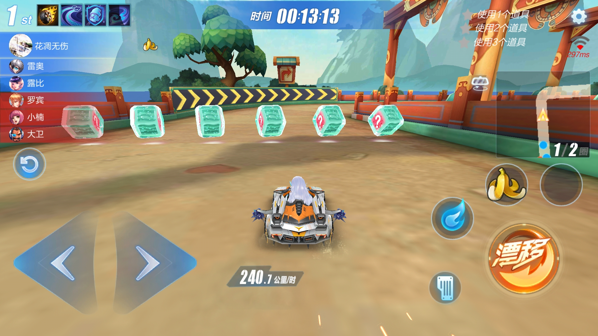
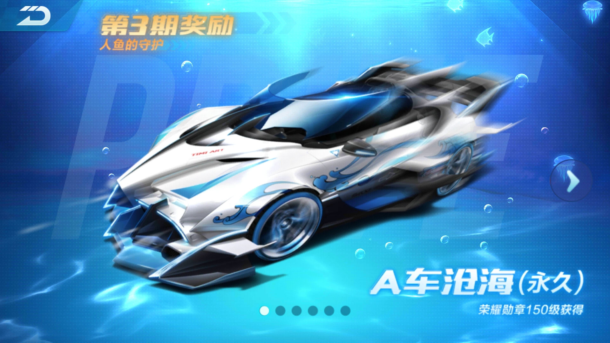

# **腾讯系竞速手游的逆袭(QQ飞车手游设计分析)**

## **导语** 
在中国巨大的游戏市场下，手游战场上的战火从未熄灭，其中以王者荣耀为首的MOBA类手游与以PUBG(现改名和平精英)为代表的吃鸡类手游延续了PC端的强势，无论是热度还是普及率都居高不下。  
然而，在最近的国内手游收入排行当中，竞速手游却异军突起，前有QQ飞车手游春节期斩获国内第二，后有跑跑卡丁车官方竞速版助力腾讯成为国内最强手游发售商，目前跑跑的日收入任位居前三，即使受到分流飞车也还在前二十。  
     
数据来源: [SensorTowerApp排行榜](https://sensortower-china.com/ios/rankings/top/iphone/china/games?locale=zh-CN&date=2019-09-07)   
竞速类网游在PC端尽显颓势，无论是跑跑卡丁车还是QQ飞车在PC端都已不复从前，不谈与LOL和PUBG这些大热竞争，即使和同为老经典的CF与DNF等相比也落入下风。那么到底为什么转入移动端后这些游戏却大放异彩了呢？  
我对QQ飞车手游玩了有较长的时间，从开测起就已经开始了，直到近几个月学业繁重才决定放弃，前后也有一年多，也算是资深玩家。
  
因此我打算从QQ飞车手游入手，来看看腾讯系竞速手游为何能够成功逆袭。  
## **1. 较短游戏时长，面向快节奏玩家**  
在常见的国民级手游当中，无论是王者荣耀还是PUBG都有着游戏时长较长的特点，这无疑对玩家游戏时间有所限制。而部分其他热门手游，不仅仅是QQ飞车这些竞速类手游，还有碧蓝航线、崩坏3rd、明日方舟等游戏，则有着较短的游戏时长。  短游戏时长使得游戏更容易受到快节奏玩家的青睐，例如这样就可以在短暂的下课时间内完成游戏。
  
以QQ飞车手游为例，一局游戏往往能够在2-3分钟内结束。配合移动端设备的高机动性，游戏时间自由度的优势就体现出来了。相比王者荣耀的主要场所还是室内，QQ飞车在室外工作时间任然有着高度自由（当然，只要胆子大，什么游戏都自由^_^）。
## **2. 画质建模升级，增添游戏魅力**  
许多PC端移植到移动端会受到移动端性能的影响，往往移动端的画面品质还不如PC端，例如PUBG。  
竞速类手游对画面建模的要求比其他手游会更高一点，因为玩家视角被限制了很多，因此在有限画面上体现更多细节就是一个重点了。QQ飞车手游对于QQ飞车而言可以算是脱胎换骨，精美的画质与建模让游戏世界充斥着美感，也让玩家不易审美疲劳。  

## **3. 游戏模式创新，道具模式上位，游戏受众拓宽**  
大家都知道马里奥赛车这款经典游戏，无论是跑跑卡丁车还是QQ飞车都或多或少有学习马里奥赛车，自然也早早就有了道具模式。  
然而在PC端中道具模式从未被提到与竞速模式同等的重要位置上，这很大的限制了游戏的受众，尤其是对女性玩家不算友好。    
QQ飞车手游却成功的将道具模式扶持了起来。确实相较于更偏单人性质的竞速，许多人更希望有足够轻松的游戏模式，而道具模式就具备这个特点，不需要自己有太高的技术，更重要的是团队配合，对单人失误有足够高的容忍度。  

这让游戏人群更加多样，尤其是对女性玩家更具包容性，很少技术歧视的现象。  

## **4. 刺激兼顾优美，游戏过程赏心悦目**  
作为竞速游戏，玩家热衷于在游戏过程感受到赛车的刺激感，而QQ飞车手游不仅具备了这些，还具备了游戏的美感。  
曾经有一个朋友问我（不是无中生友），为什么你们会忍受得住玩QQ飞车时繁琐无聊的练习过程。我回答，如果真正认真的在练习的话，是不会无聊的，因为练习过程往往是赏心悦目的。  
这不是夸夸而已，因为确实是这样，QQ飞车玩家在游戏中取得进步时往往是看得见的，哪怕一个弯一个直线都能够看得到效果。而得益于优秀的游戏画面，当玩家成功操作出精彩操作时，一定是赏心悦目的。  

更重要的是这是稳定的，游戏的一个技巧叫做背板，就是记住游戏中一些比较困难的点，每次都用一个操作去通过，而飞车就具备背板的条件，因此技术较好的玩家往往能够频繁地表现出许多行云流水的操作，这也就是为什么玩家不会因为反复练习而感到无聊的原因了。

## **5. 消费重心转移，平民玩家更友好**
无论是在哪一个热门游戏当中，绝大多数的玩家一定是消费较少的平民玩家，那么如何来留住这些玩家群体就是很重要的事了。  
在QQ飞车手游当中官方每一个阶段都保证了至少一台赛车拥有T2以上的性能，且能够全名免费或只需要花费较少+任务即可获得，这使得平民玩家能够通过自己练习提高能力来与高V玩家竞争。  

而同时QQ飞车手游也将消费重心成功从车辆消费转移到了服装消费上。依旧是得益于优秀的画质和建模，飞车在人物装扮上下足了功夫。在我的了解中，许多人在服装上的投入甚至远远大于其在车辆上的消费，而飞车在服装上的更新速度也远远快于车辆的更新，往往一个版本两三辆新车却有着七八套以上的服装。  
消费重心的转移极大的增加了游戏的收入渠道，这也是游戏能够一直排在收入榜前列的重要原因。  

## **6. 社交渠道增加，玩家凝聚力上升**
相比较PC端上的社交系统，QQ飞车手游在社交系统上大为改善。车队系统凝聚力大大加强，车队群、车队赛等都为玩家提供了大量社交渠道。  
社交上的优势往往对留住玩家有很大的作用。 

**博客中除了特别标注的图片，其他均为我在游戏当中截取下来的游戏画面。**