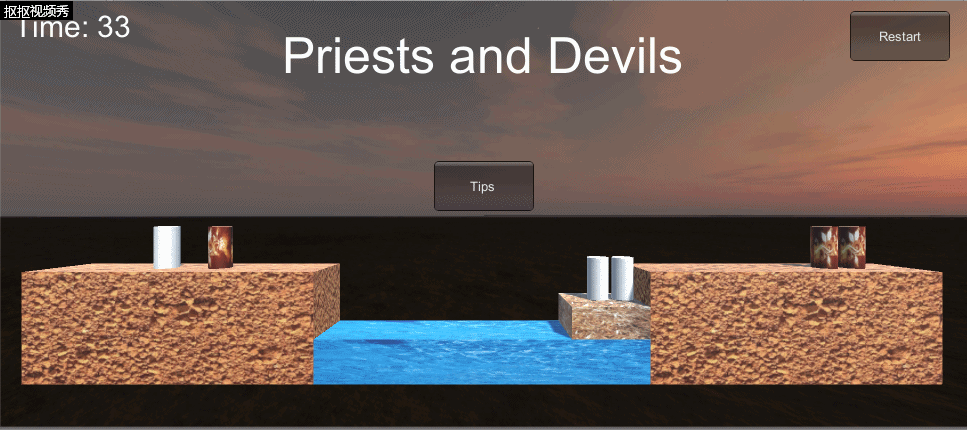

# **牧师与恶魔-智能寻路版**  
## **前言** 
这是中山大学数据科学与计算机学院2019年3D游戏编程与设计的第十次作业  
所有项目与代码已上传至github当中，欢迎大家访问。  
github个人主页: [https://starashzero.github.io](https://starashzero.github.io)  
3D游戏编程与设计主页: [https://starashzero.github.io/3DGameDesign](https://starashzero.github.io/3DGameDesign)  
本次作业项目地址: [https://github.com/StarashZero/3DGameDesign/tree/master/hw10](https://github.com/StarashZero/3DGameDesign/tree/master/hw10)  

## **项目要求**  
P&D 过河游戏智能帮助实现，程序具体要求：
* 实现状态图的自动生成
* 讲解图数据在程序中的表示方法
* 利用算法实现下一步的计算  

## **作品效果**  
* GIF:  
      
* 视频:  
    [https://v.youku.com/v_show/id_XNDQ1ODI4NTUwOA==.html?spm=a2h3j.8428770.3416059.1](https://v.youku.com/v_show/id_XNDQ1ODI4NTUwOA==.html?spm=a2h3j.8428770.3416059.1)

## **项目结构**  
本次项目基于之前完成的牧师与恶魔-动作分离版，在其基础上增加了PathController与PathNode两个类来完成自动寻路  
新特性:  
* 增加提示功能，在点击Tips后自动寻找路径并完成最近的一步  

## **算法简述**  
寻路采用广度优先搜索(BFS)，由于最近参加中级实训完成了一份BFS代码，因此这是由实训完成的JAVA代码修改而来  
寻路过程可以视作一个状态机，每个节点保存一个状态state。state由7项参数组成: 船上牧师数量、船上恶魔数量、左岸牧师数量、右岸牧师数量、左岸恶魔数量、右岸恶魔数量、船只位置。由于状态机比较复杂，这里就步画出来了，直接进入代码部分  

## **具体实现**  
* ### PathNode  
    PathNode是路径上的节点，也是状态机的状态单元，其包含有四个参数，保存在state数组当中  
    ```java  
    public int[] state;                                     //状态
    ```  
    为了不至于混淆各参数的位置，我们可以设置一些常量来寻找参数  
    ```java
    public static readonly int BOAT_PRIESTS = 0;            //船上牧师
    public static readonly int BOAT_DEVILS = 1;             //船上恶魔
    public static readonly int LEFT_PRIESTS = 2;            //左岸牧师
    public static readonly int RIGHT_PRIESTS = 3;           //右岸牧师
    public static readonly int LEFT_DEVILS = 4;             //左岸恶魔
    public static readonly int RIGHT_DEVILS = 5;            //右岸恶魔
    public static readonly int BOAT_PLACE = 6;              //船只位置
    ```  
    因为是路径节点，需要保存路径的下一步，同时为了能够生成路径，又需要保存路径的上一步，所以使用两个指针来完成  
    ```java  
    PathNode parentNode;                                    //父节点
    PathNode nextNode;                                      //路径下一节点
    ```  
    节点需要能被state唯一标识，且不被两个指针影响，我选择重载GetHashCode函数来实现  
    ```java
    //重载Hash函数，使其对state唯一
    public override int GetHashCode()
    {
        int res = 0;
        for (int i = 0; i < 7; i++)
        {
            res += state[i] * (int)Mathf.Pow(10,i);
        }
        return res;
    }
    ```  
    节点需要能被判断其类型: 可走、终点、不可走。因此实现一个GetState函数  
    ```java
    //获得当前状态
    //0 游戏进行
    //1 游戏胜利
    //2 游戏结束
    public int GetState()
    {
        if (state[RIGHT_PRIESTS] == 3)
            return 1;
        int leftPriests, leftDevils, rightPriests, rightDevils;
        leftPriests = state[LEFT_PRIESTS] + state[BOAT_PRIESTS] * (1 - state[BOAT_PLACE]);
        leftDevils = state[LEFT_DEVILS] + state[BOAT_DEVILS] * (1 - state[BOAT_PLACE]);
        rightPriests = state[RIGHT_PRIESTS] + (state[BOAT_PRIESTS] * state[BOAT_PLACE]);
        rightDevils = state[RIGHT_DEVILS] + (state[BOAT_DEVILS] * state[BOAT_PLACE]);
        if ((leftPriests!=0&& leftPriests < leftDevils) || (rightPriests!=0&& rightPriests < rightDevils))
            return 2;
        return 0;
    }
    ```  
    可以对状态进行变更以生成新的状态节点，同时必须要判断变更是否合法。因此实现CanMove和Move函数  
    ```java  
    //是否可以移动
    public bool CanMove(int state_place)
    {
        if (state_place == LEFT_PRIESTS || state_place == LEFT_DEVILS)
        {
            return (state[BOAT_PLACE] == 0 && (state[BOAT_PRIESTS] + state[BOAT_DEVILS] < 2) && state[state_place] > 0);
        }
        else if (state_place == RIGHT_PRIESTS || state_place == RIGHT_DEVILS)
        {
            return (state[BOAT_PLACE] == 1 && (state[BOAT_PRIESTS] + state[BOAT_DEVILS] < 2) && state[state_place] > 0);
        }
        else if (state_place == BOAT_PRIESTS || state_place == BOAT_DEVILS)
        {
            return (state[state_place] > 0);
        }
        else if (state_place == BOAT_PLACE)
        {
            return (state[BOAT_PRIESTS] + state[BOAT_DEVILS] > 0);
        }
        return false;
    }

    //移动
    public bool Move(int state_place)
    {
        bool canMove = CanMove(state_place);
        if (!canMove)
            return false;
        if (state_place == LEFT_PRIESTS || state_place == RIGHT_PRIESTS)
        {
            state[state_place]--;
            state[BOAT_PRIESTS]++;
        }
        else if (state_place == LEFT_DEVILS || state_place == RIGHT_DEVILS)
        {
            state[state_place]--;
            state[BOAT_DEVILS]++;
        }
        else if (state_place == BOAT_PRIESTS)
        {
            state[state_place]--;
            state[state[BOAT_PLACE] == 0 ? LEFT_PRIESTS : RIGHT_PRIESTS]++;
        }
        else if (state_place == BOAT_DEVILS)
        {
            state[state_place]--;
            state[state[BOAT_PLACE] == 0 ? LEFT_DEVILS : RIGHT_DEVILS]++;
        }
        else if (state_place == BOAT_PLACE)
        {
            state[BOAT_PLACE] = 1 - state[BOAT_PLACE];
        }
        return true;
    }
    ```  
* ### PathController  
    完成了路径节点以后就可以开始寻找路径了  
    寻找路径使用BFS算法:  
    * 缓存之前生成的路径，判断起点是否已在路径中，若在路径中则直接返回路径，结束
    * 将初始节点加入到explore list和visited list中  
    * 从explore list取一个节点(第一个)，判断其是否为终点  
    * 若不为终点，则将其从explore list中移出  
    * 遍历节点的各个行为，将可以变更且不在visited list中的状态节点加入到explore list和visited list中  
    * 若explore list不为空，重复3-5步  
    ```java
    public PathNode Search(int[] bState)
    {
        PathNode bNode = new PathNode(bState);
        //如果当前路径已被求得，则直接返回结果
        if (solutionPath != null && solutionPath.Contains(bNode.GetHashCode()))
            return (PathNode)solutionPath[bNode.GetHashCode()];
        currentNode = null;
        solutionPath = null;
        exploreList = new Queue<PathNode>();
        visitedList = new HashSet<int>();
        exploreList.Enqueue(bNode);
        visitedList.Add(bNode.GetHashCode());
        //广度优先搜索
        while (exploreList.Count != 0)
        {
            currentNode = exploreList.Peek();
            if (currentNode.GetState()==1)
            {
                GetPath();
                break;
            }
            exploreList.Dequeue();

            PathNode[] nextNodes = new PathNode[]{
                    new PathNode(currentNode), new PathNode(currentNode),
                    new PathNode(currentNode), new PathNode(currentNode),
                    new PathNode(currentNode), new PathNode(currentNode),
                    new PathNode(currentNode)
            };

            // 寻找所有与currentJNode邻接且未曾被发现的节点，将它们插入exploreList中
            // 并加入visitedList中，表示已发现
            for (int i = 0; i < 7; i++)
            {
                if (nextNodes[i].Move(i))
                {
                    if (nextNodes[i].GetState() <= 1 && !visitedList.Contains(nextNodes[i].GetHashCode()))
                    {
                        exploreList.Enqueue(nextNodes[i]);
                        visitedList.Add(nextNodes[i].GetHashCode());
                    }
                }
            }
        }

        return bNode;
    }
    ```  
    生成路径的方法很简单，从终点开始，沿着parentNode一直到起点，将节点按nextNode连接成链，同时把所有节点加入到哈希表solutionPath中进行缓存  
    ```java
    /**
     * 获得路径
     */
    public void GetPath()
    {
        if (solutionPath == null && currentNode != null)
        {
            solutionPath = new Hashtable();
            PathNode cNode, lNode;
            cNode = currentNode;
            lNode = null;
            while (cNode != null)
            {
                solutionPath.Add(cNode.GetHashCode(), cNode);
                cNode.SetNext(lNode);
                lNode = cNode;
                cNode = cNode.GetParent();
            }
        }
    }
    ```
* ### FirstController  
    FirstController中需要对新增加的PathController和PathNode进行适配，增加Tips接口，处理用户的请求  
    Tips函数将当前的数据转换为状态传入到PathController中生成路径，然后获得当前节点和下一节点传入到TransferState中进行状态转换  
    ```java
    //获得帮助
    public void Tips()
    {
        PathNode node = pathController.Search(new int[] { boatController.GetBoatModel().priestNum, boatController.GetBoatModel().devilNum, leftLandController.GetLandModel().priestNum,
        rightLandController.GetLandModel().priestNum, leftLandController.GetLandModel().devilNum, rightLandController.GetLandModel().devilNum, boatController.GetBoatModel().isRight?1:0});
        if (node.GetState() == 0)
        {
            PathNode nNode = node.GetNext();
            TransferState(node, nNode);
        }
    }
    ```  
    TransferState根据两个状态的差异来完成状态转换  
    ```java  
    //状态转换  
    private void TransferState(PathNode bNode, PathNode eNode)
    {
        int[] subs = new int[7];
        //求差,找到转换类型
        for (int i = 0; i < 7; i++)
        {
            subs[i] = eNode.state[i] - bNode.state[i];
        }
        if (subs[PathNode.BOAT_PLACE] != 0)
        {
            //船只移动
            MoveBoat();
        }
        else if (subs[PathNode.BOAT_PRIESTS] < 0)
        {
            //船上牧师移动
            for (int i = 0; i < 2; i++)
            {
                if (boatController.GetBoatModel().roles[i]!=null && boatController.GetBoatModel().roles[i].isPriest)
                {
                    MoveRole(boatController.GetBoatModel().roles[i]);
                    break;
                }
            }
        }
        else if (subs[PathNode.BOAT_DEVILS] < 0)
        {
            //船上恶魔移动
            for (int i = 0; i < 2; i++)
            {
                if (boatController.GetBoatModel().roles[i] != null && !boatController.GetBoatModel().roles[i].isPriest)
                {
                    MoveRole(boatController.GetBoatModel().roles[i]);
                    break;
                }
            }
        }
        else if (subs[PathNode.LEFT_PRIESTS] < 0)
        {
            //左岸牧师移动
            for (int i = 0; i < 6; i++)
            {
                if (roleControllers[i].GetRoleModel().isPriest&& !roleControllers[i].GetRoleModel().isInBoat&& !roleControllers[i].GetRoleModel().isRight)
                {
                    MoveRole(roleControllers[i].GetRoleModel());
                    break;
                }
            }
        }
        else if (subs[PathNode.LEFT_DEVILS] < 0)
        {
            //左岸恶魔移动
            for (int i = 0; i < 6; i++)
            {
                if (!roleControllers[i].GetRoleModel().isPriest&& !roleControllers[i].GetRoleModel().isInBoat&& !roleControllers[i].GetRoleModel().isRight)
                {
                    MoveRole(roleControllers[i].GetRoleModel());
                    break;
                }
            }
        }
        else if (subs[PathNode.RIGHT_PRIESTS] < 0)
        {
            //右岸牧师移动
            for (int i = 0; i < 6; i++)
            {
                if (roleControllers[i].GetRoleModel().isPriest && !roleControllers[i].GetRoleModel().isInBoat && roleControllers[i].GetRoleModel().isRight)
                {
                    MoveRole(roleControllers[i].GetRoleModel());
                    break;
                }
            }
        }
        else if (subs[PathNode.RIGHT_DEVILS] < 0)
        {
            //右岸恶魔移动
            for (int i = 0; i < 6; i++)
            {
                if (!roleControllers[i].GetRoleModel().isPriest && !roleControllers[i].GetRoleModel().isInBoat && roleControllers[i].GetRoleModel().isRight)
                {
                    MoveRole(roleControllers[i].GetRoleModel());
                    break;
                }
            }
        }
    }
    ```
