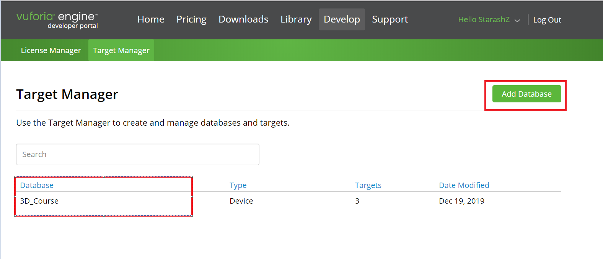
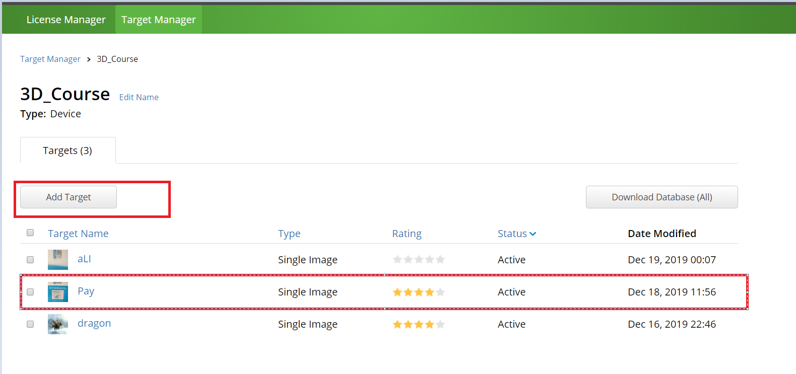
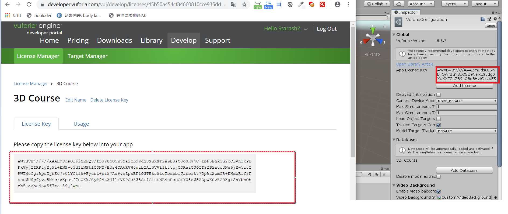
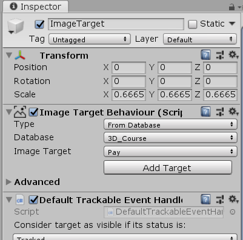
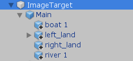
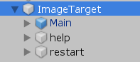
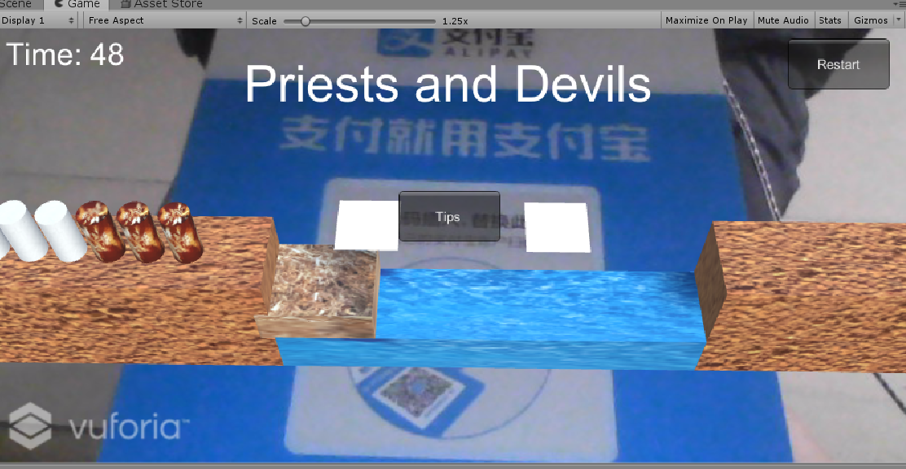

# **AR小游戏 牧师与恶魔**  
## **前言** 
这是中山大学数据科学与计算机学院2019年3D游戏编程与设计的第十一次作业  
所有项目与代码已上传至github当中，欢迎大家访问。  
github个人主页: [https://starashzero.github.io](https://starashzero.github.io)  
3D游戏编程与设计主页: [https://starashzero.github.io/3DGameDesign](https://starashzero.github.io/3DGameDesign)  
本次作业项目地址: [https://github.com/StarashZero/3DGameDesign/tree/master/hw11](https://github.com/StarashZero/3DGameDesign/tree/master/hw11)   

## **项目要求**  
* 图片识别与建模

* 虚拟按键小游戏   

## **项目简介**  
我将之前做过的牧师与恶魔实现为AR小游戏，设置两个虚拟按键对应提示、重开两个功能  
项目改动不大，但是碰到的坑比写的代码还多，接下来我会对一些坑和解决办法进行总结    
## **排雷**
* 无法开启Vuforia Augmented Reality Supported  
    提示某文件not registered  
    Vuforia无法成功导入，或每次导入需重启  
    解决办法: 应该是版本兼容问题，下载安装Unity 2018.4.14f1版本可解决  
* 无法将动态生成的对象的parent设置为ImageTarget，通过代码设置后仍为null  
    解决办法: 未彻底解决，目前是将动态生成的对象改为直接挂载再ImageTarget下  
* 运行后ImageTarget下的对象错位，且无法通过设置位置更改  
    解决办法: 将对象移出ImageTarget，再将其移回去，原因未知  
* Virtual Button位置无法更改  
    解决办法: Y轴无法变化，只能更改X，Z坐标，且必须放在ImageTarget下，如仍不能更改则重新生成VB  
* Virtual Button触碰无反应  
    解决方法: 将Virtual Button放在识别图靠中间的位置，放在四周的话容易无反应 
* 提示Virtual Button name冲突  
    解决办法: 这个提示不是指对象名冲突，而是指脚本Virtual Button Behaviour下的Name冲突  

## **实现过程**  
* 在Vuforia网页创建一个数据库  
      
* 上传一张图片作为Target，最后用身边的实物，因为用电子设备显示图片的话可能会因为屏幕反光导致无法识别，例如我将支付宝支付牌作为Target  
      
* 将生成的数据库下载下来，并导入到Unity项目中  
* 下载安装Vuforia支持包，过程略  
* 在Unity项目中，勾选Edit->Project Settings->Player->Vuforia Augmented Reality Supported，使得项目可以使用Vuforia  
* 删除Main Camera，添加AR Camera，第一次添加时会要求导入包，点确定  
* 将数据库证书填入AR Camera->Open Vuforia Engine configuration->App License Key  
      
* 添加ImageTarget，Image Target Behaviour中Type选择From Database，并设置好Target
      
* 将准备好的模型挂载到ImageTarget当中  
      
* 在ImageTarget->Image Target Behaviour->Advanced中添加两个Virtual Button，记得为其设置name  
      
* 编写ButtonBehaviour脚本并挂载在ImageTarget下  
    ```cs
    using System.Collections;
    using System.Collections.Generic;
    using System.Runtime.InteropServices;
    using UnityEngine;
    using Vuforia;

    [System.Obsolete]
    public class VuforiaButtonEventHandler : MonoBehaviour, IVirtualButtonEventHandler
    {
        public VirtualButtonBehaviour help;
        public VirtualButtonBehaviour restart;
        IUserAction action;

        // Start is called before the first frame update
        [System.Obsolete]
        void Start()
        {
            help.RegisterEventHandler(this);
            restart.RegisterEventHandler(this);
            action = SSDirector.GetInstance().CurrentSenceController as IUserAction;
        }

        private void Update()
        {
            
        }


        public void OnButtonPressed(VirtualButtonBehaviour vb)
        {
            vb.gameObject.GetComponentInChildren<MeshRenderer>().material.color = Color.red;
            switch (vb.VirtualButtonName)
            {
                case "restart":
                    action.Restart();
                    break;
                case "help":
                    action.Tips();
                    break;
                default:
                    break;
            }
        }

        public void OnButtonReleased(VirtualButtonBehaviour vb)
        {
            vb.gameObject.GetComponentInChildren<MeshRenderer>().material.color = Color.white;
        }
    }
    ```  
* 点击运行，AR游戏已完成  

## **游戏演示**  
* 截图
      
* 游戏视频  
    [https://v.youku.com/v_show/id_XNDQ3NDkzOTI0OA==.html?spm=a2hzp.8244740.0.0](https://v.youku.com/v_show/id_XNDQ3NDkzOTI0OA==.html?spm=a2hzp.8244740.0.0)