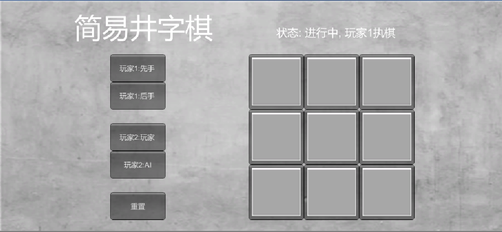
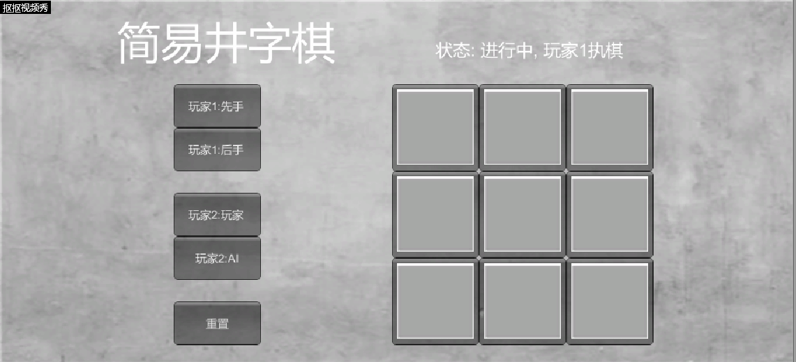

# **unity实现井字棋小游戏**  

## **前言**  
这是中山大学数据科学与计算机学院2019年3D游戏编程与设计的第二次作业  
所有项目与代码已上传至github当中，欢迎大家访问。  
github个人主页: [https://starashzero.github.io](https://starashzero.github.io)  
3D游戏编程与设计主页: [https://starashzero.github.io/3DGameDesign](https://starashzero.github.io/3DGameDesign)  
本次作业项目地址: [https://github.com/StarashZero/3DGameDesign/tree/master/hw2](https://github.com/StarashZero/3DGameDesign/tree/master/hw2)    

## **游戏简介**  
传统的井字棋游戏实现，设置了有PVP和PVE两个模式，电脑AI能够简单的选择局部最优解。  
在下没有什么艺术细胞，所以UI不太美观，献丑了^_^。  
**游戏UI:**  
  
**游戏试玩gif:**  


## **实现过程**  
**一些核心参数:**  
board为棋盘参数，用于程序判断棋盘各格状态。  
turn指示当前下棋的玩家  
mode用于切换游戏模式
initTurn用于切换玩家1先手与后手  
```c#
    private int[,] board = new int[3, 3];               //棋盘3*3
    private int turn = 0;                               //轮次
    private int mode = 1;                               //模式，切换人人或人机对战
    private int initTurn = 0;                           //切换玩家1先手后手
```  

**init():**  
棋盘初始化函数，将棋盘所有格恢复为初始状态。  
```c#
    void init()
    {
        turn = initTurn;
        for(int temp1 = 0; temp1 < 3; temp1++)
        {
            for(int temp2 = 0; temp2 < 3; temp2++)
            {
                board[temp1, temp2] = 0;
            }
        }
    }
```  

**checkState():**   
用于检测当前游戏状态，判断游戏是否进行中或者已经停止。  
判断逻辑比较简单，首先判断对角线棋子是否全部相同。  
通过遍历的方式同时判断行与列的棋子是否相同，以及统计空白格的数量，提高运行效率。  
```c#
    //检测游戏状态
    //返回值: 0-进行中, 1-玩家1获胜, 2-玩家2获胜, 3-平局
    int checkState()
    {
        //判断交叉线是否符合获胜条件
        if (board[0, 0] != 0 && board[0, 0] == board[1, 1] && board[0, 0] == board[2, 2])
            return board[0, 0];
        if (board[2, 0] != 0 && board[2, 0] == board[1, 1] && board[2, 0] == board[0, 2])
            return board[2, 0];

        int cnt = 0;
        for (int temp1 = 0; temp1 < 3; temp1++)
        {   
            //判断temp1行是否符合获胜条件
            if (board[temp1, 0] == board[temp1, 1] && board[temp1, 0] == board[temp1, 2] && board[temp1, 0] != 0)
                return board[temp1, 0];
            //判断temp1列是否符合获胜条件
            if (board[0, temp1] == board[1, temp1] && board[0, temp1] == board[2, temp1] && board[0, temp1] != 0)
                return board[0, temp1];
            //统计temo1行的空白格数量
            for (int temp2 = 0; temp2 <3; temp2++)
            {
                if (board[temp1, temp2] == 0)
                    cnt++;
            }
        }
        //若空白格已下完，则平局，否则游戏继续进行
        return cnt==0?3:0;
    }
}
```

**OnGUI():**  
搭建游戏UI，也包含了程序的主要运行逻辑，因为OnGUI()每一帧都会运行，由此很适合携带游戏的主要逻辑。  
代码上只是组建游戏画面，因此不进行分析。  
UI搭建完毕后调用游戏下棋函数。   
```c#  
    private void OnGUI()
    {
        //小字体初始化
        GUIStyle style = new GUIStyle();
        style.normal.textColor = Color.white;
        style.normal.background = null;
        style.fontSize = 20;

        //大字体初始化
        GUIStyle bigStyle = new GUIStyle();
        bigStyle.normal.textColor = Color.white;
        bigStyle.normal.background = null;
        bigStyle.fontSize = 50;
```  
预先准备两个字体格式，在后面可以直接拿来使用  
```c#
        //加载背景
        GUI.Label(new Rect(0, 0, 920, 540), Backgroud);

        //加载游戏状态
        int state = checkState();
        switch (state)
        {
            case 0:
                GUI.Label(new Rect(500, 50, 200, 50), "状态: 进行中, 玩家"+(turn+1)+"执棋", style);
                break;
            case 1:
                GUI.Label(new Rect(500, 50, 200, 50), "状态: 玩家1获胜", style);
                break;
            case 2:
                GUI.Label(new Rect(500, 50, 200, 50), "状态: 玩家2获胜", style);
                break;
            case 3:
                GUI.Label(new Rect(500, 50, 200, 50), "结果: 平局", style);
                break;
        }

        //加载标题
        GUI.Label(new Rect(135, 25, 200, 50), "简易井字棋", bigStyle);

        //加载重置按钮
        if (GUI.Button(new Rect(200, 350, 100, 50), "重置"))
            init();

        //加载玩家1选择先手与后手的选项及实现功能
        if (GUI.Button(new Rect(200, 100, 100, 50), "玩家1:先手"))
        {
            initTurn = 0;
            init();
        }
        if (GUI.Button(new Rect(200, 150, 100, 50), "玩家1:后手"))
        {
            initTurn = 1;
            init();
        }

        //加载选择与人或与AI对战模式的选项及实现其功能
        if (GUI.Button(new Rect(200, 225, 100, 50), "玩家2:玩家"))
        {
            mode = 1;
            init();
        }
        if (GUI.Button(new Rect(200, 275, 100, 50), "玩家2:AI"))
        {
            mode = 2;
            init();
        }
```  
对游戏UI进行搭建，主要用label和Button。对于Button简单的作一些条件判断。  
```c#
        //游戏运行逻辑
        //mode1: 人vs人
        //mode2: 人vsAI
        if (mode == 1)
            playerVsPlayer();
        else
            playerVsAIMode();
    }

```  
游戏UI搭建完毕后，进入游戏运行逻辑，根据mode的值来进行选择

**playerVsPlayer():**  
PVP对抗函数，以遍历整个棋盘的方式，判断玩家是否落子。  
探测到玩家落子后，将棋盘相对应的数据标记为玩家代号，储存玩家身份信息并表示玩家已落子。  
每次都会根据棋盘的信息来显示相应的图片(O,X或空白)  
```c#
    //玩家对战游戏逻辑
    void playerVsPlayer()
    {
        //通过遍历所有棋格，判断玩家落子位置
        for (int temp1 = 0; temp1 < 3; temp1++)
        {
            for (int temp2 = 0; temp2 < 3; temp2++)
            {
                switch (board[temp1, temp2])
                {
                    case 0:
                        //玩家已落子，更新棋盘
                        if (GUI.Button(new Rect(450 + temp1 * 100, 100 + temp2 * 100, 100, 100), Space) && checkState() == 0)
                        {
                            board[temp1, temp2] = turn + 1;
                            turn = 1 - turn;
                        }
                        break;
                    case 1:
                        GUI.Button(new Rect(450 + temp1 * 100, 100 + temp2 * 100, 100, 100), O);
                        break;
                    case 2:
                        GUI.Button(new Rect(450 + temp1 * 100, 100 + temp2 * 100, 100, 100), X);
                        break;
                }
            }
        }
    }
```

**playerVsAIMode():**  
PVE对抗函数，逻辑与PVP相似，只是在AI回合时会调用AITurn()进行落子。  
```c# 
    //人机对战游戏逻辑
    void playerVsAIMode()
    {
        //遍历所有棋格，在玩家回合判断玩家落子位置，在AI回合唤醒AI进行落子
        for (int temp1 = 0; temp1 < 3; temp1++)
        {
            for (int temp2 = 0; temp2 < 3; temp2++)
            {
                switch (board[temp1, temp2])
                {
                    case 0:
                        if (turn == 0)
                        {
                            //玩家回合: 
                            if (GUI.Button(new Rect(450 + temp1 * 100, 100 + temp2 * 100, 100, 100), Space) && checkState() == 0)
                            {
                                board[temp1, temp2] = 1;
                                turn = 1;
                            }
                        }
                        else
                        {
                            //AI回合
                            AITurn();
                            turn = 0;
                        }
                        break;
                    case 1:
                        GUI.Button(new Rect(450 + temp1 * 100, 100 + temp2 * 100, 100, 100), O);
                        break;
                    case 2:
                        GUI.Button(new Rect(450 + temp1 * 100, 100 + temp2 * 100, 100, 100), X);
                        break;
                }
            }
        }
    }
```  

**AITurn():**  
AI落子函数，在这个函数中AI会比较简单的选择局部最优的选择，选择逻辑如下。  
1. **如果可以获胜，则获胜**  
对每个空白格进行检测，判断落子后是否可以获胜，若可以，则直接落子。  
2. **如果不能获胜，且玩家已将军，则堵上玩家的棋子**  
在步骤1的基础上，判断空白格如果是玩家落子后，玩家是否会获胜，若玩家会获胜，说明玩家已将军，记下当前位置。  
若所有空白格检测完毕后，不能获胜，则选择记下的位置进行落子。  
3. **如果既不能获胜，玩家也没有将军，则随机选择一个空白格**  
在对步骤1, 2进行检测的时候，用mp记下空白格的数量以及空白格的数量cnt。  
如果步骤1, 2均不能满足，则产生一个0-cnt之间的随机数rd，从mp取出rd对应的棋子位置，进行落子。  

具体可以参考代码注释 
```c#
    //AI回合，AI视棋盘情况进行落子
    void AITurn()
    {
        //游戏不在进行中，不进行落子
        if (checkState() != 0)
            return;

        /*
         * (tarLoseX, tarLoseY)  玩家下一回合如下此处，玩家将胜利
         * cnt                   棋盘空闲格数量
         * mp                    储存棋盘空闲格位置
         */
        int tarLoseX, tarLoseY, cnt;
        int[] mp = new int[9];
        cnt = 0;
        tarLoseX = tarLoseY = -1;

        //遍历棋盘，计算下一次落子位置
        for(int temp1 = 0; temp1 < 3; temp1++)
        {
            for(int temp2 = 0; temp2 < 3; temp2++)
            {
                if(board[temp1, temp2] == 0)
                {
                    //判断AI落子此处是否会胜利，若胜利，则落子
                    board[temp1, temp2] = 2;
                    if (checkState() == 2)
                        return;

                    //判断玩家落子此处是否会胜利，若胜利，则记下当前位置(玩家已将军)
                    board[temp1, temp2] = 1;
                    if (checkState() == 1)
                    {
                        tarLoseX = temp1;
                        tarLoseY = temp2;
                    }

                    //恢复棋盘，记下当前空白格位置
                    board[temp1, temp2] = 0;
                    mp[cnt++] = temp1*3+temp2;
                }
            }
        }

        //若存在玩家将军，则落子
        if (tarLoseX != -1) {
            board[tarLoseX, tarLoseY] = 2;
            return;
        }

        //AI落子后既不会胜利，也不存在玩家将军，则随机选择一个空白格落子
        int rd = (int)Random.Range(0, cnt);
        board[mp[rd] / 3, mp[rd] % 3] = 2;
    }
```  
至此游戏代码就编写完毕了。   
所有项目已上传github   
github个人主页: [https://starashzero.github.io](https://starashzero.github.io)  
3D游戏编程与设计主页: [https://starashzero.github.io/3DGameDesign](https://starashzero.github.io/3DGameDesign)  
本次作业项目地址: [https://github.com/StarashZero/3DGameDesign/tree/master/hw2](https://github.com/StarashZero/3DGameDesign/tree/master/hw2)   