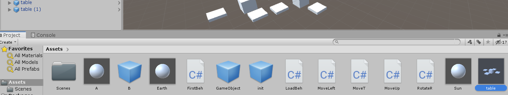

# **离散仿真引擎基础-作业与练习**

## **前言**  
这是中山大学数据科学与计算机学院2019年3D游戏编程与设计的第二次作业  
所有项目与代码已上传至github当中，欢迎大家访问。  
github个人主页: [https://starashzero.github.io](https://starashzero.github.io)  
3D游戏编程与设计主页: [https://starashzero.github.io/3DGameDesign](https://starashzero.github.io/3DGameDesign)  
本次作业项目地址: [https://github.com/StarashZero/3DGameDesign/tree/master/hw2](https://github.com/StarashZero/3DGameDesign/tree/master/hw2)  


## **1、简答题【建议做】**

**解释游戏对象（GameObjects）和 资源（Assets）的区别与联系。**  
**答:**  
* **区别:**    
    - 游戏对象：对象是具有一定属性与功能的事物的实体化。游戏对象就是在游戏过程中承担一部分职能并携带一定属性的组件，例如游戏角色、怪物、BOSS、地形等等。  
    - 资源: 资源是由我们预先准备好的素材，在创作游戏时可以直接迁移、重复使用。  

* **联系:**   
    资源可以作为游戏对象创建的模板或者一部分，而游戏对象可以被保存为资源以重复使用。  

**下载几个游戏案例，分别总结资源、对象组织的结构（指资源的目录组织结构与游戏对象树的层次结构）**  
**答:** 
* **资源目录结构**  
    从[爱给网](http://www.aigei.com/game-code/code/unity3d/)上下载了[BananaClicker](http://fd.aigei.com/pkg/code/zip/75/75afcc482daa45499115af81617b1658.zip?download/unity%E6%94%BE%E7%BD%AE%E7%B1%BB%E6%B8%B8%E6%88%8F%E3%80%8A+Banana+Clicker%E3%80%8B%E6%BA%90%E7%A0%81I_%E7%88%B1%E7%BB%99%E7%BD%91_aigei_com.zip&e=1568154960&token=P7S2Xpzfz11vAkASLTkfHN7Fw-oOZBecqeJaxypL:A8eYwFJC7PyCQU1VpTt7wrVti9I=)的游戏源码，点开可以看到如下
      
    因资源目录当中包括场景(Scenes)、动画(Animations)、预设(Prefabs)、脚本(Screpts)、精灵(Sprites)等等。  
    资源目录可以根据实际需要进行增减，比较典型的模型、材料等目录。  

* **对象组织的目录结构**
      
    对象组织的目录结构比较简单，包括摄像头、光源以及自己创建的游戏对象等，在目录中可以点开查看对象的子对象等。  


**编写一个代码，使用 debug 语句来验证 [MonoBehaviour](https://docs.unity3d.com/ScriptReference/MonoBehaviour.html) 基本行为或事件触发的条件**  
- 基本行为包括 Awake() Start() Update() FixedUpdate() LateUpdate()
- 常用事件包括 OnGUI() OnDisable() OnEnable()  

**答:**  
代码:  
```c#
    // Start is called before the first frame update
    void Start()
    {
        Debug.Log("Start");
    }

    // Update is called once per frame
    void Update()
    {
        Debug.Log("Update");
    }

    private void Awake()
    {
        Debug.Log("Awake");
    }

    private void FixedUpdate()
    {
        Debug.Log("FixedUpdate");
    }

    private void LateUpdate()
    {
        Debug.Log("LateUpdate");
    }

    private void OnGUI()
    {
        Debug.Log("OnGUI");
    }

    private void OnDisable()
    {
        Debug.Log("OnDisable");
    }

    private void OnEnable()
    {
        Debug.Log("OnEnable");
    }
```  
运行时输出:  
  

**查找脚本手册，了解 [GameObject](https://docs.unity3d.com/ScriptReference/GameObject.html)，Transform，Component 对象**  
* **分别翻译官方对三个对象的描述（Description）**  
    **答:**
    - GameObject: Unity场景中所有实体的基类  
    - Transform: 物体的位置，选择角度及比例  
    - Component: 所有附加在GameObject上的事物的基类  
* **描述下图中 table 对象（实体）的属性、table 的 Transform 的属性、 table 的部件**
    - 本题目要求是把可视化图形编程界面与 Unity API 对应起来，当你在 Inspector 面板上每一个内容，应该知道对应 API。
    - 例如：table 的对象是 GameObject，第一个选择框是 activeSelf 属性。    
    **答:**  
      
    table的对象是GameObject  
    **属性:**    
    第一行: 左边选择框的属性是activeSelf, 中间文本框是对象的名称，右边选择框的属性是static  
    第二行: 左边为Tag属性，可以对对象进行标记状态，右边为Layer，可以选择对象的框架  
    第三行: 为预设属性  
    **Transform:**  
    第一行: 为位置，设置对象的x、y、z坐标  
    第二行: 为旋转角度，设置对象关于x、y、z轴的旋转角度  
    第三行: 为比例，设置对象长宽高的大小  
    **部件:**  
    部件包括Transform、Cube等，可以通过Add Component进行增加  

**用 UML 图描述 三者的关系（请使用 UMLet 14.1.1 stand-alone版本出图）**  
  

**整理相关学习资料，编写简单代码验证以下技术的实现：**  
- **查找对象**  
查找Sun对象代码:
    ```c#
    GameObject findSun = GameObject.Find("Sun");
    if (findSun != null)
        Debug.Log("Sun exited!");
    ```
      
- **添加子对象**  
创建新对象代码  
    ```c#
        GameObject newObj = GameObject.CreatePrimitive(PrimitiveType.Cube);
        newObj.transform.position = new Vector3(0, 1, 0);
        newObj.transform.parent = this.transform;
    ```  
      
- **遍历对象树**  
遍历对象树代码(先序遍历):  
    ```c#
        void overChild(Transform root)
        {
            Debug.Log(root.name);
            foreach (Transform child in root.transform)
            {
                overChild(child);
            }
        }
    ```
      
- **清除所有子对象**  
清除子对象代码:  
    ```c#
        foreach (Transform child in this.transform)
        {
            Destroy(child.gameObject);
        }
    ```  
      
**资源预设（Prefabs）与 对象克隆 (clone)**
    - **预设（Prefabs）有什么好处？**  
    预设有利于资源重用，减少工作量。当我们需要重复用到一个对象或者需要重复用到一组数据时，我们可以预设一个对象作为模板承担相同的属性，就可以很方便的重复使用这个对象了。  
    - **预设与对象克隆 (clone or copy or Instantiate of Unity Object) 关系？**  
    预设当中产生的对象与预设的对象是联系的，当修改预设时，它产生出来的对象也会被修改。  
    而克隆中，母体和子体是独立的，相互不干扰。  
    - **制作table预制，写一段代码将table预制资源实例化成游戏对象**  
    将物体移动至下方Asserts当中生成预设体，再将预设体移回对象目录中生成游戏对象    
      
    修改预设体的属性，如图将立方体变为柱体    
      
    可以看到所有生成的子对象都自动变成柱体了  
      
## **2、 编程实践，小游戏**

* 游戏内容： 井字棋 或 贷款计算器 或 简单计算器 等等
* 技术限制： 仅允许使用 **[IMGUI](https://docs.unity3d.com/Manual/GUIScriptingGuide.html)** 构建 UI
* 作业目的： 
    - 了解 OnGUI() 事件，提升 debug 能力
    - 提升阅读 API 文档能力 

为了减少篇幅，请移步另一篇博客[unity实现井字棋小游戏](game)  
项目地址:  [https://github.com/StarashZero/3DGameDesign/tree/master/hw2](https://github.com/StarashZero/3DGameDesign/tree/master/hw2)

## **3、思考题【选做】**

**微软 XNA 引擎的 Game 对象屏蔽了游戏循环的细节，并使用一组虚方法让继承者完成它们，我们称这种设计为“模板方法模式”。**
- **为什么是“模板方法”模式而不是“策略模式”呢？**  
**答:**   
模板方法更接近于一项规则，为程序的算法规定一套流程也就是模板，代码需要遵循这个模板来编写，通过修改流程每个部分内部的实现来改变功能。  
而策略模式更强调的是内部变化与外部的分离，及内部的修改不会影响到外部其他部分的功能。  

**将游戏对象组成树型结构，每个节点都是游戏对象（或数）。**
- **尝试解释组合模式（Composite Pattern / 一种设计模式）.**  
**答:**  
组合模式描述了一组被作为一个单一实例来统一对待的对象，目的是将具有相似特征的对象组合在一起形成"部分-整体"的层次结构，使得它们被组合成树结构。组合模式使得客户端可以将一组对象统一的处理。  
- **使用 BroadcastMessage() 方法，向子对象发送消息。你能写出 BroadcastMessage() 的伪代码吗?**    
    伪代码:
    ```c#
        void BoradcastMessage(string message){
            foreach (child of this){
                if (child.hasFunction(message))
                    child.stringToFunction(message);
            }
        }
    ```
**一个游戏对象用许多部件描述不同方面的特征。我们设计坦克（Tank）游戏对象不是继承于GameObject对象，而是 GameObject 添加一组行为部件（Component）。**
- **这是什么设计模式？**  
桥接(Bridge)模式
- **为什么不用继承设计特殊的游戏对象？**  
1. 过多的继承容易导致类与类之间结构混乱。  
2. 使用桥接模式更有利于同一各组件的接口，统一管理不同类相同行为组件的属性，又不会导致组合爆炸。  
3. 桥接模式中，当部分功能被修改时，不会影响到外部其他部件的功能。  