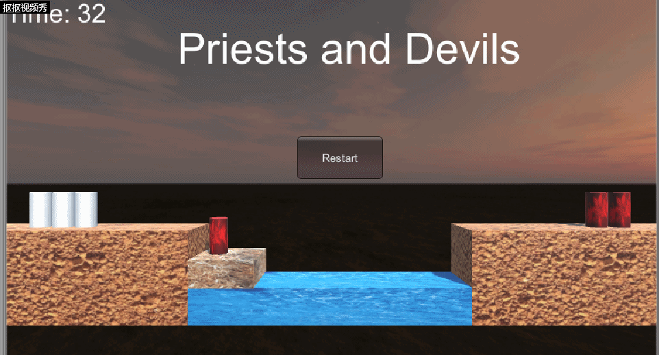

# **Unity实现Priests and Deivls游戏**  
## **前言**  
这是中山大学数据科学与计算机学院2019年3D游戏编程与设计的第三次作业  
所有项目与代码已上传至github当中，欢迎大家访问。  
github个人主页: [https://starashzero.github.io](https://starashzero.github.io)  
3D游戏编程与设计主页: [https://starashzero.github.io/3DGameDesign](https://starashzero.github.io/3DGameDesign)  
本次作业项目地址: [https://github.com/StarashZero/3DGameDesign/tree/master/hw3](https://github.com/StarashZero/3DGameDesign/tree/master/hw3)  
## **游戏简介**  
3个牧师与3个恶魔要过河，需要将牧师安全的运过去。河中有一条船，每次最多只能运两个人过河，如果任意一边的恶魔数量大于牧师数量，牧师就会被杀死。   
  
(界面略丑，没有艺术细胞真是抱歉了，嘛，不是重点)  

## **游戏玩法** 
点击牧师(白色圆柱)、恶魔(红色圆柱)可以让它们上船、上岸。  
点击船(水面上的方块)可以让船移动。  

## **游戏规则**  
1. 任意一边的牧师数量不能小于恶魔数量(船上的牧师和恶魔也会被计算)，除非牧师数目为0。  
2. 船上必须有人才能使船移动。  
3. 没有反悔选项(防止作弊)，一旦游戏结束只能重来.  
4. 游戏限时60s.  
5. 当三个牧师都到了右边河岸，游戏胜利.  

## **游戏试玩**  
  
   
## **项目要求**  
参考[潘老师的博客第三章](https://pmlpml.github.io/unity3d-learning/03-space-and-motion)最后一部分  
关于程序的要求如下:   
1. 请将游戏中对象做成预制  
2. 在GenGameObjects中创建长方形、正方形、球及其色彩代表游戏中的对象。  
3. 使用C#集合类型有效组织对象
4. 整个游戏仅主摄像机和一个 Empty 对象，其他对象必须代码动态生成！！！ 。 整个游戏不许出现 Find 游戏对象， SendMessage这类突破程序结构的 通讯耦合 语句违背本条准则，不给分
5. 请使用课件架构图编程，不接受非 MVC 结构程序
6. 注意细节，例如：船未靠岸，牧师与魔鬼上下船运动中，均不能接受用户事件！  

在编写程序时均按照上述要求编写，不过对于要求3，我选择的是直接用数组来组织对象，因为我觉得这是最合适、效率较高的。  

## **项目代码结构**  
游戏对象事先做成预制  
  
项目的程序代码采用MVC结构，根据功能将代码文件分别放入Controllers, Models, Views文件夹中。  
  
  
  
  
为了方便理解，我准备了一个UML图来解释各文件之间的关系(部分借鉴了潘老师的图，偷偷懒)。  

(~~MVC确实好用，好用就好用在它能加速掉发~~)  
大体结构是按照课程网站来做的，所有游戏对象的数据被储存在各自model对象当中。新增部分的解释如下:  
1. 在游戏中可能会变更数据的model都分配了一个各自的controller来管理大部分数据变更。  
2. 人物和船具有可被点击的属性，因此其controller需要实现ClickAction的接口，以此来处理点击事件。  
3. 游戏中物体的移动由MoveController统一管理，其携带一个Move脚本。  
4. 游戏所有物体的特殊位置信息储存在PositionModel当中，PositionModel中的数据均为静态类型，因此可以全局访问。  

除了UML图里的文件，还有一个MoveCamera.cs脚本，这个脚本只是用来移动主摄像机的位置而已，因此不在程序结构之中。  

## **各部分代码解释**  
### **Models:**
首先是Models部分，Models当中主要用于存储游戏对象的各种数据，只携带初始化函数，变更数据通过Controller。  
1. **RoleModel.cs**  
    ```java
    public class RoleModel{ 
        public GameObject role;             //角色的游戏对象
        public bool isPriest;               //区分角色是牧师还是恶魔
        public int tag;                     //给对象标号，方便查找
        public bool isRight;                //区分角色是在左侧还是右侧
        public bool isInBoat;               //区分角色是在船上还是在岸上

        //初始化函数
        public RoleModel(Vector3 position, bool isPriest, int tag)
        {
            this.isPriest = isPriest;
            this.tag = tag;
            isRight = false;
            isInBoat = false;
            role = GameObject.Instantiate(Resources.Load("Prefabs/"+(isPriest?"priest":"devil"), typeof(GameObject))) as GameObject;
            role.transform.localScale = new Vector3(1,1,1);
            role.transform.position = position;
            role.name = "role" + tag;
            role.AddComponent<Click>();
            role.AddComponent<BoxCollider>();
        }
    }
    ```  
    存储游戏当中角色（牧师、恶魔）的相关信息。  
    定义了一个初始化函数，参数设置对象的位置、角色类型和标号，函数中会调用预制生成对象，并进行一些参数设置(位置、碰撞、点击等)。  
2. **BoatModel.cs**  
    ```java
    public class BoatModel {
        public GameObject boat;                     //船对象
        public RoleModel[] roles;                   //船上的角色的指针
        public bool isRight;                        //判断船在左侧还是右侧
        public int priestNum, devilNum;             //船上牧师与恶魔的数量

        public BoatModel(Vector3 position)
        {
            priestNum = devilNum = 0;
            roles = new RoleModel[2];
            boat = GameObject.Instantiate(Resources.Load("Prefabs/boat", typeof(GameObject))) as GameObject;
            boat.name = "boat";
            boat.transform.position = position;
            boat.transform.localScale = new Vector3(4, (float)1.5, 3);
            boat.AddComponent<BoxCollider>();
            boat.AddComponent<Click>();
            isRight = false;
        }
    }
    ```
    储存船的相关信息。  
    定义了一个初始化函数，参数设置船的初始位置，此外会为船附加碰撞和点击属性。  
3. **LandModel.cs**  
    ```java
    public class LandModel
    {
        public GameObject land;                     //岸的游戏对象
        public int priestNum, devilNum;             //岸上牧师与恶魔的数量
        public LandModel(string name, Vector3 position)
        {
            priestNum = devilNum = 0;
            land = GameObject.Instantiate(Resources.Load("Prefabs/land", typeof(GameObject))) as GameObject;
            land.name = name;
            land.transform.position = position;
            land.transform.localScale = new Vector3(13,5,3);
        }
    }
    ```  
    储存岸的相关信息。  
    初始化函数的参数设置岸的名字（左岸或者右岸）和位置。  
4. **RiverModel.cs**  
    ```java
    public class RiverModel
    {
        private GameObject river;               //河流的游戏对象

        public RiverModel(Vector3 position)
        {
            river = Object.Instantiate(Resources.Load("Prefabs/river", typeof(GameObject))) as GameObject;
            river.name = "river";
            river.transform.position = position;
            river.transform.localScale = new Vector3(15, 2, 3);
        }
    }
    ```  
    储存河流的相关信息。  
    初始化函数的参数设置河流的位置。  
5. **PositionModel.cs**  
    ```java
    public class PositionModel
    {
        public static Vector3 right_land = new Vector3(15, -4, 0);                  //右侧岸的位置
        public static Vector3 left_land = new Vector3(-13, -4, 0);                  //左侧岸的位置
        public static Vector3 river = new Vector3(1, -(float)5.5, 0);               //河流的位置
        public static Vector3 right_boat = new Vector3(7, -(float)3.8, 0);          //船在右边的位置
        public static Vector3 left_boat = new Vector3(-5, -(float)3.8, 0);          //船在左边的位置
        //角色在岸上的相对位置(6个)
        public static Vector3[] roles = new Vector3[]{new Vector3((float)-0.2, (float)0.7, 0) ,new Vector3((float)-0.1, (float)0.7,0),
        new Vector3(0, (float)0.7,0),new Vector3((float)0.1, (float)0.7,0),new Vector3((float)0.2, (float)0.7,0),new Vector3((float)0.3, (float)0.7,0)};
        //角色在船上的相对位置(2个)
        public static Vector3[] boatRoles = new Vector3[] { new Vector3((float)-0.1, (float)1.2, 0), new Vector3((float)0.2, (float)1.2, 0) };
    }
    ```
    储存游戏当中对象的特殊位置，包括两侧岸的位置，河流位置，船在两侧的位置，角色在岸及船上的位置等。  

6. **Click.cs**  
    ```java
    public class Click : MonoBehaviour
    {
        ClickAction clickAction;

        public void setClickAction(ClickAction clickAction)
        {
            this.clickAction = clickAction;
        }

        void OnMouseDown()
        {
            clickAction.DealClick();
        }
    }
    ```
    Click脚本，用来给物体附带点击属性，携带一个ClickAction类型的接口成员，当物体被点击时会通过这个接口来处理点击事件。  
7. **ClickAction.cs**  
    ```java
    public interface ClickAction
    {
        void DealClick();
    }
    ```
    ClickAction接口，通过这个接口来调用处理点击事件的函数DealClick()  

以上就是Models部分的代码  

### Controllers:
Controllers当中的代码主要实现游戏的主要逻辑，原则上所有的功能函数在Controllers当中实现。  
Controllers可以直接读取修改Models和Views当中的数据，FirstController是游戏的主控制器，其负责主体框架代码以及协调副Controllers(RoleModelController等)之间的工作。  
1. **RoleModelController.cs**  
    ```java
    public class RoleModelController :ClickAction
    {
        RoleModel roleModel;                                       
        IUserAction userAction;                                     

        public RoleModelController()
        {
            userAction = SSDirector.GetInstance().CurrentSenceController as IUserAction;
        }

        public void CreateRole(Vector3 position, bool isPriest, int tag)
        {
            if (roleModel != null)
                Object.DestroyImmediate(roleModel.role);
            roleModel = new RoleModel(position, isPriest, tag);
            roleModel.role.GetComponent<Click>().setClickAction(this);
        }

        public RoleModel GetRoleModel()
        {
            return roleModel;
        }

        public void DealClick()
        {
            userAction.MoveRole(roleModel);
        }
    }
    ```
    RoleModelController主要用来处理RoleModel的事件，其实现了ClickAction的接口，并且携带了IUserAction的接口成员。  
    CreateRole()函数用于创建或者初始化RoleModel  
    GetRoleModel()会返回controller管理的RoleModel  
    DealClick()处理RoleModel的点击事件
2. **BoatController.cs**  
    ```java
    public class BoatController : ClickAction
    {
        BoatModel boatModel;
        IUserAction userAction;

        public BoatController()
        {
            userAction = SSDirector.GetInstance().CurrentSenceController as IUserAction;
        }
        public void CreateBoat(Vector3 position)
        {
            if (boatModel != null)
                Object.DestroyImmediate(boatModel.boat);
            boatModel = new BoatModel(position);
            boatModel.boat.GetComponent<Click>().setClickAction(this);
        }

        public BoatModel GetBoatModel()
        {
            return boatModel;
        }

        //将角色加到船上，返回接下来角色应该到达的位置
        public Vector3 AddRole(RoleModel roleModel)
        {
            //船上有两个位置，分别判断两个位置是否为空
            if (boatModel.roles[0] == null)
            {
                boatModel.roles[0] = roleModel;
                roleModel.isInBoat = true;
                roleModel.role.transform.parent = boatModel.boat.transform;
                if (roleModel.isPriest)
                    boatModel.priestNum++;
                else
                    boatModel.devilNum++;
                return PositionModel.boatRoles[0];

            }
            if (boatModel.roles[1] == null)
            {
                boatModel.roles[1] = roleModel;
                roleModel.isInBoat = true;
                roleModel.role.transform.parent = boatModel.boat.transform;
                if (roleModel.isPriest)
                    boatModel.priestNum++;
                else
                    boatModel.devilNum++;
                return PositionModel.boatRoles[1];
            }
            return roleModel.role.transform.localPosition;
        }

        //将角色从船上移除
        public void RemoveRole(RoleModel roleModel)
        {
            //船上有两个位置,分别判断两个位置当中有没有要移除的角色
            if (boatModel.roles[0] == roleModel)
            {
                boatModel.roles[0] = null;
                if (roleModel.isPriest)
                    boatModel.priestNum--;
                else
                    boatModel.devilNum--;
            }
            if (boatModel.roles[1] == roleModel)
            {
                boatModel.roles[1] = null;
                if (roleModel.isPriest)
                    boatModel.priestNum--;
                else
                    boatModel.devilNum--;
            }
        }

        public void DealClick()
        {
            if (boatModel.roles[0] != null || boatModel.roles[1] != null)
                userAction.MoveBoat();
        }
    }
    ```
    BoatController处理有关Boat的事件，其实现了ClickAction的接口，并且携带了IUserAction的接口成员。  
    CreateBoat()用于创建或者初始化BoatModel  
    GetBoatModel()用于返回所管理的BoatModel
    AddRole()处理人物上船的一些数据变动  
    RemoveRole()处理人物下船时的一些数据变动  
    DealClick()处理船被点击的事件  
3. **LandModelController.cs**  
    ```java
    public class LandModelController
    {
        private LandModel landModel;

        public void CreateLand(string name, Vector3 position)
        {
            if (landModel==null)
                landModel = new LandModel(name, position);
            landModel.priestNum = landModel.devilNum = 0;
        } 

        public LandModel GetLandModel()
        {
            return landModel;
        }

        //将人物添加到岸上，返回角色在岸上的相对坐标
        public Vector3 AddRole(RoleModel roleModel)
        {
            if (roleModel.isPriest)
                landModel.priestNum++;
            else
                landModel.devilNum++;
            roleModel.role.transform.parent = landModel.land.transform;
            roleModel.isInBoat = false;
            return PositionModel.roles[roleModel.tag];
        }

        //将角色从岸上移除
        public void RemoveRole(RoleModel roleModel)
        {
            if (roleModel.isPriest)
                landModel.priestNum--;
            else
                landModel.devilNum--;
        }
    }
    ```
    LandModelController处理Land的有关事件。  
    CreateLand()用于创建或初始化LandModel  
    AddRole()用于将人物添加到岸上  
    RemoveRole()用于将人物从岸上移除  

4. **Move.cs**  
    ```java
    public class Move : MonoBehaviour
    {
        public bool isMoving = false;                   //判断当前对象是否在移动
        public float speed = 5;                         //移动速度
        public Vector3 destination;                     //目的地
        public Vector3 mid_destination;                 //中转地址   

        void Update()
        {
            //已到达目的地，不进行移动
            if (transform.localPosition == destination)
            {
                isMoving = false;
                return;
            }

            isMoving = true;
            if (transform.localPosition.x != destination.x && transform.localPosition.y != destination.y)
            {
                //还未到达中转地址，向中转地址移动
                transform.localPosition = Vector3.MoveTowards(transform.localPosition, mid_destination, speed * Time.deltaTime);
            }
            else
            {
                //以到达中转地址，向目的地移动
                transform.localPosition = Vector3.MoveTowards(transform.localPosition, destination, speed * Time.deltaTime);
            }
        }
    }
    ```
    Move为移动脚本，给对象附带移动属性。  
    为了避免穿模现象，为移动设置了一个中转地址，通过对象x,y坐标与中转地址的x,y坐标的关系来判断该往哪移动。  
5. **MoveController.cs**  
    ```java
    public class MoveController
    {
        private GameObject moveObject;                      //移动对象

        //判断当前是否在移动
        public bool GetIsMoving()
        {
            return (moveObject != null && moveObject.GetComponent<Move>().isMoving);
        }

        //设置新的移动
        public void SetMove(Vector3 destination, GameObject moveObject)
        {
            //判断新的对象是否已携带Move脚本,若不携带，则为其添加
            Move test;
            this.moveObject = moveObject;
            if (!moveObject.TryGetComponent<Move>(out test))
                moveObject.AddComponent<Move>();
            //设置目的地
            this.moveObject.GetComponent<Move>().destination = destination;
            //设置中转地址
            if (this.moveObject.transform.localPosition.y > destination.y)
                this.moveObject.GetComponent<Move>().mid_destination = new Vector3(destination.x, this.moveObject.transform.localPosition.y, destination.z);
            else
                this.moveObject.GetComponent<Move>().mid_destination = new Vector3(this.moveObject.transform.localPosition.x, destination.y, this.moveObject.transform.localPosition.z);
        }
    }
    ```
    MoveController控制游戏的移动事件。  
    GetIsMoving()返回当前是否在移动的状态(有物体在移动时，外部不允许其他操作)   
    SetMove()为对象设置移动属性
6. **SSDirector.cs**  
    ```java
    public class SSDirector : System.Object
    {
        private static SSDirector _instance;
        public ISceneController CurrentSenceController { get; set; }
        public static SSDirector GetInstance()
        {
            if (_instance == null)
            {
                _instance = new SSDirector();
            }
            return _instance;
        }
    }
    ```
    导演类，主要用于获得主控制器  
7. **ISceneController.cs**
    ```java
    public interface ISceneController
    {
        void LoadResources();    
    }
    ```
    场景控制器接口，需要实现导入资源的函数。
8. **IUserAction.cs**
    ```java
    public interface IUserAction
    {
        void MoveBoat();
        void MoveRole(RoleModel roleModel);
        void Restart();

        void Check();
    }
    ```
    用户交互接口，需要实现移动船、移动人物、重开、检查游戏状态的函数。  
9. **FirstController.cs**  
    ```java
    public class FirstController : MonoBehaviour, ISceneController, IUserAction
    ```
    FirstController作为游戏的主控制器，负责游戏主要运行逻辑以及协调各控制器之间的工作。  
    ```java
    private LandModelController rightLandRoleController;                        //右岸控制器
    private LandModelController leftLandRoleController;                         //左岸控制器
    private RiverModel riverModel;                                              //河流Model
    private BoatController boatRoleController;                                  //船控制器
    private RoleModelController[] roleModelControllers;                         //人物控制器集合
    private MoveController moveController;                                      //移动控制器
    private bool isRuning;                                                      //游戏进行状态
    private float time;                                                         //游戏进行时间
    ```
    主控制器的成员变量，包括各副控制器、河流Model、游戏进行状态和游戏进行时间。  
    ```java
        //导入资源
    public void LoadResources()
    {
        //人物初始化
        roleModelControllers = new RoleModelController[6];
        for (int i = 0; i < 6; i++)
        {
            roleModelControllers[i] = new RoleModelController();
            roleModelControllers[i].CreateRole(PositionModel.roles[i], i < 3 ? true : false, i);
        }
        //左右岸初始化
        leftLandRoleController = new LandModelController();
        leftLandRoleController.CreateLand("left_land", PositionModel.left_land);
        rightLandRoleController = new LandModelController();
        rightLandRoleController.CreateLand("right_land", PositionModel.right_land);
        //将人物添加并定位至左岸  
        foreach (RoleModelController roleModelController in roleModelControllers)
        {
            roleModelController.GetRoleModel().role.transform.localPosition = leftLandRoleController.AddRole(roleModelController.GetRoleModel());
        }
        //河流Model实例化
        riverModel = new RiverModel(PositionModel.river);
        //船初始化
        boatRoleController = new BoatController();
        boatRoleController.CreateBoat(PositionModel.left_boat);
        //移动控制器实例化
        moveController = new MoveController();
        //数据初始化
        isRuning = true;
        time = 60;
    }
    ```
    LoadResources用于导入场景需要的资源。  
    函数内部会对各控制器、Model、变量进行初始化。  
    ```java
        //移动船
    public void MoveBoat()
    {
        //判断当前游戏是否在进行，同时是否有对象正在移动
        if ((!isRuning) || moveController.GetIsMoving())
            return;
        //判断船在左侧还是右侧
        if (boatRoleController.GetBoatModel().isRight)
            moveController.SetMove(PositionModel.left_boat, boatRoleController.GetBoatModel().boat);
        else
            moveController.SetMove(PositionModel.right_boat, boatRoleController.GetBoatModel().boat);
        //移动后，将船的位置取反
        boatRoleController.GetBoatModel().isRight = !boatRoleController.GetBoatModel().isRight;
    }
    ```
    MoveBoat实现船的移动。  
    首先判断是否可以移动，接着将船移向相反的位置。   
    ```java
        //游戏重置
    public void Restart()
    {
        //对各数据进行初始化
        time = 60;
        leftLandRoleController.CreateLand("left_land", PositionModel.left_land);
        rightLandRoleController.CreateLand("right_land", PositionModel.right_land);
        for (int i = 0; i < 6; i++)
        {
            roleModelControllers[i].CreateRole(PositionModel.roles[i], i < 3 ? true : false, i);
            roleModelControllers[i].GetRoleModel().role.transform.localPosition = leftLandRoleController.AddRole(roleModelControllers[i].GetRoleModel());
        }
        boatRoleController.CreateBoat(PositionModel.left_boat);
        isRuning = true;
    }
    ```
    Restart用于重置游戏，对成员变量进行初始化，以及调用各控制器的初始化函数。  
    ```java
        //检测游戏状态
    public void Check()
    {
        if (!isRuning)
            return;
        this.gameObject.GetComponent<UserGUI>().gameMessage = "";
        //判断是否已经胜利
        if (rightLandRoleController.GetLandModel().priestNum == 3)
        {
            this.gameObject.GetComponent<UserGUI>().gameMessage = "You Win!";
            isRuning = false;
        }
        else
        {
            //判断是否已经失败
            /*
             leftPriestNum: 左边牧师数量
             leftDevilNum: 左边恶魔数量
             rightPriestNum: 右边牧师数量
             rightDevilNum: 右边恶魔数量
             若任意一侧，牧师数量不为0且牧师数量少于恶魔数量，则游戏失败
             */
            int leftPriestNum, leftDevilNum, rightPriestNum, rightDevilNum;
            leftPriestNum = leftLandRoleController.GetLandModel().priestNum + (boatRoleController.GetBoatModel().isRight ? 0 : boatRoleController.GetBoatModel().priestNum);
            leftDevilNum = leftLandRoleController.GetLandModel().devilNum + (boatRoleController.GetBoatModel().isRight ? 0 : boatRoleController.GetBoatModel().devilNum);
            if (leftPriestNum != 0 && leftPriestNum < leftDevilNum)
            {
                this.gameObject.GetComponent<UserGUI>().gameMessage = "Game Over!";
                isRuning = false;
            }
            rightPriestNum = rightLandRoleController.GetLandModel().priestNum + (boatRoleController.GetBoatModel().isRight ? boatRoleController.GetBoatModel().priestNum : 0);
            rightDevilNum = rightLandRoleController.GetLandModel().devilNum + (boatRoleController.GetBoatModel().isRight ? boatRoleController.GetBoatModel().devilNum : 0);
            if (rightPriestNum != 0 && rightPriestNum < rightDevilNum)
            {
                this.gameObject.GetComponent<UserGUI>().gameMessage = "Game Over!";
                isRuning = false;
            }
        }
    }
    ```
    Check用于检测当前游戏是否胜利或者失败。  
    ```java
    void Awake()
    {
        SSDirector.GetInstance().CurrentSenceController = this;
        LoadResources();
        this.gameObject.AddComponent<UserGUI>();
    }
    ```
    Awake对FirstController进行初始化  
    ```java
    void Update()
    {
        if (isRuning)
        {
            time -= Time.deltaTime;
            this.gameObject.GetComponent<UserGUI>().time = (int)time;
            if (time <= 0)
            {
                this.gameObject.GetComponent<UserGUI>().time = 0;
                this.gameObject.GetComponent<UserGUI>().gameMessage = "Game Over!";
                isRuning = false;
            }
        }
    }
    ```
    Update用于游戏计时，每次调用都会减去一帧的时间。  
10. MoveCamera.cs  
    ```java
    public class MoveCamera : MonoBehaviour
    {
        void Start()
        {
            transform.position = new Vector3((float)1.11,1, (float)-18.32);        
        }
    }
    ```
    MoveCamera是给主摄像机的脚本，只是调整了主摄像机的位置。 

### **Views:**  
Views搭建游戏的UI，其中只有UserGUI一个文件，用来设置UI和接收用户交互。  
```java
public class UserGUI : MonoBehaviour
{
    private IUserAction userAction;
    public string gameMessage;
    public int time;
    void Start()
    {
        time = 60;
        userAction = SSDirector.GetInstance().CurrentSenceController as IUserAction;
    }

    void OnGUI()
    {
        userAction.Check();
        //小字体初始化
        GUIStyle style = new GUIStyle();
        style.normal.textColor = Color.white;
        style.fontSize = 30;

        //大字体初始化
        GUIStyle bigStyle = new GUIStyle();
        bigStyle.normal.textColor = Color.white;
        bigStyle.fontSize = 50;

        GUI.Label(new Rect(200, 30, 50, 200), "Priests and Devils", bigStyle);

        GUI.Label(new Rect(320, 100, 50, 200), gameMessage, style);

        GUI.Label(new Rect(0, 0, 100, 50), "Time: " + time, style);

        if(GUI.Button(new Rect(340, 160, 100, 50), "Restart"))
        {
            userAction.Restart();
        }
    }
}
```
所有程序已经编写完成。  