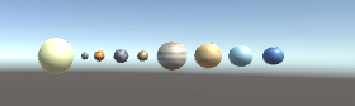
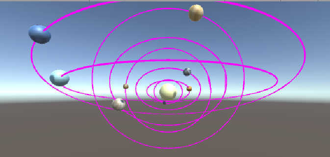

# **空间与运动-作业与练习**  
## **前言**  
这是中山大学数据科学与计算机学院2019年3D游戏编程与设计的第三次作业  
所有项目与代码已上传至github当中，欢迎大家访问。  
github个人主页: [https://starashzero.github.io](https://starashzero.github.io)  
3D游戏编程与设计主页: [https://starashzero.github.io/3DGameDesign](https://starashzero.github.io/3DGameDesign)  
本次作业项目地址: [https://github.com/StarashZero/3DGameDesign/tree/master/hw3](https://github.com/StarashZero/3DGameDesign/tree/master/hw3)  
## **1、简答并用程序验证【建议做】**

### **游戏对象运动的本质是什么？**  
游戏对象运动的本质是游戏对象Position、Rotate、Scale属性数值的变化  
### **请用三种方法以上方法，实现物体的抛物线运动。（如，修改Transform属性，使用向量Vector3的方法...）**  
1. 使用Vector3    
x方向速度保持不变，y方向每秒速度+1  
    ```java
    public int xSpeed = 1;  //单位时间x方向的位移量    
    public int ySpeed = 1;  //单位时间y方向的位移量    
    public int T = 1;       //时间
    void Update()
    {
        transform.position += Vector3.right * Time.deltaTime * xSpeed;
        transform.position += Vector3.down * Time.deltaTime * ySpeed * Time.deltaTime * T;
        T++;
    }
    ```  
2. 使用Transform.Translate  
    和方法1比较类似
    ```java
    public int xSpeed = 1;  //单位时间x方向的位移量    
    public int ySpeed = 1;  //单位时间y方向的位移量    
    public int T = 1;       //时间
    void Update()
    {
        transform.Translate(Vector3.right * Time.deltaTime * xSpeed + Vector3.down * Time.deltaTime * ySpeed * Time.deltaTime * T);
        T++;
    }
    ```  
3. 直接修改transform   
    利用x方向和y方向变化值的关系 
    ```java
    public int speed = 2;

    void Update()
    {
        transform.position += new Vector3(Time.deltaTime * speed, -Time.deltaTime * speed * (2 * transform.position.x + Time.deltaTime * speed), 0);
    }
    ```
### **写一个程序，实现一个完整的太阳系， 其他星球围绕太阳的转速必须不一样，且不在一个法平面上。**
太阳系程序比较简单，因为在课堂上已经有讲过并且练习过，只需要编写一个RotatoRound的脚本，让行星绕着太阳的位置旋转即可。
```java
    public GameObject center;
    public int speed;
    public int xAngle;
    public int yAngle;
    // Start is called before the first frame update
    void Start()
    {
        speed = (int)Random.Range(20, 80);
        xAngle = (int)Random.Range(0, 20);
        yAngle = (int)Random.Range(0, 20);
    }

    // Update is called once per frame
    void Update()
    {
        Vector3 angle = Vector3.up * xAngle + Vector3.forward * yAngle;
        transform.RotateAround(center.transform.position, angle, speed * Time.deltaTime);
    }
```  
题目中要求不在同一个法平面上，因此每个行星环绕的角度用随机数来取。  
**不过这里有一个要注意的点：**  
创建角度向量是用Vector3几个方向的向量相加，但是要特别注意行星初始位置与太阳的坐标关系。  
Vector3.up、Vector3.forward这些方向向量在RotateRound当中的效果是变化对象的两个坐标值，例如Vector3.up的效果是x、z值变化而y值不变，变化范围是由对象初始坐标与环绕中心坐标之间的差值决定的。  
因此这里就必须特别注意对象初始坐标与环绕中心坐标之间的关系，例如我设置8大行星与太阳的y值和z值是一样的。  
  

那么如果设置角度angle的时候用的是Vector3.right or left的话，就会出现自转而不是公转，因为对象初始坐标与太阳的y、z值相同，那么他们y、z值都是无法变化的（差值为0），这会导致对象在原地打转。  
与其他向量混合使用也会因为自转而导致公转轨道出错，所以不能出现Vector3.right or left。其他情况也是类似。  
  
在编写好脚本之后将脚本加到对象上，并把太阳设置为环绕中心即可，为了方便观察可给每个组件都加上Trail Renderer的组件  
  

## **2、编程实践**

### 阅读以下游戏脚本

> Priests and Devils
>
> Priests and Devils is a puzzle game in which you will help the Priests and Devils to cross the river within the time limit. There 
> are 3 priests and 3 devils at one side of the river. They all want to get to the other side of this river, but there is only one 
> boat and this boat can only carry two persons each time. And there must be one person steering the boat from one side to the other 
> side. In the flash game, you can click on them to move them and click the go button to move the boat to the other direction. If the 
> priests are out numbered by the devils on either side of the river, they get killed and the game is over. You can try it in many >
> ways. Keep all priests alive! Good luck!

程序需要满足的要求：

* play the game ( http://www.flash-game.net/game/2535/priests-and-devils.html )
* 列出游戏中提及的事物（Objects）  
    牧师(Priest)、恶魔(Devil)、河岸(Side)、河流(River)、船(Boat)  
* 用表格列出玩家动作表（规则表），注意，动作越少越好    

    玩家动作 | 游戏状态 | 结果  
    -|-|-|
    点击牧师/恶魔|牧师/恶魔在船上|牧师/恶魔移动到船处在的岸上
    点击牧师/恶魔|牧师/恶魔在岸上，船在这一侧的岸边且船上有空位|牧师/恶魔上船  
    点击船|船上有人|船移动到对岸  
    | |任意一岸的恶魔大于牧师且牧师数量不为0|游戏失败
    | |右侧岸上有三个牧师|游戏胜利

* 请将游戏中对象做成预制
* 在 GenGameObjects 中创建 长方形、正方形、球 及其色彩代表游戏中的对象。
* 使用 C# 集合类型 有效组织对象
* 整个游戏仅 主摄像机 和 一个 Empty 对象， **其他对象必须代码动态生成！！！** 。 整个游戏不许出现 Find 游戏对象， SendMessage 这类突破程序结构的 通讯耦合 语句。 **违背本条准则，不给分**
* 请使用课件架构图编程，**不接受非 MVC 结构程序**
* 注意细节，例如：船未靠岸，牧师与魔鬼上下船运动中，均不能接受用户事件！  
为了节省篇幅，游戏细节请移步[Unity实现Priests and Deivls游戏](game)