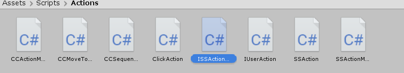
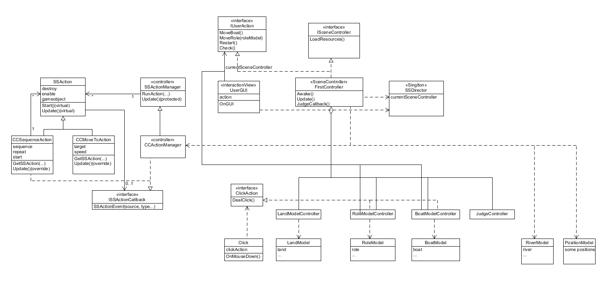
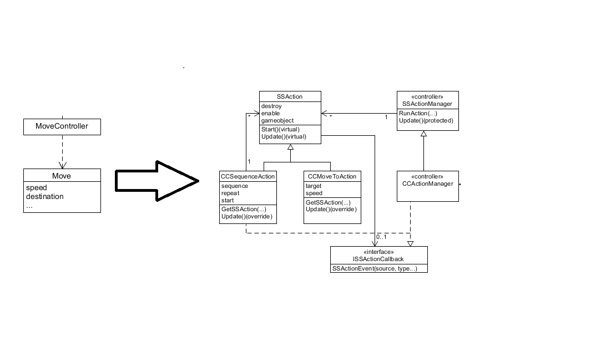
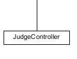

# **Unity实现Priests and Deivls动作分离版(V2)**  
## **前言**  
这是中山大学数据科学与计算机学院2019年3D游戏编程与设计的第四次作业  
所有项目与代码已上传至github当中，欢迎大家访问。  
github个人主页: [https://starashzero.github.io](https://starashzero.github.io)  
3D游戏编程与设计主页: [https://starashzero.github.io/3DGameDesign](https://starashzero.github.io/3DGameDesign)  
本次作业项目地址: [https://github.com/StarashZero/3DGameDesign/tree/master/hw4](https://github.com/StarashZero/3DGameDesign/tree/master/hw4)

## **项目新特性**  
V1版Priests and Deivls请参考[Unity实现Priests and Deivls游戏](../hw3/game)  
- 使用专用的对象来管理运动。在本游戏中的运动即对象的移动，现在对象的移动由动作管理器接手，而不是上一个版本的MoveController，现在不再需要为每个对象都加上Move.cs了.  
- 【2019新要求】：设计一个裁判类，当游戏达到结束条件时，通知场景控制器游戏结束.  
    现在游戏胜利与失败的条件均由JudgeController接管，FirstController新增处理JudgeController反馈的JudgeCallback函数，而取消了Check函数.  

## **项目结构**  
**新的代码文件：**  
在上个版本MVC的基础上，增加了Actions，以及JudgeController.  
  
**新的UML图：**  
  
<center>(尽力地与老师的UML无缝衔接了)</center>   

**新增结构解释：**     

+   旧动作管理主帅MoveController与其助手Move宣布下课!  
    由来自第四节课的CCActionManager及他的团队出任新帅。  
      
    现在游戏中所有的动作(其实只有移动)都与主控制器FirstController分离开来，FirstController通过调用CCActionManager的函数来触发动作。具体各部分的功能会在后面讲述。
+   判断游戏状态的功能从FirstController中分离，撤销了原有的Check函数引进裁判JudgeController专门处理这项事物。  
        

## **各部分代码解释**  
这里只解释新增或者出现改动的代码，其他代码请参考上一版本。  
### **Actions**  
大部分代码与老师课件是一致的，改动的地方我会指出。
1. **ISSActionCallback.cs**  
    ```java  
    public interface ISSActionCallback
    {
        //回调函数
        void SSActionEvent(SSAction source,
            SSActionEventType events = SSActionEventType.Competed,
            int intParam = 0,
            string strParam = null,
            Object objectParam = null);
    }
    ```  
    ISSActionCallback作用是作为向其他函数通信的接口，当一个动作有了结果需要向另一个函数传递这个信息，可通过SSActionEvent回调。  
    例如说船移动是一个动作，当船从一岸移动了到另一岸时表示动作结束。如果需要告诉管理者这个信息，那么就调用管理者的SSActionEvent(前提是管理者类实现了ISSActionCallback)进行处理。  
2. **SSAction.cs**  
    ```java  
    public class SSAction : ScriptableObject
    {
        public bool enable = true;
        public bool destroy = false;

        public GameObject gameObject { get; set; }
        public Transform transform { get; set; }
        public ISSActionCallback callback { get; set; }

        protected SSAction()
        {

        }

        // Start is called before the first frame update
        public virtual void Start()
        {
            throw new System.NotImplementedException();
        }

        // Update is called once per frame
        public virtual void Update()
        {
            throw new System.NotImplementedException();
        }
    }
    ```  
    + SSAction是动作类的基类，其继承了ScriptableObject，可以不绑定实体对象运作。  
    + gameObject为动作作用的实体对象。  
    + transform = gameObject.transform  
    + callback是回调接口，在1中已经解释过了，当动作类需要向别的类（大部分时候为调用这个动作的类）传递信息时，便需要通过ISSActionCallback接口。  
3.  **SSActionManager.cs**  
    ```java
    public class SSActionManager : MonoBehaviour
    {
        //动作集，以字典形式存在
        private Dictionary<int, SSAction> actions = new Dictionary<int, SSAction>();
        //等待被加入的动作队列(动作即将开始)
        private List<SSAction> waitingAdd = new List<SSAction>();
        //等待被删除的动作队列(动作已完成)
        private List<int> waitingDelete = new List<int>();

        protected void Update()
        {
            //将waitingAdd中的动作保存
            foreach (SSAction ac in waitingAdd)
                actions[ac.GetInstanceID()] = ac;
            waitingAdd.Clear();

            //运行被保存的事件
            foreach (KeyValuePair<int, SSAction> kv in actions)
            {
                SSAction ac = kv.Value;
                if (ac.destroy)
                {
                    waitingDelete.Add(ac.GetInstanceID());
                }else if (ac.enable)
                {
                    ac.Update();
                }
            }

            //销毁waitingDelete中的动作
            foreach (int key in waitingDelete)
            {
                SSAction ac = actions[key];
                actions.Remove(key);
                Destroy(ac);
            }
            waitingDelete.Clear();
        }

        //准备运行一个动作，将动作初始化，并加入到waitingAdd
        public void RunAction(GameObject gameObject, SSAction action, ISSActionCallback manager)
        {
            action.gameObject = gameObject;
            action.transform = gameObject.transform;
            action.callback = manager;
            waitingAdd.Add(action);
            action.Start();
        }

        // Start is called before the first frame update
        protected void Start()
        {

        }

    }
    ```  
    + SSActionManager是动作管理类的基类，作为动作生成、运行与销毁的管理者。  
    + actions以字典的形式存储正在运行中的动作。
    + waitingAdd保存即将被运行的动作。  
    + waitingDelete保存即将被删除的动作。
    + Update()每次会将waitingAdd中的动作加入到actions当中，然后遍历运行actions中的动作，如果动作已经结束，则加入到waitingDelete中，最后将waitingDelete中的动作删除并销毁。  
4. **CCMoveToAction.cs**
    ```java
    public class CCMoveToAction : SSAction
    {
        //目的地
        public Vector3 target;
        //速度
        public float speed;

        private CCMoveToAction()
        {

        }

        //生产函数(工厂模式)
        public static CCMoveToAction GetSSAction(Vector3 target, float speed)
        {
            CCMoveToAction action = ScriptableObject.CreateInstance<CCMoveToAction>();
            action.target = target;
            action.speed = speed;
            return action;
        }

        // Start is called before the first frame update
        public override void Start()
        {
            
        }

        // Update is called once per frame
        public override void Update()
        {
            //判断是否符合移动条件
            if (this.gameObject == null || this.transform.localPosition == target)
            {
                this.destroy = true;
                this.callback.SSActionEvent(this);
                return;
            }
            //移动
            this.transform.localPosition = Vector3.MoveTowards(this.transform.localPosition, target, speed * Time.deltaTime);
        }
    }
    ```  
    + CCMoveToAction是移动动作类，作用是将物体以一定速度(speed)移动到目的地(target)  
    + GetSSAction()是生成目标SSAction的函数，遵循工厂模式。 
    + 每次调用Update()会使得对象向目的地运动一段距离。  
    + **改动**:  
    对Update()进行了少量修改，在老师的代码基础上。  
        1. 将判断的语句放在了移动的前面，原因是因为在游戏重开时，也需要对移动动作删除，而我重开是依靠将游戏对象销毁再重新生成一个来实现的，因此需要判断游戏对象是否已经被销毁来判断动作是否被中断。  
        2. 将改变position变为改变localPosition，这样就支持相对坐标的移动了。
5. **CCSequenceAction.cs**  
    ```java
    public class CCSequenceAction : SSAction, ISSActionCallback
    {
        //动作序列
        public List<SSAction> sequence;
        //重复次数
        public int repeat = -1;
        //动作开始指针
        public int start = 0;

        //生产函数(工厂模式)
        public static CCSequenceAction GetSSAction(int repeat, int start, List<SSAction> sequence)
        {
            CCSequenceAction action = ScriptableObject.CreateInstance<CCSequenceAction>();
            action.repeat = repeat;
            action.start = start;
            action.sequence = sequence;
            return action;
        }

        //对序列中的动作进行初始化
        public override void Start()
        {
            foreach (SSAction action in sequence)
            {
                action.gameObject = this.gameObject;
                action.transform = this.transform;
                action.callback = this;
                action.Start();
            }
        }

        //运行序列中的动作
        public override void Update()
        {
            if (sequence.Count == 0)
                return;
            if (start < sequence.Count)
            {
                sequence[start].Update();
            }
        }

        //回调处理，当有动作完成时触发
        public void SSActionEvent(SSAction source,
            SSActionEventType events = SSActionEventType.Competed,
            int Param = 0,
            string strParam = null,
            Object objectParam = null)
        {
            source.destroy = false;
            this.start++;
            if (this.start >= sequence.Count)
            {
                this.start = 0;
                if (repeat > 0)
                    repeat--;
                if (repeat == 0)
                {
                    this.destroy = true;
                    this.callback.SSActionEvent(this);
                }
            }
        }

        void OnDestroy()
        {

        }
    }
    ```  
    + CCSequenceAction是组合动作类，其包含了一系列要进行的动作，并按顺序运行这些动作。  
    + 例如人上船，为了避免人物掉进地里，所以需要先让人平移、再让人垂直移动，这就是两个动作的组合，需要使用CCSequenceAction。  
    + sequence中是要执行的动作序列。  
    + start指向当前要进行的动作。
    + repeat表示动作序列需要重复执行的次数。  
    + GetSSAction作用与4一致。
    + Start()会将动作序列中的动作进行初始化。
    + 每次调用Update()将对序列中目前存在的所有动作执行一次。  
    + SSActionEvent是回调函数，因为CCSequenceAction是组合动作，因此需要获得每个动作执行状态的信息，当一个动作已经完成，就需要执行下一个动作，或者所有动作完成时销毁自己。  
    因此当CCSequenceAction中有一个动作完成时，就会调用SSActionEvent通知CCSequenceAction，如果仍有需要执行的动作，则执行下一个动作，否则所有动作已完成，需要销毁自己，即调用callback.SSActionEvent通知其他类来处理。  
6. **CCActionManager.cs**  
    ```java
    public class CCActionManager : SSActionManager, ISSActionCallback
    {
        //是否正在运动
        private bool isMoving = false;
        //船移动动作类
        public CCMoveToAction moveBoatAction;
        //人移动动作类(需要组合)
        public CCSequenceAction moveRoleAction;
        //控制器
        public FirstController controller;

        protected new void Start()
        {
            controller = (FirstController)SSDirector.GetInstance().CurrentSenceController;
            controller.actionManager = this;
        }

        public bool IsMoving()
        {
            return isMoving;
        }

        //移动船
        public void MoveBoat(GameObject boat, Vector3 target, float speed)
        {
            if (isMoving)
                return;
            isMoving = true;
            moveBoatAction = CCMoveToAction.GetSSAction(target, speed);
            this.RunAction(boat, moveBoatAction, this);
        }

        //移动人
        public void MoveRole(GameObject role, Vector3 mid_destination, Vector3 destination, int speed)
        {
            if (isMoving)
                return;
            isMoving = true;
            moveRoleAction = CCSequenceAction.GetSSAction(0, 0, new List<SSAction> { CCMoveToAction.GetSSAction(mid_destination, speed), CCMoveToAction.GetSSAction(destination, speed) });
            this.RunAction(role, moveRoleAction, this);
        }

        //回调函数
        public void SSActionEvent(SSAction source,
        SSActionEventType events = SSActionEventType.Competed,
        int intParam = 0,
        string strParam = null,
        Object objectParam = null)
        {
            isMoving = false;
        }
    }
    ```   
    + CCActionManager是动作管理者，继承和实现了SSActionManager与 ISSActionCallback。  
    + isMoving标识当前是否正在运动，本游戏当有物体在运动时不允许用户产生其他操作(除了重开)，因此需要使用isMoving来记下当前状态。  
    + moveBoatAction是船移动类，因为船只需要横向移动，因此为单一动作，使用CCMoveToAction。  
    + moveRoleAction是人移动类，因为人需要在两个方向上移动，是组合动作，因此使用CCSequenceAction。
    + controller为当前与动作管理者关联的控制器。  
    + 其他函数不难理解了，MoveBoat即移动船，MoveRole即移动人，在移动时会将isMoving设为true，当动作完成后通过SSActionEvent回调，则会将isMoving设为false。  

### **Controllers**  
1. **JudgeController.cs**  
    ```java
    public class JudgeController : MonoBehaviour
    {
        public FirstController mainController;
        public LandModel leftLandModel;
        public LandModel rightLandModel;
        public BoatModel boatModel;
        // Start is called before the first frame update
        void Start()
        {
            mainController = (FirstController)SSDirector.GetInstance().CurrentSenceController;
            this.leftLandModel = mainController.leftLandController.GetLandModel();
            this.rightLandModel = mainController.rightLandController.GetLandModel();
            this.boatModel = mainController.boatController.GetBoatModel();
        }

        // Update is called once per frame
        void Update()
        {
            if (!mainController.isRuning)
                return;
            if (mainController.time <= 0)
            {
                mainController.JudgeCallback(false, "Game Over!");
                return;
            }
            this.gameObject.GetComponent<UserGUI>().gameMessage = "";
            //判断是否已经胜利
            if (rightLandModel.priestNum == 3)
            {
                mainController.JudgeCallback(false, "You Win!");
                return;
            }
            else
            {
                //判断是否已经失败
                /*
                leftPriestNum: 左边牧师数量
                leftDevilNum: 左边恶魔数量
                rightPriestNum: 右边牧师数量
                rightDevilNum: 右边恶魔数量
                若任意一侧，牧师数量不为0且牧师数量少于恶魔数量，则游戏失败
                */
                int leftPriestNum, leftDevilNum, rightPriestNum, rightDevilNum;
                leftPriestNum = leftLandModel.priestNum + (boatModel.isRight ? 0 : boatModel.priestNum);
                leftDevilNum = leftLandModel.devilNum + (boatModel.isRight ? 0 : boatModel.devilNum);
                if (leftPriestNum != 0 && leftPriestNum < leftDevilNum)
                {
                    mainController.JudgeCallback(false, "Game Over!");
                    return;
                }
                rightPriestNum = rightLandModel.priestNum + (boatModel.isRight ? boatModel.priestNum : 0);
                rightDevilNum = rightLandModel.devilNum + (boatModel.isRight ? boatModel.devilNum : 0);
                if (rightPriestNum != 0 && rightPriestNum < rightDevilNum)
                {
                    mainController.JudgeCallback(false, "Game Over!");
                    return;
                }
            }
        }
    }
    ```  
    + JudgeController是新要求的裁判类，其会在每一帧判断当前游戏是否已经结束，如果已经结束则通过mainController.JudgeCallback()通知主控制器处理。  
    + 代码逻辑与上一版本中的Check基本一致，因此不多解释了。  
2. **FirstController.cs**  
    ```java
    public class FirstController : MonoBehaviour, ISceneController, IUserAction
    {
        public CCActionManager actionManager;
        public LandModelController rightLandController;                        //右岸控制器
        public LandModelController leftLandController;                         //左岸控制器
        public RiverModel riverModel;                                              //河流Model
        public BoatModelController boatController;                                  //船控制器
        public RoleModelController[] roleControllers;                         //人物控制器集合
        //private MoveController moveController;                                      //移动控制器
        public bool isRuning;                                                      //游戏进行状态
        public float time;                                                         //游戏进行时间

        public void JudgeCallback(bool isRuning, string message)
        {
            this.gameObject.GetComponent<UserGUI>().gameMessage = message;
            this.gameObject.GetComponent<UserGUI>().time = (int)time;
            this.isRuning = isRuning;
        }


        //导入资源
        public void LoadResources()
        {
            //人物初始化
            roleControllers = new RoleModelController[6];
            for (int i = 0; i < 6; i++)
            {
                roleControllers[i] = new RoleModelController();
                roleControllers[i].CreateRole(PositionModel.roles[i], i < 3 ? true : false, i);
            }
            //左右岸初始化
            leftLandController = new LandModelController();
            leftLandController.CreateLand("left_land", PositionModel.left_land);
            rightLandController = new LandModelController();
            rightLandController.CreateLand("right_land", PositionModel.right_land);
            //将人物添加并定位至左岸  
            foreach (RoleModelController roleModelController in roleControllers)
            {
                roleModelController.GetRoleModel().role.transform.localPosition = leftLandController.AddRole(roleModelController.GetRoleModel());
            }
            //河流Model实例化
            riverModel = new RiverModel(PositionModel.river);
            //船初始化
            boatController = new BoatModelController();
            boatController.CreateBoat(PositionModel.left_boat);
            //移动控制器实例化
            //moveController = new MoveController();
            //数据初始化
            isRuning = true;
            time = 60;
        }

        //移动船
        public void MoveBoat()
        {
            //判断当前游戏是否在进行，同时是否有对象正在移动
            if ((!isRuning) || actionManager.IsMoving())
                return;
            //判断船在左侧还是右侧
            Vector3 destination = boatController.GetBoatModel().isRight ? PositionModel.left_boat : PositionModel.right_boat;
            actionManager.MoveBoat(boatController.GetBoatModel().boat, destination, 5);
            //移动后，将船的位置取反
            boatController.GetBoatModel().isRight = !boatController.GetBoatModel().isRight;
        }

        //移动人物    
        public void MoveRole(RoleModel roleModel)
        {
            //判断当前游戏是否在进行，同时是否有对象正在移动
            if ((!isRuning) || actionManager.IsMoving())
                return;

            Vector3 destination, mid_destination;
            if (roleModel.isInBoat)
            {
                //若人在船上，则将其移向岸上
                if (boatController.GetBoatModel().isRight)
                    destination = rightLandController.AddRole(roleModel);
                else
                    destination = leftLandController.AddRole(roleModel);
                if (roleModel.role.transform.localPosition.y > destination.y)
                    mid_destination = new Vector3(destination.x, roleModel.role.transform.localPosition.y, destination.z);
                else
                    mid_destination = new Vector3(roleModel.role.transform.localPosition.x, destination.y, destination.z);
                actionManager.MoveRole(roleModel.role, mid_destination, destination, 5);
                roleModel.isRight = boatController.GetBoatModel().isRight;
                boatController.RemoveRole(roleModel);
            }
            else
            {
                //若人在岸上，则将其移向船
                if (boatController.GetBoatModel().isRight == roleModel.isRight)
                {
                    if (roleModel.isRight)
                    {
                        rightLandController.RemoveRole(roleModel);
                    }
                    else
                    {
                        leftLandController.RemoveRole(roleModel);
                    }
                    destination = boatController.AddRole(roleModel);
                    if (roleModel.role.transform.localPosition.y > destination.y)
                        mid_destination = new Vector3(destination.x, roleModel.role.transform.localPosition.y, destination.z);
                    else
                        mid_destination = new Vector3(roleModel.role.transform.localPosition.x, destination.y, destination.z);
                    actionManager.MoveRole(roleModel.role, mid_destination, destination, 5);
                }
            }
        }

        //游戏重置
        public void Restart()
        {
            //对各数据进行初始化
            time = 60;
            leftLandController.CreateLand("left_land", PositionModel.left_land);
            rightLandController.CreateLand("right_land", PositionModel.right_land);
            for (int i = 0; i < 6; i++)
            {
                roleControllers[i].CreateRole(PositionModel.roles[i], i < 3 ? true : false, i);
                roleControllers[i].GetRoleModel().role.transform.localPosition = leftLandController.AddRole(roleControllers[i].GetRoleModel());
            }
            boatController.CreateBoat(PositionModel.left_boat);
            isRuning = true;
        }

        void Awake()
        {
            SSDirector.GetInstance().CurrentSenceController = this;
            LoadResources();
            this.gameObject.AddComponent<UserGUI>();
            this.gameObject.AddComponent<CCActionManager>();
            this.gameObject.AddComponent<JudgeController>();
        }

        void Update()
        {
            if (isRuning)
            {
                time -= Time.deltaTime;
                this.gameObject.GetComponent<UserGUI>().time = (int)time;
            }
        }

    }

    ```
    + FirstController相比上一版本的变化主要是需要对动作分离进行适配，将上个版本调用MoveController的代码改为调用CCActionManager的代码。  
    + 增加了JudgeCallback()函数来处理裁判类的反馈信息。  
    之所以没有使用ISSActionCallback接口是因为ISSActionCallback接口属于Actions当中的组成部分，若主控制器实现这个接口，反而会导致结构混乱。  
    + 具体可以参照上一版本和这一版本的FirstController代码，大部分逻辑都没变。  

其他一些类也有小改动，不过影响不大，因此就不多解释了。  
这些就是这次项目的全部内容了，改完之后相比上一版本直接创建一个MoveController来管理动作，现在的程序结构显得更健全了，虽然代码上复杂了许多，但是可以很方便的添加许多新动作了。  
感谢师兄的优质博客[Unity3d学习之路-牧师与魔鬼V2(动作分离版)](https://blog.csdn.net/C486C/article/details/79854679)
