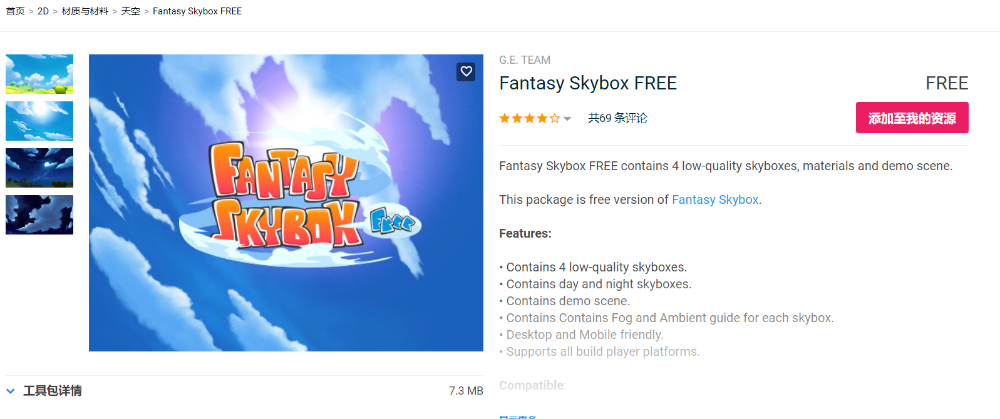
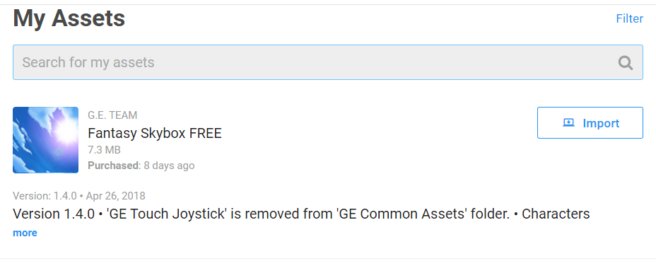
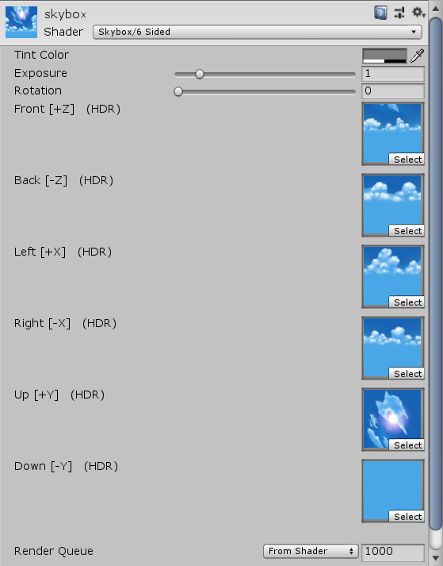
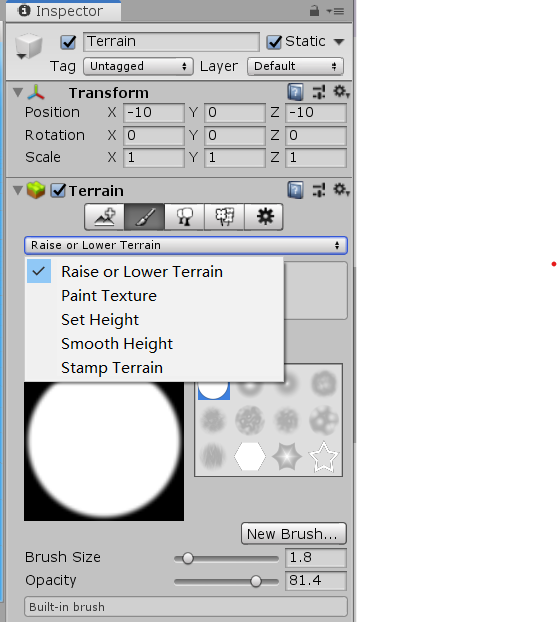
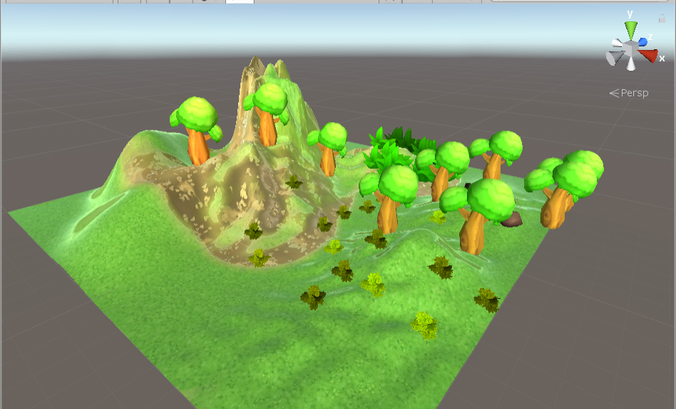
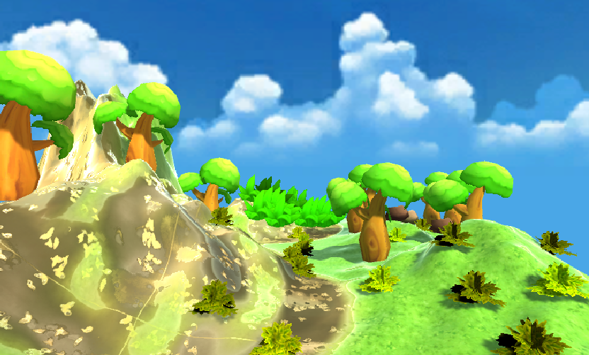

# **游戏对象与图形基础-作业与练习**
## **前言**  
这是中山大学数据科学与计算机学院2019年3D游戏编程与设计的第四次作业  
所有项目与代码已上传至github当中，欢迎大家访问。  
github个人主页: [https://starashzero.github.io](https://starashzero.github.io)  
3D游戏编程与设计主页: [https://starashzero.github.io/3DGameDesign](https://starashzero.github.io/3DGameDesign)  
本次作业项目地址: [https://github.com/StarashZero/3DGameDesign/tree/master/hw4](https://github.com/StarashZero/3DGameDesign/tree/master/hw4)  

## **1、基本操作演练【建议做】**

* ### **下载  Fantasy Skybox FREE， 构建自己的游戏场景**  
    下载并导入  Fantasy Skybox FREE:
    + 在Assets Store中找到Fantasy Skybox FREE，并将其添加至自己的Assets中
      
    + 在Unity中打开Assets Store并找到自己的Assets，点击Import导入  
      

    制作天空盒：
    + 在Assets中右击->Create->Material  
    + 将Shader改为Skybox/6 Sided并将相应的图片拖入  
      

    创建地图:  
    + 在对象栏右击->3D Object->Terrain，新建一个地图对象  
    + 使用Terrain的各项工具绘制地图, 包括造山，造草，添加细节等等
      

    成果:
       
      
    (很丑对吧，我也觉得，实在是尽力了~~)
* ### **写一个简单的总结，总结游戏对象的使用**
    + **Camera:**   
    作为游戏的眼睛，通过Camera来观察游戏世界。  
    + **Light:**  
    光源，可以用来照明也可用于添加阴影  
    + **Empty空对象**  
    空对象多被用于当做载体，例如挂载游戏脚本、成为其他对象的父对象等。 
    + **Cube等3D Object：**  
    搭建游戏世界的组成元素，通过设置其Transform等属性来变换它们的位置、形态等。  
    + **Terrain等:**  
    即是组成元素，又是编辑工具，例如Terrain本身是地图，然后又附带了绘制地图的各项工具（造山、造草等）。

## **2、编程实践**

* ### **牧师与魔鬼 动作分离版**
    - 【2019新要求】：设计一个裁判类，当游戏达到结束条件时，通知场景控制器游戏结束  
为节省篇幅，请移步[Unity实现Priests and Deivls动作分离版(V2)](game)  