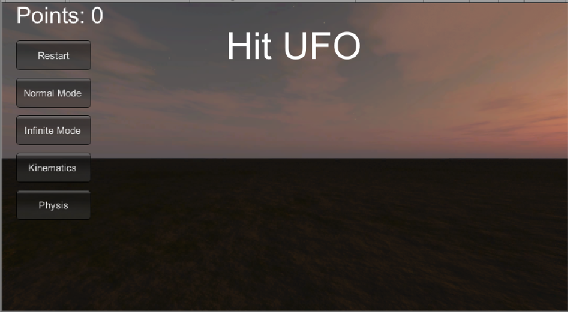
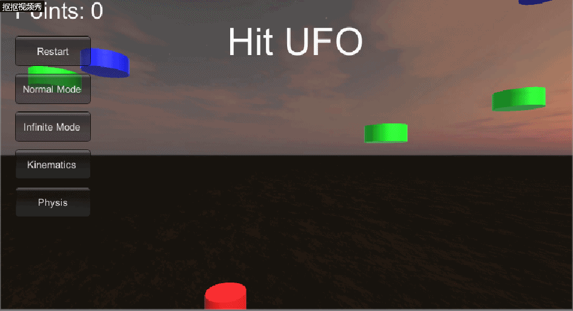
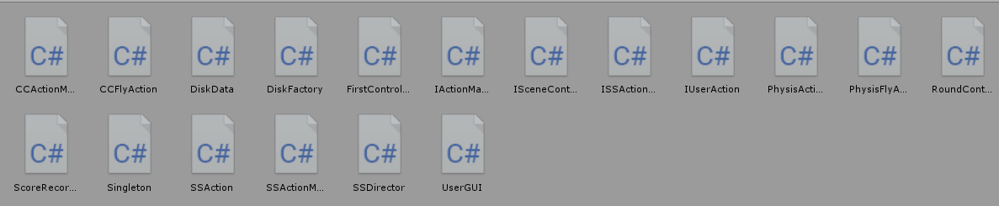
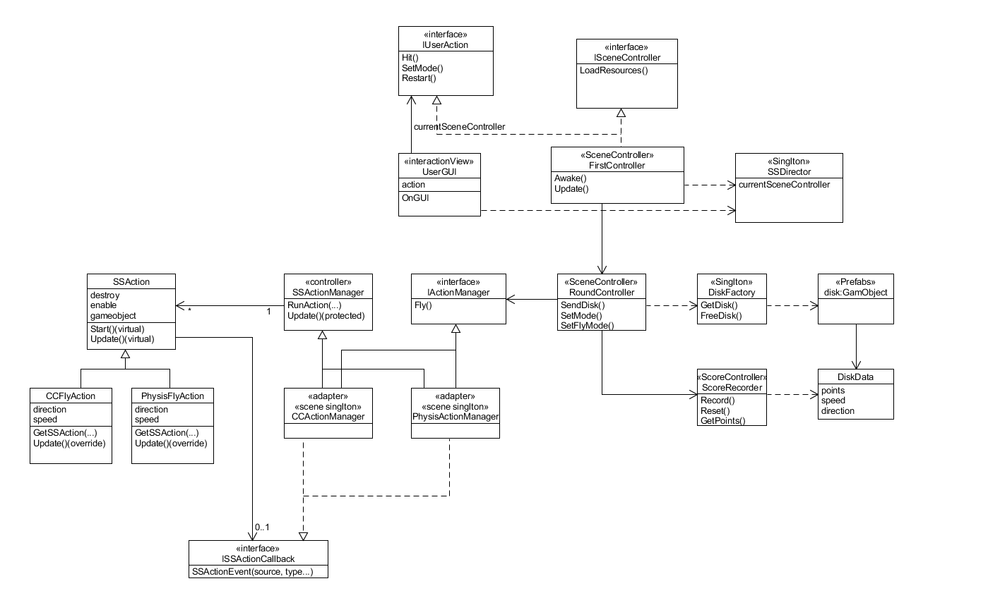

# **Unity实现简易打飞碟改进版(Hit UFO)**  
## **前言**  
这是中山大学数据科学与计算机学院2019年3D游戏编程与设计的第六次作业  
所有项目与代码已上传至github当中，欢迎大家访问。  
github个人主页: [https://starashzero.github.io](https://starashzero.github.io)  
3D游戏编程与设计主页: [https://starashzero.github.io/3DGameDesign](https://starashzero.github.io/3DGameDesign)  
本次作业项目地址: [https://github.com/StarashZero/3DGameDesign/tree/master/hw6](https://github.com/StarashZero/3DGameDesign/tree/master/hw6)  
## **游戏简介**  
鼠标作为武器，打爆飞碟!   
  
<center>(比上一代多了两个按钮)</center>  

## **游戏玩法** 
点击飞出来的UFO(各种圆盘)即可得分。 

## **游戏规则**  
1. 正常模式共有五轮飞碟，飞碟数列遵循斐波那契数列，当所有飞碟发射完毕时游戏结束。  
2. 无限模式拥有无限轮数 ~~(其实就是重复)~~  
3. 红色飞碟为1分，绿色飞碟为2分，蓝色飞碟为3分 ~~(RGB!)~~  
4. 物理学模式下飞碟会互相碰撞，这不是一个bug，是一个feature!   

## **游戏试玩**  
   

## **项目要求**  
在Hit UFO初版的基础上  
*   按 adapter模式 设计图修改飞碟游戏

*   使它同时支持物理运动与运动学（变换）运动

## **项目代码结构**
在[初版项目](../hw5/hw5)的基础上进行了进一步的封装，同时需要实现物理学运动，所以增加了几个文件。  
  
UML图:  
  

## **各部分代码解释**   
许多文件的代码都是没有变动或者变动较少的，新增或有修改我会指出。
* **Singleton.cs**  
    ```java
    public class Singleton<T> : MonoBehaviour where T: MonoBehaviour
    {
        protected static T instance;

        public static T Instance
        {
            get
            {
                if (instance == null)
                {
                    instance = (T)FindObjectOfType(typeof(T));
                    if (instance == null)
                    {
                        Debug.LogError("An instance of " + typeof(T) + " is needed in the scene, but there is none");
                    }
                }
                return instance;
            }
        }
    }
    ```  
    场景单实例类，当所需的实例第一次被需要时，在场景内搜索该实例，下一次使用时不需要搜索直接返回。  
* **DiskData.cs**  
    ```java
    public class DiskData : MonoBehaviour
    {
        public float speed;         //水平速度
        public int points;          //得分
        public Vector3 direction;   //初始方向
    }
    ```  
    飞碟数据，携带飞碟的飞行速度、得分、以及飞行方向。  
* **DiskFactory.cs**  
    ```java
    public class DiskFactory : MonoBehaviour
    {
        public GameObject disk_Prefab;              //飞碟预制

        private List<DiskData> used;                //正被使用的飞碟
        private List<DiskData> free;                //空闲的飞碟

        public void Start()
        {
            used = new List<DiskData>();
            free = new List<DiskData>();
            disk_Prefab = GameObject.Instantiate<GameObject>(Resources.Load<GameObject>("Prefabs/Disk_Prefab"), Vector3.zero, Quaternion.identity);
            disk_Prefab.SetActive(false);
        }

        public GameObject GetDisk(int round)
        {
            GameObject disk;
            //如果有空闲的飞碟，则直接使用，否则生成一个新的
            if (free.Count > 0)
            {
                disk = free[0].gameObject;
                free.Remove(free[0]);
            }
            else
            {
                disk = GameObject.Instantiate<GameObject>(disk_Prefab, Vector3.zero, Quaternion.identity);
                disk.AddComponent<DiskData>();
            }

            //按照round来设置飞碟属性
            //飞碟的等级 = 0~2之间的随机数 * 轮次数
            //0~4:  红色飞碟  
            //4~7:  绿色飞碟  
            //7~10: 蓝色飞碟
            float level = UnityEngine.Random.Range(0, 2f) * (round + 1);
            if (level < 4)
            {
                disk.GetComponent<DiskData>().points = 1;
                disk.GetComponent<DiskData>().speed = 4.0f;
                disk.GetComponent<DiskData>().direction = new Vector3(UnityEngine.Random.Range(-1f, 1f) > 0 ? 2 : -2, 1, 0);
                disk.GetComponent<Renderer>().material.color = Color.red;
            }
            else if (level > 7)
            {
                disk.GetComponent<DiskData>().points = 3;
                disk.GetComponent<DiskData>().speed = 8.0f;
                disk.GetComponent<DiskData>().direction = new Vector3(UnityEngine.Random.Range(-1f, 1f) > 0 ? 2 : -2, 1, 0);
                disk.GetComponent<Renderer>().material.color = Color.blue;
            }
            else
            {
                disk.GetComponent<DiskData>().points = 2;
                disk.GetComponent<DiskData>().speed = 6.0f;
                disk.GetComponent<DiskData>().direction = new Vector3(UnityEngine.Random.Range(-1f, 1f) > 0 ? 2 : -2, 1, 0);
                disk.GetComponent<Renderer>().material.color = Color.green;
            }

            used.Add(disk.GetComponent<DiskData>());

            return disk;
        }

        public void FreeDisk(GameObject disk)
        {
            //找到使用中的飞碟，将其踢出并加入到空闲队列
            foreach (DiskData diskData in used)
            {
                if (diskData.gameObject.GetInstanceID() == disk.GetInstanceID())
                {
                    disk.SetActive(false);
                    free.Add(diskData);
                    used.Remove(diskData);
                    break;
                }

            }
        }
    }
    ```  
    飞碟工厂，负责生产与释放飞碟。  
    + GetDisk:  
    GetDisk用于生产飞碟，首先从free空闲队列中查找是否有可用的飞碟，如果没有则新建一个飞碟。  
    飞碟属性的设置依赖轮次数，将一个0~2之间的随机数乘以轮次数获得level，再根据level来设置属性。  
    这样就具有了轮次越多优质飞碟越多的特性，且前期不会产生高分飞碟。  
    + FreeDisk:  
    FreeDisk用于释放飞碟，将飞碟从used队列中移除并添加到free队列中。  

* **SSAction.cs**
    ```java
    public class SSAction : ScriptableObject
    {
        public bool enable = true;
        public bool destroy = false;

        public GameObject gameObject { get; set; }
        public Transform transform { get; set; }
        public ISSActionCallback callback { get; set; }

        protected SSAction()
        {

        }

        // Start is called before the first frame update
        public virtual void Start()
        {
            throw new System.NotImplementedException();
        }

        // Update is called once per frame
        public virtual void Update()
        {
            throw new System.NotImplementedException();
        }
    }
    ```  
    动作的基类，与之前的项目用途一致。  
* **CCFlyAction.cs**  
    CCFlyAction有一些少量修改。  
    因为CCFlyAction是运动学的飞行，因此生成CCFlyAction时会将对象的刚体设为运动学的。
    ```java
    public override void Start()
    {
        gameObject.GetComponent<Rigidbody>().isKinematic = true;
    }
    ```  
    完整代码
    ```java
    public class CCFlyAction : SSAction
    {
        float gravity;          //重力加速度
        float speed;            //水平速度
        Vector3 direction;      //飞行方向
        float time;             //时间

        //生产函数(工厂模式)
        public static CCFlyAction GetSSAction(Vector3 direction, float speed)
        {
            CCFlyAction action = ScriptableObject.CreateInstance<CCFlyAction>();
            action.gravity = 9.8f;
            action.time = 0;
            action.speed = speed;
            action.direction = direction;
            return action;
        }

        public override void Start()
        {
            gameObject.GetComponent<Rigidbody>().isKinematic = true;
        }

        public override void Update()
        {
            time += Time.deltaTime;
            transform.Translate(Vector3.down * gravity * time * Time.deltaTime);
            transform.Translate(direction * speed * Time.deltaTime);
            //如果飞碟到达底部，则动作结束，进行回调
            if (this.transform.position.y < -6)
            {
                this.destroy = true;
                this.enable = false;
                this.callback.SSActionEvent(this);
            }
            
        }
    }

    ```  
    飞行动作，将飞行拆分成水平和垂直两个方向的运动，水平速度恒定，垂直方向施加重力加速度。  
    当飞碟到达底部时，动作结束，将进行回调。  
* **ISSActionCallback**  
    ```java
    public enum SSActionEventType : int { Started, Competed }
    public interface ISSActionCallback
    {
        //回调函数
        void SSActionEvent(SSAction source,
            SSActionEventType events = SSActionEventType.Competed,
            int intParam = 0,
            string strParam = null,
            Object objectParam = null);
    }
    ```  
    回调函数接口，与之前项目用途一致。  
* **SSActionManager.cs**  
    ```java
    public class SSActionManager : MonoBehaviour
    {
        //动作集，以字典形式存在
        private Dictionary<int, SSAction> actions = new Dictionary<int, SSAction>();
        //等待被加入的动作队列(动作即将开始)
        private List<SSAction> waitingAdd = new List<SSAction>();
        //等待被删除的动作队列(动作已完成)
        private List<int> waitingDelete = new List<int>();

        protected void Update()
        {
            //将waitingAdd中的动作保存
            foreach (SSAction ac in waitingAdd)
                actions[ac.GetInstanceID()] = ac;
            waitingAdd.Clear();

            //运行被保存的事件
            foreach (KeyValuePair<int, SSAction> kv in actions)
            {
                SSAction ac = kv.Value;
                if (ac.destroy)
                {
                    waitingDelete.Add(ac.GetInstanceID());
                }
                else if (ac.enable)
                {
                    ac.Update();
                }
            }

            //销毁waitingDelete中的动作
            foreach (int key in waitingDelete)
            {
                SSAction ac = actions[key];
                actions.Remove(key);
                Destroy(ac);
            }
            waitingDelete.Clear();
        }

        //准备运行一个动作，将动作初始化，并加入到waitingAdd
        public void RunAction(GameObject gameObject, SSAction action, ISSActionCallback manager)
        {
            action.gameObject = gameObject;
            action.transform = gameObject.transform;
            action.callback = manager;
            waitingAdd.Add(action);
            action.Start();
        }

        // Start is called before the first frame update
        protected void Start()
        {

        }

    }
    ```  
    动作管理者的基类，和之前项目用途一致。  

* **CCActionManager.cs**  
    现在CCActionManager需要实现IActionManager的接口了
    ```java
    public class CCActionManager : SSActionManager, ISSActionCallback, IActionManager
    {

        //飞行动作
        CCFlyAction flyAction;
        //控制器
        FirstController controller;

        protected new void Start()
        {
            controller = (FirstController)SSDirector.GetInstance().CurrentScenceController;
        }

        public void Fly(GameObject disk, float speed, Vector3 direction)
        {
            flyAction = CCFlyAction.GetSSAction(direction, speed);
            RunAction(disk, flyAction, this);
        }

        //回调函数
        public void SSActionEvent(SSAction source,
        SSActionEventType events = SSActionEventType.Competed,
        int intParam = 0,
        string strParam = null,
        Object objectParam = null)
        {
            //飞碟结束飞行后进行回收
            controller.FreeDisk(source.gameObject);
        }
    }
    ```  
    飞行动作管理者，负责生成飞行动作，并接受飞行动作的回调信息，使飞碟被回收。  
* **IUserAction.cs**  
    IUserAction进行了少量修改  
    现在IUserAction提供了设置飞行模式的接口  
    ```java
    void SetFlyMode(bool isPhysis);
    ```  
    完整代码
    ```java  
    public interface IUserAction
    {
        void SetFlyMode(bool isPhysis);
        void Hit(Vector3 position);
        void Restart();
        void SetMode(bool isInfinite);
    }
    ```  
    用户动作接口，提供点击、重置、选择模式三个函数的接口。  
* **SSDirector.cs**  
    ```java
    public class SSDirector : System.Object
    {
        private static SSDirector _instance;
        public ISceneController CurrentScenceController { get; set; }
        public static SSDirector GetInstance()
        {
            if (_instance == null)
            {
                _instance = new SSDirector();
            }
            return _instance;
        }
    }
    ```  
    导演类，与之前项目用途一致。
* **ISceneController.cs**  
    ```java
    public interface ISceneController
    {
        void LoadResources();
    }
    ```  
    场景控制类接口，与之前项目用途一致。  
* **FirstController**  
    FirstController进行了大量修改  
    FirstController现在只负责与UserAction交互及少量功能函数了，其他功能下放置RoundController
    ```java
    public class FirstController : MonoBehaviour, ISceneController, IUserAction
    {
        DiskFactory diskFactory;                         //飞碟工厂
        RoundController roundController;
        UserGUI userGUI;

        void Start()
        {
            SSDirector.GetInstance().CurrentScenceController = this;
            gameObject.AddComponent<DiskFactory>();
            gameObject.AddComponent<CCActionManager>();
            gameObject.AddComponent<PhysisActionManager>();
            gameObject.AddComponent<RoundController>();
            gameObject.AddComponent<UserGUI>();
            LoadResources();
        }

        public void LoadResources()
        {
            diskFactory = Singleton<DiskFactory>.Instance;
            roundController = Singleton<RoundController>.Instance;
            userGUI = Singleton<UserGUI>.Instance;
        }

        public void Hit(Vector3 position)
        {
            Camera ca = Camera.main;
            Ray ray = ca.ScreenPointToRay(position);

            RaycastHit[] hits;
            hits = Physics.RaycastAll(ray);

            for (int i = 0; i < hits.Length; i++)
            {
                RaycastHit hit = hits[i];
                if (hit.collider.gameObject.GetComponent<DiskData>() != null)
                {
                    //将飞碟移至底端，触发飞行动作的回调
                    hit.collider.gameObject.transform.position = new Vector3(0, -7, 0);
                    //积分
                    roundController.Record(hit.collider.gameObject.GetComponent<DiskData>());
                    //更新GUI数据
                    userGUI.SetPoints(roundController.GetPoints());
                }
            }
        }

        public void Restart()
        {
            userGUI.SetMessage("");
            userGUI.SetPoints(0);
            roundController.Reset();
        }

        public void SetMode(bool isInfinite)
        {
            roundController.SetMode(isInfinite);
        }

        public void SetFlyMode(bool isPhysis)
        {
            roundController.SetFlyMode(isPhysis);
        }

        public void FreeDisk(GameObject disk)
        {
            diskFactory.FreeDisk(disk);
        }

        void Update()
        {
        }
    }
    ``` 
    场景控制器，负责游戏主要逻辑。  
    + SendDisk:  
    SendDisk用于发射一个飞碟，首先从工厂获得一个飞碟，再为其设置初始位置和飞行动作。  
    + Hit:  
    Hit用于处理用户的点击动作，将用户点击到的飞碟移除，并计算分数。  
    + Restart:  
    Restart用于重置游戏。  
    + Update:  
    Update用于发射飞碟与更新状态，飞碟每1s发射一次，每次做多5只，避免太过拥挤，当飞碟发射完毕后判断是否重置或者结束游戏。  
* **UserGUI.cs**  
    UserGUI进行了少量修改  
    添加了两个设置飞行模式的按钮  
    ```java
    if (GUI.Button(new Rect(20, 200, 100, 40), "Kinematics"))
    {
        userAction.SetFlyMode(false);
    }
    if (GUI.Button(new Rect(20, 250, 100, 40), "Physis"))
    {
        userAction.SetFlyMode(true);
    }
    ```  
    并且将UserGUI的成员设置成了私有(为了更好的封装)，现在需要通过函数来修改UserGUI的变量了  
    ```java  
    public void SetMessage(string gameMessage)
    {
        this.gameMessage = gameMessage;
    }

    public void SetPoints(int points)
    {
        this.points = points;
    }
    ```  
    完整代码  
    ```java
    public class UserGUI : MonoBehaviour
    {
        IUserAction userAction;
        string gameMessage;
        int points;

        public void SetMessage(string gameMessage)
        {
            this.gameMessage = gameMessage;
        }

        public void SetPoints(int points)
        {
            this.points = points;
        }

        void Start()
        {
            points = 0;
            gameMessage = "";
            userAction = SSDirector.GetInstance().CurrentScenceController as IUserAction;
        }

        void OnGUI()
        {
            //小字体初始化
            GUIStyle style = new GUIStyle();
            style.normal.textColor = Color.white;
            style.fontSize = 30;

            //大字体初始化
            GUIStyle bigStyle = new GUIStyle();
            bigStyle.normal.textColor = Color.white;
            bigStyle.fontSize = 50;

            GUI.Label(new Rect(300, 30, 50, 200), "Hit UFO", bigStyle);
            GUI.Label(new Rect(20, 0, 100, 50), "Points: " + points, style);
            GUI.Label(new Rect(310, 100, 50, 200), gameMessage, style);
            if (GUI.Button(new Rect(20, 50, 100, 40), "Restart"))
            {
                userAction.Restart();
            }
            if (GUI.Button(new Rect(20, 100, 100, 40), "Normal Mode"))
            {
                userAction.SetMode(false);
            }
            if (GUI.Button(new Rect(20, 150, 100, 40), "Infinite Mode"))
            {
                userAction.SetMode(true);
            }
            if (GUI.Button(new Rect(20, 200, 100, 40), "Kinematics"))
            {
                userAction.SetFlyMode(false);
            }
            if (GUI.Button(new Rect(20, 250, 100, 40), "Physis"))
            {
                userAction.SetFlyMode(true);
            }
            if (Input.GetButtonDown("Fire1"))
            {
                userAction.Hit(Input.mousePosition);
            }
        }
    }
    ```
    界面类，构建UI并捕捉用户动作。  

* **IActionManager**  
    ```java
    public interface IActionManager
    {
        void Fly(GameObject disk, float speed, Vector3 direction);
    }
    ```  
    动作管理类的接口，要求动作管理类的Adapter模式就是基于这个接口来实现，不过我认为在本次项目中并没有体现的很好，因为设计的两个动作管理类都是可以实现这个接口的功能的，因此感觉只起到了接口多态的作用。  
    不过拥有这个接口后，以后可以将非Fly类型的动作管理类通过Adapter模式转换成Fly类型的动作管理类。

* **PhysisFlyAction**  
    PhysisFlyAction是新增的代码  
    PhysisFlyAction实现物体的物理学飞行  
    由于预制体已经添加了刚体属性，并且选择了Use Gravity，因此只需要为物体增加一个水平初速度即可。  
    ```java  
    public class PhysisFlyAction : SSAction
    {
        float speed;            //水平速度
        Vector3 direction;      //飞行方向

        //生产函数(工厂模式)
        public static PhysisFlyAction GetSSAction(Vector3 direction, float speed)
        {
            PhysisFlyAction action = ScriptableObject.CreateInstance<PhysisFlyAction>();
            action.speed = speed;
            action.direction = direction;
            return action;
        }

        public override void Start()
        {
            gameObject.GetComponent<Rigidbody>().isKinematic = false;
            //为物体增加水平初速度
            gameObject.GetComponent<Rigidbody>().velocity = speed * direction;
        }

        public override void Update()
        {
            //如果飞碟到达底部，则动作结束，进行回调
            if (this.transform.position.y < -6)
            {
                this.destroy = true;
                this.enable = false;
                this.callback.SSActionEvent(this);
            }

        }
    }
    ```  
* **PhysisActionManager**  
    PhysisActionManager是新增的代码。  
    虽然是新增的，但是代码几乎与CCActionManager一致，只是从管理CCFlyAction变为管理PhysisFlyAction  
    ```java
    public class PhysisActionManager : SSActionManager, ISSActionCallback, IActionManager
    {
        //飞行动作
        PhysisFlyAction flyAction;
        //控制器
        FirstController controller;

        protected new void Start()
        {
            controller = (FirstController)SSDirector.GetInstance().CurrentScenceController;
        }

        public void Fly(GameObject disk, float speed, Vector3 direction)
        {
            flyAction = PhysisFlyAction.GetSSAction(direction, speed);
            RunAction(disk, flyAction, this);
        }

        //回调函数
        public void SSActionEvent(SSAction source,
        SSActionEventType events = SSActionEventType.Competed,
        int intParam = 0,
        string strParam = null,
        Object objectParam = null)
        {
            //飞碟结束飞行后进行回收
            controller.FreeDisk(source.gameObject);
        }
    }
    ```  


 
* **RoundController**  
    RoundController承接了初版中FirstController每回合对飞碟的发送、计分等功能的代码  
    目的是减轻FirstController的负担并使代码结构更加清晰  
    ```java  
    public class RoundController : MonoBehaviour
    {
        FirstController controller;
        IActionManager actionManager;                   //动作管理者
        DiskFactory diskFactory;                         //飞碟工厂
        ScoreRecorder scoreRecorder;
        UserGUI userGUI;
        int[] roundDisks;           //对应轮次的飞碟数量
        bool isInfinite;            //游戏当前模式
        int round;                  //游戏当前轮次
        int sendCnt;                //当前已发送的飞碟数量
        float sendTime;             //发送时间

        void Start()
        {
            controller = (FirstController)SSDirector.GetInstance().CurrentScenceController;
            actionManager = Singleton<CCActionManager>.Instance;
            diskFactory = Singleton<DiskFactory>.Instance;
            scoreRecorder = new ScoreRecorder();
            userGUI = Singleton<UserGUI>.Instance;
            sendCnt = 0;
            round = 0;
            sendTime = 0;
            isInfinite = false;
            roundDisks = new int[] { 3, 5, 8, 13, 21 };
        }

        public void Reset()
        {
            sendCnt = 0;
            round = 0;
            sendTime = 0;
            scoreRecorder.Reset();
        }

        public void Record(DiskData disk)
        {
            scoreRecorder.Record(disk);
        }

        public int GetPoints()
        {
            return scoreRecorder.GetPoints();
        }

        public void SetMode(bool isInfinite)
        {
            this.isInfinite = isInfinite;
        }

        public void SetFlyMode(bool isPhysis)
        {
            actionManager = isPhysis ? Singleton<PhysisActionManager>.Instance : Singleton<CCActionManager>.Instance as IActionManager;
        }

        public void SendDisk()
        {
            //从工厂生成一个飞碟
            GameObject disk = diskFactory.GetDisk(round);
            //设置飞碟的随机位置
            disk.transform.position = new Vector3(-disk.GetComponent<DiskData>().direction.x * 7, UnityEngine.Random.Range(0f, 8f), 0);
            disk.SetActive(true);
            //设置飞碟的飞行动作
            actionManager.Fly(disk, disk.GetComponent<DiskData>().speed, disk.GetComponent<DiskData>().direction);
        }

        // Update is called once per frame
        void Update()
        {
            sendTime += Time.deltaTime;
            //每隔1s发送一次飞碟
            if (sendTime > 1)
            {
                sendTime = 0;
                //每次发送至多5个飞碟
                for (int i = 0; i < 5 && sendCnt < roundDisks[round]; i++)
                {
                    sendCnt++;
                    SendDisk();
                }
                //判断是否需要重置轮次，不需要则输出游戏结束
                if (sendCnt == roundDisks[round] && round == roundDisks.Length - 1)
                {
                    if (isInfinite)
                    {
                        round = 0;
                        sendCnt = 0;
                        userGUI.SetMessage("");
                    }
                    else
                    {
                        userGUI.SetMessage("Game Over!");
                    }
                }
                //更新轮次
                if (sendCnt == roundDisks[round] && round < roundDisks.Length - 1)
                {
                    sendCnt = 0;
                    round++;
                }
            }
        }
    }
    ```  
* **ScoreRecorder**  
    ScoreRecorder是新增的代码  
    实现了对游戏计分的功能
    ```java
    public class ScoreRecorder
    {
        int points;                 //游戏当前分数

        public ScoreRecorder()
        {
            points = 0;
        }

        public void Record(DiskData disk)
        {
            points += disk.points;
        }

        public int GetPoints()
        {
            return points;
        }
        public void Reset()
        {
            points = 0;
        }
    }
    ```