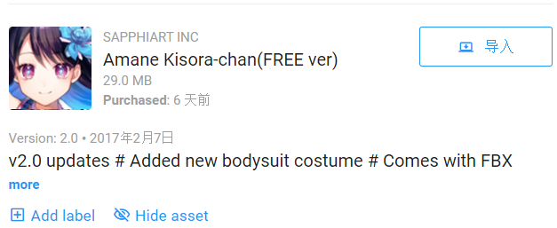

# **Unity巡逻兵游戏-与怪兽战斗!**  
## **前言**  
这是中山大学数据科学与计算机学院2019年3D游戏编程与设计的第七次作业  
所有项目与代码已上传至github当中，欢迎大家访问。  
github个人主页: [https://starashzero.github.io](https://starashzero.github.io)  
3D游戏编程与设计主页: [https://starashzero.github.io/3DGameDesign](https://starashzero.github.io/3DGameDesign)  
本次作业项目地址: [https://github.com/StarashZero/3DGameDesign/tree/master/hw7](https://github.com/StarashZero/3DGameDesign/tree/master/hw7)  
## **游戏简介**  
操作迷路少女与迷宫的怪兽进行战斗，击败所有BOSS!  

## **项目要求**  
参考[潘老师博客](https://pmlpml.github.io/unity3d-learning/07-model-and-animation)  
在此基础上我做了一些修改，将游戏方式从躲避改为战斗，从碰撞即游戏结束改为碰撞掉血等等，具体变动见玩法以及具体实现。

## **游戏玩法**  
1. 使用WASD或者上下左右进行移动，行走1.5s后触发加速  
2. 按下J进行攻击，有2s冷却时间  
3. 按下K或空格跳跃规避怪兽攻击，有2s冷却时间  
4. 玩家拥有10滴血，扣完则游戏结束  
5. 击败地图上所有怪兽则玩家获胜    

## **游戏演示**  
* 部分截图   
    攻击:  
      
    跳跃:  
       
* 视频演示:  
    [https://v.youku.com/v_show/id_XNDQxNzM4MjM4MA==.html?spm=a2h3j.8428770.3416059.1](https://v.youku.com/v_show/id_XNDQxNzM4MjM4MA==.html?spm=a2h3j.8428770.3416059.1)
    

## **项目结构**  
UML图:  
  
* 程序代码大致分为6个模块: 用户交互、主控制、玩家管理、怪兽管理、地图、动作管理。  
* 其中主控制模块与剩余5个模块连接，除了特殊情况(可以通过修改玩家与怪兽的数据来影响动作的运作形式)其他4个模块互不影响。  
* 除了主控制模块以外不进行跨模块订阅与发布，例如: AreaController需要给monster加动作需要发布给FirstController，再由FirstController进行动作添加，而不是直接发布给CCActionManager。这样做的目的有两个: 
    + 一是使得程序解耦度更低、结构更清晰，整个UML其实可以视作是一颗树，主控制模块是树根，其他模块是树叶；
    + 二是方便FirstController做一些中间处理(有时一个事件需要多模块进行协助)。  

## **预制体**  
* 地图全貌:  
      
* 怪兽预制:  
    怪兽资源来自Asset Store  
      
    为怪兽的右手添加一个Trigger，当怪兽执行攻击动画时这个Trigger会随着运动，用于进行攻击判定。  
      
    为怪兽设置Layer，用处稍后会说  
      
    设置怪兽的动画状态机  
    
    + speed<0.2时播放idle，0.2<speed<0.7时播放Walk Forward in Place，速度>0.7时播放Run Forward In Place
    + 触发Attack 01时播放Attack 01  
    + 触发Take Damage时播放Take Damage  
    + 触发Die时播放Die  
    + ToIdle用于将状态归位  
* 玩家预制:  
    玩家资源来自AssetStore  
      
    为玩家腿部增加一个Trigger，当玩家执行攻击动画时Trigger会随之运动，用于进行攻击判定  
      
    为玩家设置动画状态机  
      
    + speed<0.2时播放idle，0.2<speed<0.7时播放Walk，速度>0.7时播放running  
    + jumpTrigger、KOTrigger、damageTrigger、hitTrigger、winTrigger分别触发jump、KO_big、damage、hit01、winpose状态  
    + running用于暂停状态机  
    + toIdle用于状态机归位  
* 地图预制:  
    地图皮肤来自Asset Store  
      
    使用Cube搭建地图  
    注意为地图设置空气墙，并设置空气墙的Layer，用于限制怪兽活动区域  
      
    设置碰撞属性，使得空气墙只对怪兽有效  
      
    这样怪兽就不能跨区域了  

## **具体实现**  
* ### **用户交互**:  
    + UserGUI  
        UserGUI用于接收玩家交互信息并显示一些画面  
        UserGUI会将玩家当前血量、分数以及攻击的敌方血量显示在屏幕上  
        当玩家触发相应操作时，UserGUI会将信息传给控制器  
        ```java
        public class UserGUI : MonoBehaviour
        {
            IUserAction userAction;             //控制器接口
            int points;                         //分数
            int playerHealth;                   //玩家血量
            int monsterHealth;                  //怪兽血量
            public bool gameOver;               //是否游戏结束
            public bool victory;                //是否胜利

            //增加分数
            public void AddPoints(int points)
            {
                this.points += points;
            }

            //设置分数
            public void SetPoints(int points)
            {
                this.points = points;
            }

            //设置玩家血量
            public void SetPlayerHealth(int health)
            {
                playerHealth = health;
            }

            //设置怪兽血量
            public void SetMonsterHealth(int health)
            {
                monsterHealth = health;
            }

            void Start()
            {
                gameOver = false;
                points = 0;
                userAction = SSDirector.GetInstance().CurrentScenceController as IUserAction;
            }

            void OnGUI()
            {
                //小字体初始化
                GUIStyle style = new GUIStyle();
                style.normal.textColor = Color.white;
                style.fontSize = 30;

                //大字体初始化
                GUIStyle bigStyle = new GUIStyle();
                bigStyle.normal.textColor = Color.white;
                bigStyle.fontSize = 50;

                GUI.Label(new Rect(20, 0, 200, 50), "Health: " + playerHealth, style);
                GUI.Label(new Rect(Screen.width-230, 0, 200, 50), "Enemy Health: " + monsterHealth, style);
                GUI.Label(new Rect(20, 60, 100, 50), "Points: " + points, style);

                //显示游戏结束画面
                if (gameOver)
                {
                    GUI.Label(new Rect(Screen.width/2-100, Screen.height/2 - 100, 200, 50), "You Die !", bigStyle);
                    if (GUI.Button(new Rect(Screen.width / 2 - 100, Screen.height / 2, 200, 50), "Restart"))
                    {
                        userAction.Restart();
                    }
                }

                //显示胜利画面
                if (victory)
                {
                    GUI.Label(new Rect(Screen.width / 2 - 100, Screen.height / 2 - 100, 200, 50), "You Win !", bigStyle);
                    if (GUI.Button(new Rect(Screen.width / 2 - 100, Screen.height / 2, 200, 50), "Restart"))
                    {
                        userAction.Restart();
                    }
                }

                //获得玩家移动操作
                float speed = Input.GetAxis("Vertical");
                float direction = Input.GetAxis("Horizontal");
                userAction.MovePlayer(speed, direction);

                //获得玩家跳跃操作
                if (Input.GetButtonDown("Jump")|| Input.GetKeyDown(KeyCode.K))
                    userAction.Jump();

                //获得玩家攻击操作
                if (Input.GetKeyDown(KeyCode.J))
                    userAction.Hit();
            }
        }
        ```  
* ### **玩家管理**  
    + PlayerManager  
        PlayerManager管理玩家的信息以及动画操作，提供订阅接口  
        当玩家受伤时将事件发布出去，又订阅者进行处理  
        当接收到Monster的攻击判定时判定是否符合受伤条件  
        提供一些冷却机制，提高游戏可玩性  
        ```java
        public class PlayerManager : MonoBehaviour
        {
            public delegate void DealDamage(GameObject player);
            public static event DealDamage dealDamage;              //受伤事件发布

            public float speed;             //当前速度
            public float direction;         //当前方向位移
            public bool moveable;           //是否可移动          
            public int health;              //当前血量
            float jumpCounter;              //跳跃冷却计数器
            float hitCounter;               //攻击冷却计数器
            float damageCounter;            //受伤保护计数器

            Animator animator;
            private void Start()
            {
                animator = gameObject.GetComponent<Animator>();
                speed = 0;
                direction = 0;
                jumpCounter = hitCounter = damageCounter = 0;
            }

            //设置速度(动画)
            public void SetSpeed(float speed)
            {
                animator.SetFloat("speed",speed);
            }

            //跳跃
            public void Jump()
            {
                if (jumpCounter > 2)
                {
                    animator.ResetTrigger("jumpTrigger");
                    animator.SetTrigger("jumpTrigger");
                    jumpCounter = 0;
                }
            }

            //攻击
            public void Hit()
            {
                if (hitCounter > 2 && !IsName("jump"))
                {
                    animator.SetTrigger("hitTrigger");
                    hitCounter = 0;
                }
            }

            //受伤
            public void Damage()
            {
                animator.SetTrigger("damageTrigger");
            }

            //死亡
            public void Die()
            {
                animator.SetBool("running", false);
                animator.SetTrigger("KOTrigger");
            }

            //胜利
            public void Win()
            {
                animator.SetBool("running", false);
                animator.SetTrigger("winTrigger");
            }

            //归位
            public void ToIdle()
            {
                animator.SetTrigger("toIdle");
            }

            //判断动画状态
            public bool IsName(string name)
            {
                return animator.GetCurrentAnimatorStateInfo(0).IsName(name);
            }

            //复活
            public void Revive()
            {
                ToIdle();
                animator.SetBool("running", true);
            }

            //受伤判定
            private void OnTriggerEnter(Collider other)
            {
                //如果接受到怪兽的攻击Trigger判定则进行处理
                if (other.gameObject.name == "MonsterHitRange" && !IsName("jump") && damageCounter > 1)
                {
                    MonsterManager parentManager = other.gameObject.GetComponentInParent<MonsterManager>();
                    //只有怪兽攻击时Trigger有效，避免误判
                    if (!parentManager.IsName("Attack 01"))
                        return;
                    Damage();
                    damageCounter = 0;
                    health--;
                    if (health <= 0)
                    {
                        Die();
                    }
                    //发布受伤事件
                    dealDamage(gameObject);
                }
            }


            private void Update()
            {
                //及时进行归位消除，避免出现toIdle长时间存在的情况
                if (!IsName("KO_big") && !IsName("winpose"))
                    animator.ResetTrigger("toIdle");
                hitCounter = (hitCounter + Time.deltaTime) > 5 ? 5 : hitCounter + Time.deltaTime;
                damageCounter = (damageCounter + Time.deltaTime) > 5 ? 5 : damageCounter + Time.deltaTime;
                jumpCounter = (jumpCounter + Time.deltaTime) > 5 ? 5 : jumpCounter + Time.deltaTime;
            }
        }
        ```  
* ### **怪兽管理**  
    + MonsterManager  
        MonsterManager管理怪兽信息与动画操作，提供订阅操作  
        当Monster与玩家碰撞时触发攻击事件  
        当接收到玩家攻击判定时，判断是否符合条件  
        受伤后发布受伤事件，交由外部处理  
        当Monster血量为0且死亡动画结束后发布释放事件    
        ```java
        public class MonsterManager : MonoBehaviour
        {
            public delegate void FreeMe(GameObject follower);
            public static event FreeMe freeAction;                  //释放事件发布
            public delegate void DealDamage(GameObject player);
            public static event DealDamage dealDamage;              //受伤事件发布


            public bool moveable;           //释放可移动
            public bool stop;               //释放暂停移动
            public int health;              //当前血量
            Animator animator;
            FollowManager followManager;
            float damageCounter;            //受伤保护计数器
            float hitCounter;               //攻击冷却
            private void Start()
            {
                moveable = false;
                animator = gameObject.GetComponent<Animator>();
                followManager = gameObject.GetComponent<FollowManager>();
                damageCounter = 0;
                stop = false;
            }

            //设置速度(动画)
            public void SetSpeed(float speed)
            {
                if (animator == null)
                    return;
                animator.SetFloat("speed", speed);
            }

            //跳跃
            public void Jump()
            {
                if (animator == null)
                    return;
                animator.SetTrigger("jumpTrigger");
            }

            //攻击
            public void Hit()
            {
                if (animator == null)
                    return;
                animator.SetTrigger("Attack 01");
            }

            //受伤
            public void Damage()
            {
                if (animator == null)
                    return;
                animator.SetTrigger("Take Damage");
            }

            //死亡
            public void Die()
            {
                if (animator == null)
                    return;
                animator.SetTrigger("Die");
            }

            //归位
            public void ToIdle()
            {
                if (animator == null)
                    return;
                animator.SetTrigger("ToIdle");
            }

            //判断动画状态
            public bool IsName(string name)
            {
                if (animator == null)
                    return false;
                return animator.GetCurrentAnimatorStateInfo(0).IsName(name);
            }

            //玩家攻击判定
            private void OnTriggerEnter(Collider other)
            {
                if (other.gameObject.name == "PlayerHitRange" && damageCounter > 2)
                {
                    PlayerManager parentManger = other.gameObject.GetComponentInParent<PlayerManager>();
                    //判断玩家是否正在攻击，避免误判
                    if (!parentManger.IsName("hit01"))
                        return;
                    Damage();
                    followManager.stop = true;
                    damageCounter = 0;
                    health--;
                    //发布受伤事件
                    dealDamage(gameObject);
                    if (health == 0)
                    {
                        Die();
                    }
                }
            }

            private void OnTriggerStay(Collider other)
            {
                if (other.gameObject.name == "PlayerHitRange" && damageCounter > 2)
                {
                    PlayerManager parentManger = other.gameObject.GetComponentInParent<PlayerManager>();
                    if (!parentManger.IsName("hit01"))
                        return;
                    Damage();
                    followManager.stop = true;
                    damageCounter = 0;
                    health--;
                    dealDamage(gameObject);
                    if (health == 0)
                    {
                        Die();
                    }
                }
            }

            //碰撞事件，与玩家碰撞时触发攻击操作
            private void OnCollisionStay(Collision collision)
            {
                if (collision.gameObject.tag == "Player" && hitCounter > 4)
                {
                    Hit();
                    followManager.stop = true;
                    hitCounter = 0;
                }
            }
            private void OnCollisionEnter(Collision collision)
            {
                if (collision.gameObject.tag == "Player" && hitCounter > 4)
                {
                    Hit();
                    followManager.stop = true;
                    hitCounter = 0;
                }
            }

            private void Update()
            {
                if (animator.GetCurrentAnimatorStateInfo(0).IsName("Die") && animator.GetCurrentAnimatorStateInfo(0).normalizedTime > 1.0f)
                {
                    ToIdle();
                    //释放操作发布
                    freeAction(gameObject);
                }
                damageCounter = (damageCounter + Time.deltaTime) > 5 ? 5 : damageCounter + Time.deltaTime;
                hitCounter = (hitCounter + Time.deltaTime) > 5 ? 5 : hitCounter + Time.deltaTime;
                if (followManager.stop && !IsName("Attack 01"))
                    followManager.stop = false;
            }
        }
        ```  
    + FollowManager  
        FollowManager实质上并不是Monster专属，而是FollowPlayerAction专属，主要是携带跟随信息，除了Monster以外主摄像头也会附带该部件以跟随玩家，为了方便(因为摄像头不在解释范围内)起见将其归为Monster  
        ```java
        public class FollowManager : MonoBehaviour
        {
            public bool followable;         //是否可跟随
            public bool stop;               //是否暂停
            public bool lookat;             //是否朝向玩家
            public float speed;             //跟随速度
            void Start()
            {
                followable = true;
                lookat = true;
                stop = false;
            }

        }
        ```
    + MonsterFactory  
        MonsterFactory是怪兽工厂，提供怪兽的生成和释放操作  
        MonsterFactory订阅MonsterManager的释放事件，当Monster需要释放时由它处理 
        ```java  
        public class MonsterFactory : MonoBehaviour
        {
            public GameObject monster_Prefab;              

            List<MonsterManager> used;               
            List<MonsterManager> free;
            Vector3[] areaPositions;
            void Start()
            {
                used = new List<MonsterManager>();
                free = new List<MonsterManager>();
                monster_Prefab = GameObject.Instantiate<GameObject>(Resources.Load<GameObject>("Prefabs/Boximon Fiery"), Vector3.zero, Quaternion.identity);
                monster_Prefab.SetActive(false);
                areaPositions = new Vector3[] { new Vector3(6,-1.5f,-3), new Vector3(-3, -1.5f, -3), new Vector3(6, -1.5f, -12), new Vector3(-7.5f, -1.5f, -12), new Vector3(-12, -1.5f, 6)};
            }

            //订阅MonsterManager释放事件
            private void OnEnable()
            {
                MonsterManager.freeAction += FreeMonster;
            }

            //取消订阅
            private void OnDisable()
            {
                MonsterManager.freeAction -= FreeMonster;
            }

            //生成Monster
            public GameObject GetMonster(int area)
            {
                GameObject monster;
                if (free.Count > 0)
                {
                    monster = free[0].gameObject;
                    free.Remove(free[0]);
                }
                else
                {
                    monster = GameObject.Instantiate<GameObject>(monster_Prefab, Vector3.zero, Quaternion.identity);
                    monster.AddComponent<FollowManager>();
                    monster.AddComponent<MonsterManager>();
                }
                monster.SetActive(true);
                monster.transform.position = areaPositions[area];

                if (area < 3)
                {
                    monster.transform.localScale = new Vector3(1, 1, 1);
                    monster.GetComponent<FollowManager>().speed = 0.8f;
                    monster.GetComponent<MonsterManager>().health = 2;
                }else if (area == 3)
                {
                    monster.transform.localScale = new Vector3(2, 2, 2);
                    monster.GetComponent<FollowManager>().speed = 1;
                    monster.GetComponent<MonsterManager>().health = 3;
                }
                else
                {
                    monster.transform.localScale = new Vector3(3, 3, 3);
                    monster.GetComponent<FollowManager>().speed = 1.2f;
                    monster.GetComponent<MonsterManager>().health = 5;
                }

                used.Add(monster.GetComponent<MonsterManager>());

                return monster;
            }

            //释放Monster
            public void FreeMonster(GameObject monster)
            {
                foreach (MonsterManager monsterManger in used)
                {
                    if (monsterManger.gameObject.GetInstanceID() == monster.GetInstanceID())
                    {
                        monster.GetComponent<FollowManager>().followable = false;
                        monster.GetComponent<MonsterManager>().moveable = false;
                        monster.SetActive(false);
                        free.Add(monsterManger);
                        used.Remove(monsterManger);
                        break;
                    }

                }
            }

            //释放所有Monster
            public void FreeAll()
            {
                while(used.Count!=0)
                {
                    used[0].gameObject.GetComponent<FollowManager>().followable = false;
                    used[0].moveable = false;
                    used[0].gameObject.SetActive(false);
                    free.Add(used[0]);
                    used.Remove(used[0]);
                }
            }
        }
        ```  
    * AreaController  
        AreaController负责控制各区域Monster的行为，提供一些订阅操作  
        当玩家进入某个区域时，唤醒该区域的怪兽并发布追击  
        当玩家不在区域内时，发布巡逻事件  
        当所有区域怪兽均被击败时，发布胜利事件  
        ```java
        public class AreaController : MonoBehaviour
        {
            public delegate void FollowAction(GameObject follower, float distanceAway, float distanceUp, float speed);      
            public delegate void MonsterMoveAction(GameObject monster, float speed);
            public delegate void Victory();
            public static event FollowAction followAction;              //跟随事件发布
            public static event MonsterMoveAction monsterMoveAction;    //巡逻事件发布
            public static event Victory victory;                        //胜利事件发布

            MonsterFactory monsterFactory;
            GameObject[] monsters;
            int playerArea;
            void Start()
            {
                monsterFactory = Singleton<MonsterFactory>.Instance;
                playerArea = -1;
                monsters = new GameObject[5];
                GameStart();
            }

            //游戏开始，初始化Monster
            public void GameStart()
            {
                for (int temp = 0; temp < 5; temp++)
                {
                    monsters[temp] = monsterFactory.GetMonster(temp);
                }
            }

            //设置玩家区域
            public void SetArea(int area)
            {
                playerArea = area;
            }

            //释放所有Monster
            public void FreeAll()
            {
                monsterFactory.FreeAll();
            }

            void Update()
            {
                int cnt = 0;
                for (int temp = 0; temp < 5; temp++)
                {
                    if (!monsters[temp].activeSelf)
                        continue;
                    //当玩家进入区域时，唤醒该区域的Monster，使其追击玩家，否则巡逻
                    if (temp == playerArea && monsters[temp].GetComponent<FollowManager>().followable == false)
                    {
                        monsters[temp].GetComponent<MonsterManager>().moveable = false;
                        monsters[temp].GetComponent<MonsterManager>().SetSpeed(monsters[temp].GetComponent<FollowManager>().speed);
                        followAction(monsters[temp], 0, 0, monsters[temp].GetComponent<FollowManager>().speed);
                    }
                    else if (temp != playerArea)
                    {
                        monsters[temp].GetComponent<FollowManager>().followable = false;
                        monsters[temp].GetComponent<MonsterManager>().SetSpeed(0.5f);
                        monsterMoveAction(monsters[temp], 0.5f);
                    }
                    cnt++;
                }
                //如果所有怪兽都不再存在，发布胜利事件
                if (cnt == 0)
                    victory();
            }
        }

        ```  
* ### **地图管理**  
    + DetectPlace  
        探测玩家移动区域，当玩家移动到该区域时发布区域事件
        ```java  
        public class DetectPlace : MonoBehaviour
        {
            public delegate void SetArea(float x, float y);
            public static event SetArea setArea;                  //区域事件发布

            private void OnTriggerStay(Collider other)
            {
                if (other.gameObject.tag == "Player")
                {
                    setArea(transform.position.x, transform.position.z);
                }
            }

        }

        ```
* ### **动作管理**  
    + SSAction  
        动作基类，与之前项目功能一致  
        ```java
        public class SSAction : ScriptableObject
        {
            public bool enable = true;
            public bool destroy = false;

            public GameObject gameObject { get; set; }
            public Transform transform { get; set; }
            public ISSActionCallback callback { get; set; }

            protected SSAction()
            {

            }

            // Start is called before the first frame update
            public virtual void Start()
            {
                throw new System.NotImplementedException();
            }

            // Update is called once per frame
            public virtual void Update()
            {
                throw new System.NotImplementedException();
            }

        }
        ```  
    + SSActionManager  
        动作管理者基类，与之前功能一致  
        ```java  
        public class SSActionManager : MonoBehaviour
        {
            //动作集，以字典形式存在
            private Dictionary<int, SSAction> actions = new Dictionary<int, SSAction>();
            //等待被加入的动作队列(动作即将开始)
            private List<SSAction> waitingAdd = new List<SSAction>();
            //等待被删除的动作队列(动作已完成)
            private List<int> waitingDelete = new List<int>();

            protected void Update()
            {
                //将waitingAdd中的动作保存
                foreach (SSAction ac in waitingAdd)
                    actions[ac.GetInstanceID()] = ac;
                waitingAdd.Clear();

                //运行被保存的事件
                foreach (KeyValuePair<int, SSAction> kv in actions)
                {
                    SSAction ac = kv.Value;
                    if (ac.destroy)
                    {
                        waitingDelete.Add(ac.GetInstanceID());
                    }
                    else if (ac.enable)
                    {
                        ac.Update();
                    }
                }

                //销毁waitingDelete中的动作
                foreach (int key in waitingDelete)
                {
                    SSAction ac = actions[key];
                    actions.Remove(key);
                    Destroy(ac);
                }
                waitingDelete.Clear();
            }

            //准备运行一个动作，将动作初始化，并加入到waitingAdd
            public void RunAction(GameObject gameObject, SSAction action, ISSActionCallback manager)
            {
                action.gameObject = gameObject;
                action.transform = gameObject.transform;
                action.callback = manager;
                waitingAdd.Add(action);
                action.Start();
            }

            // Start is called before the first frame update
            protected void Start()
            {

            }

        }
        ```  
    + ISSActionCallback  
        回调事件接口，与之前功能一致  
        ```java  
        public interface ISSActionCallback
        {
            //回调函数
            void SSActionEvent(SSAction source,
                SSActionEventType events = SSActionEventType.Competed,
                int intParam = 0,
                string strParam = null,
                Object objectParam = null);
        }
        ```  
    + IActionManager  
        控制管理者对外接口，适用于Adapter模式，与之前功能一致  
        ```java
        public interface IActionManager
        {
            void MovePlayer(GameObject player, float speed, float direction);
            void FollowPlayer(GameObject follower, float distanceAway, float distanceUp, float speed);

            void MoveMonster(GameObject monster, float speed);
        }
        ```  
    + FollowPlayerManager  
        跟随玩家事件，用于实现摄像头跟随和怪兽追击  
        跟随逻辑借鉴了网上的一部分代码  
        ```java
        public class FollowPlayerAction : SSAction
        {
            float distanceAway;             //与玩家的水平距离
            float distanceUp;               //与玩家的垂直距离
            float speed;                    //跟随速度

            Vector3 targetPosition; 

            Transform player;

            //生产函数(工厂模式)
            public static FollowPlayerAction GetSSAction(float distanceAway, float distanceUp, float speed)
            {
                FollowPlayerAction action = ScriptableObject.CreateInstance<FollowPlayerAction>();
                action.distanceAway = distanceAway;
                action.distanceUp = distanceUp;
                action.speed = speed;
                return action;
            }

            public override void Start()
            {
                player = GameObject.FindWithTag("Player").transform;
            }

            public override void Update()
            {
                if (gameObject.GetComponent<FollowManager>().followable)
                {
                    if (gameObject.GetComponent<FollowManager>().stop)
                        return;
                    targetPosition = player.position + Vector3.up * distanceUp + (gameObject.GetComponent<FollowManager>().lookat?-player.forward * distanceAway: player.forward * distanceAway);
                    transform.position = Vector3.MoveTowards(transform.position, targetPosition, Time.deltaTime * speed * 1.6f);
                    transform.LookAt(player);
                }
                else
                {
                    this.destroy = true;
                    this.enable = false;
                    this.callback.SSActionEvent(this);
                }
            }
        }
        ```  
    + MoveMonsterAction  
        Monster的巡逻事件  
        每次往前移动一段距离  
        当移动了3s后随机旋转45-135度，这样monster的行走路径就是3-8边形(平均4边形)  
        ```java
        public class MoveMonsterAction : SSAction
        {
            MonsterManager monsterManager;
            float speed;                    //速度
            float counter;                  //计数器

            public static MoveMonsterAction GetSSAction(float speed)
            {
                MoveMonsterAction action = ScriptableObject.CreateInstance<MoveMonsterAction>();
                action.speed = speed;
                return action;
            }

            public override void Start()
            {
                counter = 0;
                monsterManager = gameObject.GetComponent<MonsterManager>();
            }

            public override void Update()
            {
                if (monsterManager.moveable)
                {
                    if (monsterManager.stop)
                        return;
                    counter += Time.deltaTime;
                    //向前移动一段距离
                    gameObject.transform.Translate(0, 0, speed * 2.6f * Time.deltaTime);
                    //每3s换一个方向
                    if (counter > 3)
                    {
                        gameObject.transform.Rotate(0, Random.Range(45, 135), 0);
                        counter = 0;
                    }
                }
                else
                {
                    this.destroy = true;
                    this.enable = false;
                    this.callback.SSActionEvent(this);
                }

            }
        }
        ```  
    + MovePlayerAction  
        玩家的移动动作  
        为玩家速度提供缓冲，不允许直接加速到满值，当速度>0.7时进行计数，1.5s内最高0.7，这样玩家就会出现先走路再跑步的动画  
        当玩家后退时，将玩家旋转180度且不让摄像头面向玩家，这样游戏界面就能看到玩家正面了(hhh)  
        攻击时不允许移动(不然对monster太赖皮了)  
        ```java
        public class MovePlayerAction : SSAction
        {
            PlayerManager playerManager;
            float counter;                  //计数器

            //生产函数(工厂模式)
            public static MovePlayerAction GetSSAction()
            {
                MovePlayerAction action = ScriptableObject.CreateInstance<MovePlayerAction>();
                return action;
            }

            public override void Start()
            {
                playerManager = gameObject.GetComponent<PlayerManager>();
                counter = 0;
            }

            public override void Update()
            {
                if (playerManager.moveable)
                {
                    //攻击时不允许移动
                    if (playerManager.IsName("hit01"))
                        return;
                    float speed = playerManager.speed;
                    //玩家后退时将玩家旋转180度并让摄像头不再面向玩家
                    if (speed < -0.1)
                    {
                        speed = -speed;
                        if (GameObject.FindWithTag("MainCamera").GetComponent<FollowManager>().lookat)
                        {
                            gameObject.transform.Rotate(0, 180, 0);
                            GameObject.FindWithTag("MainCamera").GetComponent<FollowManager>().lookat = false;
                        }
                    }
                    else if (speed > 0.1)
                    {
                        if (!GameObject.FindWithTag("MainCamera").GetComponent<FollowManager>().lookat)
                        {
                            gameObject.transform.Rotate(0, 180, 0);
                            GameObject.FindWithTag("MainCamera").GetComponent<FollowManager>().lookat = true;
                        }
                    }
                    //速度>0.7时增加计数器，1.5s后转为跑步速度，否则最高为0.7
                    if (speed >= 0.7)
                    {
                        counter = (counter + Time.deltaTime) > 1.5f ? 1.5f : counter + Time.deltaTime;
                        speed = counter == 1.5f ? speed : 0.7f;
                    }
                    else
                    {
                        counter = (counter - Time.deltaTime) < 0 ? 0 : counter - Time.deltaTime;
                    }
                    //向前移动
                    gameObject.transform.Translate(0, 0, speed * 3.6f * Time.deltaTime);
                    playerManager.speed = playerManager.speed > 0 ? playerManager.speed - Time.deltaTime : playerManager.speed + Time.deltaTime;
                    //进行旋转
                    gameObject.transform.Rotate(0, playerManager.direction * 70 * Time.deltaTime, 0);
                    playerManager.direction = 0;
                    //设置玩家状态机速度
                    playerManager.SetSpeed(speed);
                }
                else
                {
                    this.destroy = true;
                    this.enable = false;
                    this.callback.SSActionEvent(this);
                }

            }
        }
        ```  
    + CCActionManager  
        动作管理者，主要是为传入的对象添加动作  
        ```java
        public class CCActionManager : SSActionManager, ISSActionCallback, IActionManager
        {
            FollowPlayerAction follow;
            MovePlayerAction movePlayer;
            MoveMonsterAction monsterAction;
            protected new void Start()
            {
            }

            //移动玩家
            public void MovePlayer(GameObject player, float speed, float direction)
            {
                PlayerManager playerManager = player.GetComponent<PlayerManager>();
                if (playerManager == null)
                    return;
                playerManager.speed = speed;
                playerManager.direction = direction;
                if (!playerManager.moveable)
                {
                    playerManager.moveable = true;
                    movePlayer = MovePlayerAction.GetSSAction();
                    RunAction(player, movePlayer, this);
                }
            }

            //跟随玩家
            public void FollowPlayer(GameObject follower, float distanceAway, float distanceUp, float speed)
            {
                FollowManager followManager = follower.GetComponent<FollowManager>();
                if (followManager == null)
                    return;
                if (!followManager.followable)
                {
                    followManager.followable = true;
                    follow = FollowPlayerAction.GetSSAction(distanceAway, distanceUp, speed);
                    RunAction(follower, follow, this);
                }
            }

            //巡逻
            public void MoveMonster(GameObject monster, float speed)
            {
                MonsterManager monsterManager = monster.GetComponent<MonsterManager>();
                if (monsterManager == null)
                    return;
                if (!monsterManager.moveable)
                {
                    monsterManager.moveable = true;
                    monsterAction = MoveMonsterAction.GetSSAction(speed);
                    RunAction(monster, monsterAction, this);
                }
            }

            //回调函数
            public void SSActionEvent(SSAction source,
            SSActionEventType events = SSActionEventType.Competed,
            int intParam = 0,
            string strParam = null,
            Object objectParam = null)
            {
                
            }
        }
        ```  
* ### **主控制**  
    + ISceneController  
        场景控制器接口，与以前功能一致 
        ```java
        public interface ISceneController
        {
            void LoadResources();
        }
        ```  
    + SSDirector  
        导演类，与之前功能一致  
        ```java
        public class SSDirector : System.Object
        {
            private static SSDirector _instance;
            public ISceneController CurrentScenceController { get; set; }
            public static SSDirector GetInstance()
            {
                if (_instance == null)
                {
                    _instance = new SSDirector();
                }
                return _instance;
            }
        }
        ```  
    + Singlton  
        单实例类，与之前功能一致  
        ```java
        public class Singleton<T> : MonoBehaviour where T : MonoBehaviour
        {
            protected static T instance;

            public static T Instance
            {
                get
                {
                    if (instance == null)
                    {
                        instance = (T)FindObjectOfType(typeof(T));
                        if (instance == null)
                        {
                            Debug.LogError("An instance of " + typeof(T) + " is needed in the scene, but there is none");
                        }
                    }
                    return instance;
                }
            }
        }
        ```  
    + IUserAction  
        用户事件处理接口，与之前功能一致
        ```java
        public interface IUserAction
        {
            void MovePlayer(float speed, float direction);
            void Jump();
            void Hit();
            void SetArea(float x, float y);
            void Restart();
        }
        ```  
    + FirstController  
        主控制器，负责资源初始化与协调各模块的工作  
        与其他5个模块通信，订阅其他模块发布的事件并进行处理  
        接收玩家交互后产生的信息并进行相应处理  
        ```java
        public class FirstController : MonoBehaviour, ISceneController, IUserAction
        {
            GameObject map;                     //地图管理
            GameObject player;                  //玩家管理
            UserGUI userGUI;                    //用户交互
            IActionManager actionManager;       //动作管理
            AreaController areaController;      //怪兽管理
            void Start()
            {
                SSDirector.GetInstance().CurrentScenceController = this;
                gameObject.AddComponent<MonsterFactory>();
                gameObject.AddComponent<AreaController>();
                areaController = Singleton<AreaController>.Instance;
                gameObject.AddComponent<CCActionManager>();
                gameObject.AddComponent<UserGUI>();
                userGUI = Singleton<UserGUI>.Instance;
                actionManager = Singleton<CCActionManager>.Instance;
                LoadResources();
                GameObject.FindWithTag("MainCamera").AddComponent<FollowManager>();
                actionManager.FollowPlayer(GameObject.FindWithTag("MainCamera"), 3.5f, 5f, 6);
            }

            //订阅各事件
            private void OnEnable()
            {
                AreaController.followAction += FollowAction;
                AreaController.monsterMoveAction += MonsterMoveAction;
                AreaController.victory += Victory;
                PlayerManager.dealDamage += DealPlayerDamage;
                MonsterManager.dealDamage += DealMonsterDamage;
                DetectPlace.setArea += SetArea;
            }

            //取消订阅
            private void OnDisable()
            {
                AreaController.followAction -= FollowAction;
                AreaController.monsterMoveAction -= MonsterMoveAction;
                AreaController.victory -= Victory;
                PlayerManager.dealDamage -= DealPlayerDamage;
                MonsterManager.dealDamage -= DealMonsterDamage;
                DetectPlace.setArea -= SetArea;
            }

            //加载资源
            public void LoadResources()
            {
                if (map == null)
                    map = GameObject.Instantiate<GameObject>(Resources.Load<GameObject>("Prefabs/Map"), Vector3.zero, Quaternion.identity);
                if (player == null)
                {
                    player = GameObject.Instantiate<GameObject>(Resources.Load<GameObject>("Prefabs/SapphiArtchan"), Vector3.zero, Quaternion.identity);
                    player.AddComponent<PlayerManager>();
                }
                player.GetComponent<PlayerManager>().health = 10;
                userGUI.SetPlayerHealth(10);
                userGUI.SetPoints(0);
                player.transform.position = new Vector3(6, -1.5f, 5);
                actionManager.MovePlayer(player, 0, 0);
            }

            //处理胜利事件
            public void Victory()
            {
                if (userGUI.gameOver|| userGUI.victory)
                    return;
                userGUI.victory = true;
                areaController.FreeAll();
                player.GetComponent<PlayerManager>().moveable = false;
                player.GetComponent<PlayerManager>().Win();
            }

            //处理玩家受伤事件
            public void DealPlayerDamage(GameObject sender)
            {
                userGUI.SetPlayerHealth(sender.GetComponent<PlayerManager>().health);
                if (sender.GetComponent<PlayerManager>().health == 0)
                {
                    areaController.FreeAll();
                    sender.GetComponent<PlayerManager>().moveable = false;
                    userGUI.gameOver = true;
                    userGUI.victory = false;
                }
            }

            //处理怪兽受伤事件
            public void DealMonsterDamage(GameObject sender)
            {
                userGUI.SetMonsterHealth(sender.GetComponent<MonsterManager>().health);
                userGUI.AddPoints(sender.GetComponent<MonsterManager>().health == 0 ? 2 : 1);
            }

            //玩家移动
            public void MovePlayer(float speed, float direction)
            {
                if (player.GetComponent<PlayerManager>().moveable)
                    actionManager.MovePlayer(player, speed, direction);
            }

            //玩家跳跃
            public void Jump()
            {
                player.GetComponent<PlayerManager>().Jump();
            }

            //玩家攻击
            public void Hit()
            {
                player.GetComponent<PlayerManager>().Hit();
            }

            //处理怪兽追击事件
            public void FollowAction(GameObject follower, float distanceAway, float distanceUp, float speed)
            {
                actionManager.FollowPlayer(follower, distanceAway, distanceUp, speed);
            }

            //处理怪兽巡逻事件
            public void MonsterMoveAction(GameObject monster, float speed)
            {
                actionManager.MoveMonster(monster, speed);
            }

            //游戏重开
            public void Restart()
            {
                LoadResources();
                player.GetComponent<PlayerManager>().Revive();
                areaController.GameStart();
                userGUI.gameOver = false;
                userGUI.victory = false;
            }

            //设置玩家区域
            public void SetArea(float x, float y)
            {
                int playerArea;
                x += 4.5f;
                y += 4.5f;
                if ((int)x == 9 && (int)y == 9)
                    playerArea = -1;
                else if ((int)x == 9 && (int)y == 0)
                    playerArea = 0;
                else if ((int)x == 0 && (int)y == 0)
                    playerArea = 1;
                else if ((int)x == 9 && (int)y == -9)
                    playerArea = 2;
                else if (((int)x == 0 || (int)x == -9) && (int)y == -9)
                    playerArea = 3;
                else
                    playerArea = 4;
                areaController.SetArea(playerArea);

            }

            void Update()
            {

            }
        }

        ```  
## **小结**  
这是一个附带简单即时战斗系统的巡逻兵游戏。产生做这个游戏的想法的原因是看了师兄写的躲避怪兽游戏，预制很精美，所以我就想能不能用精美的预制来实现一个可以战斗的游戏，毕竟只是躲避太无聊了，所以就做了。  
做这个游戏花了非常长的时间，中途有一些想法也不得不因为能力不足而舍弃，例如本来我希望将摄像头移动到玩家正身后，这样能更好的欣赏战斗画面，但是处理不了摄像头穿墙的问题(试过设置刚体，结果抖动太厉害了)。  
还有不少改进升级空间，继续努力。  