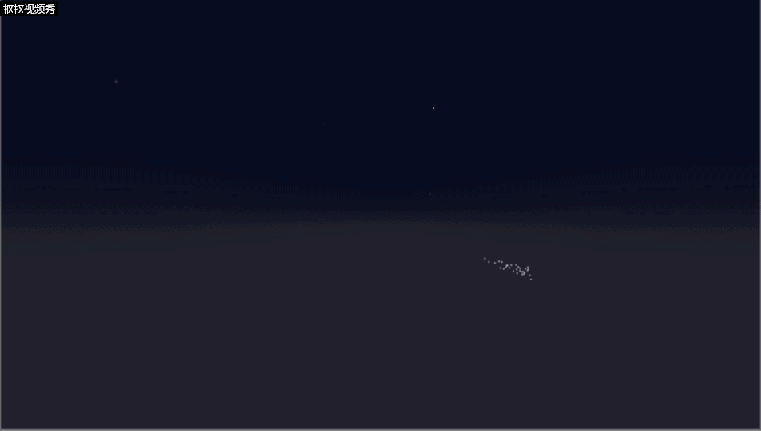
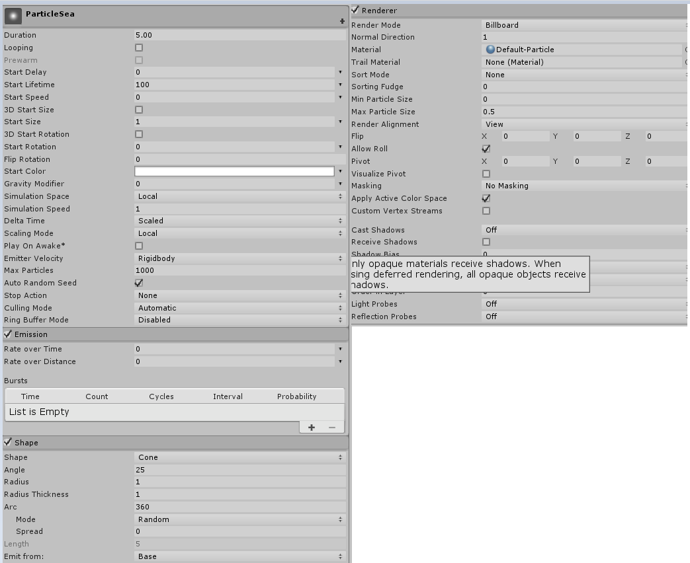

# **Unity粒子系统-粒子光环**  
## **前言**  
这是中山大学数据科学与计算机学院2019年3D游戏编程与设计的第八次作业  
所有项目与代码已上传至github当中，欢迎大家访问。  
github个人主页: [https://starashzero.github.io](https://starashzero.github.io)  
3D游戏编程与设计主页: [https://starashzero.github.io/3DGameDesign](https://starashzero.github.io/3DGameDesign)  
本次作业项目地址: [https://github.com/StarashZero/3DGameDesign/tree/master/hw8](https://github.com/StarashZero/3DGameDesign/tree/master/hw8)   

## **项目要求**  
参考[潘老师博客](https://pmlpml.github.io/unity3d-learning/08-particle-system)    
本次作业基本要求是三选一  

* 1、简单粒子制作  
按参考资源要求，制作一个粒子系统，参考资源  
使用 3.3 节介绍，用代码控制使之在不同场景下效果不一样  
* 2、完善官方的“汽车尾气”模拟  
使用官方资源资源 Vehicle 的 car， 使用 Smoke 粒子系统模拟启动发动、运行、故障等场景效果  
* 3、参考 http://i-remember.fr/en 这类网站，使用粒子流编程控制制作一些效果， 如“粒子光环”  
    可参考以前作业  

我选择的是做第三个，完成一个简陋的盗版http://i-remember.fr/en网页效果  
## **作品效果**  
* 光环产生过程  
      
* 光环收缩与还原  
      
* 视频演示    
    [https://v.youku.com/v_show/id_XNDQyNTE2MzM5Mg==.html?spm=a2h3j.8428770.3416059.1](https://v.youku.com/v_show/id_XNDQyNTE2MzM5Mg==.html?spm=a2h3j.8428770.3416059.1)

## **预置体**  
总共有两个预置体: 粒子海洋、粒子光环。  
创建空对象并为起添加Particle System的组件，属性配置如下:  
  

## **代码解释**  
* ParticleSea  
    粒子海洋的代码编写参考了文章[Unity制作神奇的粒子海洋!](http://www.manew.com/thread-47123-1-1.html)  
    没有进行多少改动，只是修改了部分参数  
    ```java
    public class ParticleSea : MonoBehaviour
    {

        ParticleSystem particleSystem;
        ParticleSystem.Particle[] particlesArray;

        public float spacing = 1;
        public int seaResolution = 100;
        public float noiseScale = 0.1f;
        public float heightScale = 4f;
        float perlinNoiseAnimX = 0.01f;
        float perlinNoiseAnimY = 0.01f;
        public Gradient colorGradient;

        void Start()
        {
            particleSystem = gameObject.GetComponent<ParticleSystem>();
            particlesArray = new ParticleSystem.Particle[seaResolution * seaResolution];
            particleSystem.maxParticles = seaResolution * seaResolution;
            particleSystem.Emit(seaResolution * seaResolution);
            particleSystem.GetParticles(particlesArray);
        }

        private void Update()
        {
            for (int i = 0; i < seaResolution; i++)
            {
                for (int j = 0; j < seaResolution; j++)
                {
                    float zPos = Mathf.PerlinNoise(i * noiseScale + perlinNoiseAnimX, j * noiseScale + perlinNoiseAnimY);
                    particlesArray[i * seaResolution + j].startColor = colorGradient.Evaluate(zPos);
                    particlesArray[i * seaResolution + j].position = new Vector3(i * spacing, zPos * heightScale, j * spacing);
                }
            }

            perlinNoiseAnimX += 0.01f;
            perlinNoiseAnimY += 0.01f;

            particleSystem.SetParticles(particlesArray, particlesArray.Length);
        }

    }
    ```  
* ParticleRing  
    粒子光环的代码很多参考了[师兄的博客](https://blog.csdn.net/simba_scorpio/article/details/51251126)，并根据自己的理解加了很多特性    
    需要用到一个结构体了记录粒子的位置，除了记录粒子的半径、角度和运行时间外，现在会额外记录一个约束半径(粒子的初半径)，便于实现粒子位置还原    
    ```java   
    CirclePosition[] circles;                   //粒子位置
    class CirclePosition
    {
        public float radius = 0f, angle = 0f, time = 0f, targetRadius = 0f;
        public CirclePosition(float radius, float angle, float time, float targetRadius)
        {
            this.radius = radius;                   //半径    
            this.angle = angle;                     //角度
            this.time = time;                       //运行时间                              
            this.targetRadius = targetRadius;       //约束半径
        }
    }
    ```    
    在```Start()```函数中对参数进行初始化，并设置各的属性粒子，另外需要保证粒子的位置按索引排序，便于实现开始时粒子逐渐出现的效果  
    ```java  
    public int count = 3000;                    //粒子数量
    public float size = 0.1f;                   //粒子大小
    public float maxRadius = 12f;               //最大半径
    public float minRadius = 7f;                //最小半径
    public float speed = 2f;                    //初始速度
    void Start()
    {
        particlesArray = new ParticleSystem.Particle[count];
        circles = new CirclePosition[count];
        particleSystem = gameObject.GetComponent<ParticleSystem>();
        particleSystem.maxParticles = count;
        particleSystem.startSize = size;
        particleSystem.Emit(count);
        particleSystem.GetParticles(particlesArray);
        float midRadius = (maxRadius + minRadius) / 2;
        float minRate = Random.Range(1.0f, midRadius / minRadius);
        float maxRate = Random.Range(midRadius / maxRadius, 1.0f);
        for (int i = 0; i < count; i++)
        {
            //设置半径
            float radius = Random.Range(minRadius * minRate, maxRadius * maxRate);
            //设置角度
            float angle = (float)i / count * 360f;

            float theta = angle / 180 * Mathf.PI;
            //保存粒子初位置
            circles[i] = new CirclePosition(radius, angle, (float)i / count * 360f, radius);
            //设置粒子初位置
            particlesArray[i].position = new Vector3(radius * Mathf.Cos(theta), radius * Mathf.Sin(theta), 0);
        }
        particleSystem.SetParticles(particlesArray, particlesArray.Length);
    }
    ```
    要实现粒子逐渐出现的效果，需要记录粒子光环出现的时间，并且按照索引让粒子逐渐出现  
    ```java
    public float time = 0;                      //时间
    //增加时间，并计算当前应该显示的粒子的最低索引
    time = (time + Time.deltaTime) > 5 ? 5 : (time + Time.deltaTime);
    int tar = count - (int)(Mathf.Pow(time / 5, 3) * count);  
    //设置粒子颜色
    if (i < tar)
        particlesArray[i].startColor = gradient.Evaluate(0.5f);             //粒子全透明
    else
    {
        float deep = circles[i].angle / 360f > 0.6f ? (circles[i].angle / 360f) : (circles[i].angle / 360f < 0.4f ? circles[i].angle / 360f : 0.4f);    //不允许全透明
        particlesArray[i].startColor = gradient.Evaluate(deep);
    }
    ```  
    要让粒子能够运动，需要变动粒子的角度，同时让粒子在半径上波动使运动更自然  
    ```java
    //粒子角度增加
    circles[i].angle = (circles[i].angle - Random.Range(0.4f, 0.6f) + 360f) % 360f;

    float theta = circles[i].angle / 180 * Mathf.PI;

    //粒子半径变动
    circles[i].time += Time.deltaTime;
    circles[i].radius += Mathf.PingPong(circles[i].time / minRadius / maxRadius, pingPong) - pingPong / 2.0f;
    ```  
    要让光环能够收缩，最简单的办法是减小最大半径，因此必须让粒子能够随着最大半径变化而运动  
    ```java  
    //将粒子锁定至最大半径与最小半径之间
    if (circles[i].radius < minRadius)
        circles[i].radius += Time.deltaTime;
    else if (circles[i].radius>maxRadius)
        circles[i].radius -= Time.deltaTime;
    ```  
    当最大半径增大时，粒子位置需要自动恢复到原位置，因此粒子需要有向约束半径位移的趋势  
    ```java
    //约束粒子半径，使得粒子有向初半径位移的趋势
    if (circles[i].radius < circles[i].targetRadius)
        circles[i].radius += 0.01f;
    else if (circles[i].radius > circles[i].targetRadius)
        circles[i].radius -= 0.01f;
    ```  
* SimpleController  
    SimpleController是一个简易的控制器，生成粒子光环和粒子海洋，并且处理用户点击事件  
    ```java
    public class SimpleController : MonoBehaviour
    {
        GameObject particleSea;
        GameObject particleRing;
        // Start is called before the first frame update
        void Start()
        {
            //生成粒子光环
            particleRing = GameObject.Instantiate<GameObject>(Resources.Load<GameObject>("Prefabs/ParticleRing"), new Vector3(0, 0, 15), Quaternion.identity);
        }

        // Update is called once per frame
        void Update()
        {
            //当粒子光环完全出现后生成粒子海洋
            if (particleSea == null && particleRing.GetComponent<ParticleRing>().time == 5)
                particleSea = GameObject.Instantiate<GameObject>(Resources.Load<GameObject>("Prefabs/ParticleSea"), new Vector3(-45, -8, -5), Quaternion.identity);
        }

        private void OnGUI()
        {
            //当用户点击按钮后，改变粒子光环的最大半径
            if (particleSea != null&&GUI.Button(new Rect(Screen.width/2-20,Screen.height/2-10,40,40), "+"))
            {
                particleRing.GetComponent<ParticleRing>().maxRadius = particleRing.GetComponent<ParticleRing>().maxRadius == 12 ? 9 : 12;
            }
        }
    }
    ```
