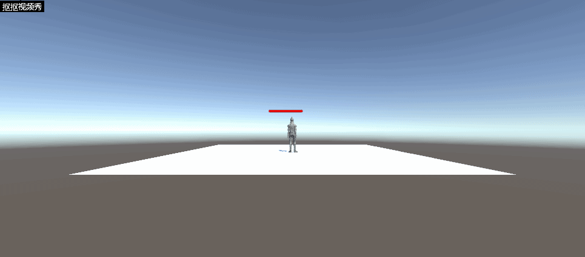

# **血条（Health Bar）的预制设计**  
## **前言**  
这是中山大学数据科学与计算机学院2019年3D游戏编程与设计的第九次作业  
所有项目与代码已上传至github当中，欢迎大家访问。  
github个人主页: [https://starashzero.github.io](https://starashzero.github.io)  
3D游戏编程与设计主页: [https://starashzero.github.io/3DGameDesign](https://starashzero.github.io/3DGameDesign)  
本次作业项目地址: [https://github.com/StarashZero/3DGameDesign/tree/master/hw9](https://github.com/StarashZero/3DGameDesign/tree/master/hw9)   

## **项目要求**  
参考[潘老师博客](https://pmlpml.github.io/unity3d-learning/09-ui.html)    
血条（Health Bar）的预制设计。具体要求如下

* 分别使用 IMGUI 和 UGUI 实现
* 使用 UGUI，血条是游戏对象的一个子元素，任何时候需要面对主摄像机
* 分析两种实现的优缺点
* 给出预制的使用方法

## **IMGUI实现**  
IMGUI比较简单，使用GUI.HorizontalScrollbar来实现，其他要做的只是计算出HorizontalScrollbar的位置和大小  
```java
    //初步计算血条位置
    Vector3 worldPos = new Vector3(transform.position.x, transform.position.y -0.2f, transform.position.z);
    Vector3 screenPos = Camera.main.WorldToScreenPoint(worldPos);
```  
因为IMGUI不会随着物体移动，HorizontalScrollbar大小自然也不会随着远近变化，我简单计算人物与摄像机的距离，随着距离增大减少  
这里只是简单模拟，所以设计的公式是$\frac{1}{1+distance}$ 
```java  
    //计算血条大小比例
    float distance = (transform.position.z - Camera.main.transform.position.z - 10);
    float newScale = (distance < 0 ? 1 : 1 / (1 + distance)) * 0.5f;
```  
最后用计算的位置和大小比例生成HorizontalScrollbar即可  
```java  
    GUI.HorizontalScrollbar(new Rect(new Rect(screenPos.x - 100*newScale, screenPos.y, 200*newScale, 20*newScale)), 0.0f, health, 0.0f, 1.0f);
```  
完整代码:  
```java  
public class HealthBar : MonoBehaviour
{
    public float health = 0.5f;

    void OnGUI()
    {
        //初步计算血条位置
        Vector3 worldPos = new Vector3(transform.position.x, transform.position.y -0.2f, transform.position.z);
        Vector3 screenPos = Camera.main.WorldToScreenPoint(worldPos);
        //计算血条大小比例
        float distance = (transform.position.z - Camera.main.transform.position.z - 10);
        float newScale = (distance < 0 ? 1 : 1 / (1 + distance)) * 0.5f;
        //生产HorizontalScrollbar
        GUI.HorizontalScrollbar(new Rect(new Rect(screenPos.x - 100*newScale, screenPos.y, 200*newScale, 20*newScale)), 0.0f, health, 0.0f, 1.0f);
    }
}
```  

## **UGUI World Place实现**  
使用UGUI World Place实现血条的过程与课程博客提供的一致  
* 菜单 Assets -> Import Package -> Characters 导入资源
* 在层次视图，Context 菜单 -> 3D Object -> Plane 添加 Plane 对象
* 资源视图展开 Standard Assets :: Charactors :: ThirdPersonCharater :: Prefab
* 将 ThirdPersonController 预制拖放放入场景，改名为 Ethan
* 检查以下属性
  + Plane 的 Transform 的 Position = (0,0,0)
  + Ethan 的 Transform 的 Position = (0,0,0)
  + Main Camera 的 Transform 的 Position = (0,1,-10)
* 运行检查效果
* 选择 Ethan 用上下文菜单 -> UI -> Canvas, 添加画布子对象
* 选择 Ethan 的 Canvas，用上下文菜单 -> UI -> Slider 添加滑条作为血条子对象
* 运行检查效果
* 选择 Ethan 的 Canvas，在 Inspector 视图
  + 设置 Canvas 组件 Render Mode 为 World Space
  + 设置 Rect Transform 组件 (PosX，PosY，Width， Height) 为 (0,2,160,20)
  + 设置 Rect Transform 组件 Scale （x,y） 为 (0.01,0.01)
* 运行检查效果，应该是头顶 Slider 的 Ethan，用键盘移动 Ethan，观察
* 展开 Slider
  + 选择 Handle Slider Area，禁灰（disable）该元素
  + 选择 Background，禁灰（disable）该元素
  + 选择 Fill Area 的 Fill，修改 Image 组件的 Color 为 红色
* 选择 Slider 的 Slider 组件
  + 设置 MaxValue 为 100
  + 设置 Value 为 75   

给 Canvas 添加以下脚本 LookAtCamera.cs
```java
using UnityEngine;

public class LookAtCamera : MonoBehaviour {

	void Update () {
		this.transform.LookAt (Camera.main.transform.position);
	}
}
```  
## **UGUI Srceen Space - Overlay实现**  
如果只用UGUI World Place实现我感觉这次作业不像是我做的，而是直接跟着做，所以就试着做了一个UGUI Srceen Space - Overlay版本，其实这个版本和IMGUI很像，也算是将它当作IMGUI来做，但是现在血条是一个对象  
预制体制作与UGUI World Place一致  
首先计算血条位置  
```java
    //计算healthBar位置
    Vector3 worldPos = new Vector3(transform.position.x, transform.position.y + 1.8f, transform.position.z);
    Vector3 screenPos = Camera.main.WorldToScreenPoint(worldPos);
    healthBar.transform.position = new Vector3(screenPos.x, screenPos.y, screenPos.z);
```  
然后计算血条比例，任然使用$\frac{1}{1+distance}$  
```java  
    //计算scale比例  
    float distance = (transform.position.z - Camera.main.transform.position.z - 10);
    float newScale = (distance<0?1: 1/(1+distance)) *0.5f;
    healthBar.transform.localScale = new Vector3(newScale, newScale, 1);
```  
完整代码:  
```java
using System.Collections;
using System.Collections.Generic;
using UnityEngine;
using UnityEngine.UI;

public class OverlayHealthBar : MonoBehaviour
{
    private Slider healthBar;
    void Start()
    {
        healthBar = GetComponentInChildren<Slider>();
    }

    void Update()
    {
        //计算healthBar位置
        Vector3 worldPos = new Vector3(transform.position.x, transform.position.y + 1.8f, transform.position.z);
        Vector3 screenPos = Camera.main.WorldToScreenPoint(worldPos);
        healthBar.transform.position = new Vector3(screenPos.x, screenPos.y, screenPos.z);
        //计算scale比例  
        float distance = (transform.position.z - Camera.main.transform.position.z - 10);
        float newScale = (distance<0?1: 1/(1+distance)) *0.5f;
        healthBar.transform.localScale = new Vector3(newScale, newScale, 1);
    }
}

```
## **效果**  
* IMGUI  
      
* UGUI World Place
      
* UGUI Srceen Space - Overlay  
      

## **优缺点分析**  
* IMGUI  
    优点:  
    + 使用方便，上手容易  
    + 没有状态，维护方便   
  
    缺点:  
    + 效率低下，每次都需要重新生成所有组件  
    + 没有状态，配置不够灵活，实现运动、动画等比较麻烦  
* UGUI  
    优点:   
    + 拥有UI状态，可以比较方便的修改其属性或进行其他操作(运动等)  
    + 锚点的存在可以实现位置自适应  
    + 每次生命周期不需要重复遍历一次UI组件，效率较高  
    缺点:   
    + 使用比较繁琐、对不同的功能需要提供不同的canvas，并单独配置    

## **预制使用方法**  
使用比较简单，直接将脚本拖入Ethan中即可(lookAtCamera除外)  
