# **设计模式与3D游戏编程**  
## **前言** 
这是中山大学数据科学与计算机学院2019年3D游戏编程与设计的约稿博客，主要是总结课程一个学期以来学习的设计模式以及将其用于Unity3D编程的个人经验。  
所有项目与代码已上传至github当中，欢迎大家访问。  
github个人主页: [https://starashzero.github.io](https://starashzero.github.io)  
3D游戏编程与设计主页: [https://starashzero.github.io/3DGameDesign](https://starashzero.github.io/3DGameDesign)    

## **会用到哪些设计模式?**  
存在的设计模式有很多，推荐大家阅读Alan Shalloway、 James R. Trott编写的[Design Patterns Explained](https://book.douban.com/subject/1442623/)，该书也有中文版《设计模式解析》。  
该书内容深入浅出，没有太多复杂的概念，有的话作者基本也会耐心的解释，很适合初学者进行学习。  
接下来我主要是总结一些课程中涉及到的设计模式、以及虽然课程中没提到但是游戏编程中使用到了的模式和使用场景举例    
* Composite Pattern——组合模式  
    组合模式（Composite Pattern），又叫部分整体模式，是用于把一组相似的对象当作一个单一的对象。组合模式依据树形结构来组合对象，用来表示部分以及整体层次。这种类型的设计模式属于结构型模式，它创建了对象组的树形结构。  
    这种模式创建了一个包含自己对象组的类。该类提供了修改相同对象组的方式。(菜鸟教程)  
    组合模式是Unity编程中很常见的设计模式，或者说在面向对象编程中几乎不会离开它，毕竟将相似的东西归为一类统一处理是我们的“常识”。  
    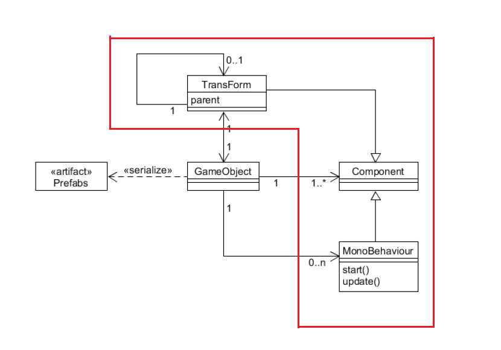  
    例如在Unity系统中，我们所用的Component就属于组合模式，无论是TransForm还是MonoBehavior都属于Component。  
    再比如  
    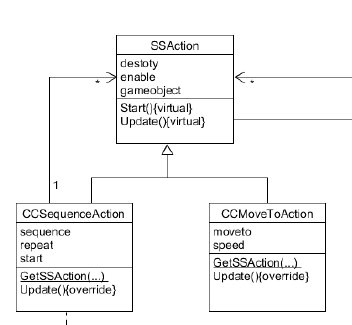  
    CCSequenceAction，CCMoveToAction都属于SSAction，因为它们都是动作类型  
* Strategy Pattern——策略模式  
    在策略模式（Strategy Pattern）中，一个类的行为或其算法可以在运行时更改。这种类型的设计模式属于行为型模式。  
    在策略模式中，我们创建表示各种策略的对象和一个行为随着策略对象改变而改变的 context 对象。策略对象改变 context 对象的执行算法。(菜鸟教程)    
    策略模式总结起来就是以“以不变，应万变”，不变的是接口，变化的是实现。策略模式与组合模式比较相似，我认为其差异在于组合模式是以类型来进行封装，而策略模式是以功能来进行封装，当然很多时候这两种设计模式同时存在。    
    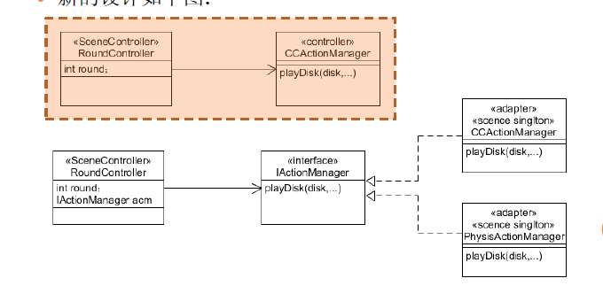  
    例如上图的IActionManager、CCActionManager、PhysisActionManager，从类型角度上来看，这是组合模式，因为后两者都属于动作管理类；从功能角度上来看，这是策略模式，后两者代表着不同的动作管理策略。也就是说，组合模式看重的ActionManager，而策略模式看重的是CC与Physis，前者封装相似，后者封装变化。    
* Facade Pattern——门面/外观模式    
    外观模式（Facade Pattern）隐藏系统的复杂性，并向客户端提供了一个客户端可以访问系统的接口。这种类型的设计模式属于结构型模式，它向现有的系统添加一个接口，来隐藏系统的复杂性。  
    这种模式涉及到一个单一的类，该类提供了客户端请求的简化方法和对现有系统类方法的委托调用。(菜鸟教程)  
    又是一个用于封装的设计模式，门面模式的目的是封装整个复杂的系统，而对外只提供简单的接口，对使用者隐藏实现细节并方便其使用。  
    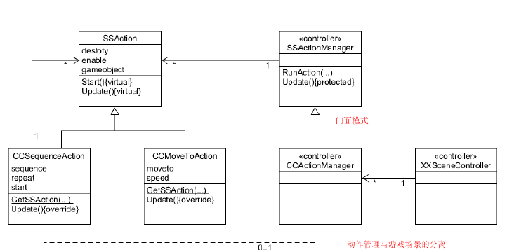
    还是之前的动作管理的例子，要完成动作管理的功能，需要多个类的协作，但是用户(XXSceneController)只需要值得CCActionManager即可，实现细节不需要被了解，这样大大降低了用户的使用难度。  
* Adapter Pattern——适配器模式  
    适配器模式（Adapter Pattern）是作为两个不兼容的接口之间的桥梁。这种类型的设计模式属于结构型模式，它结合了两个独立接口的功能。  
    这种模式涉及到一个单一的类，该类负责加入独立的或不兼容的接口功能。举个真实的例子，读卡器是作为内存卡和笔记本之间的适配器。您将内存卡插入读卡器，再将读卡器插入笔记本，这样就可以通过笔记本来读取内存卡。(菜鸟教程)   
    Adapter模式的目的就是将原本不兼容的器件通过适配器使其能够兼容系统，<<设计模式解析>>中与Facade模式进行了一些比较认为Facade模式是简化系统的接口，而Adapter模式是将一种接口转变为另一种接口。  
    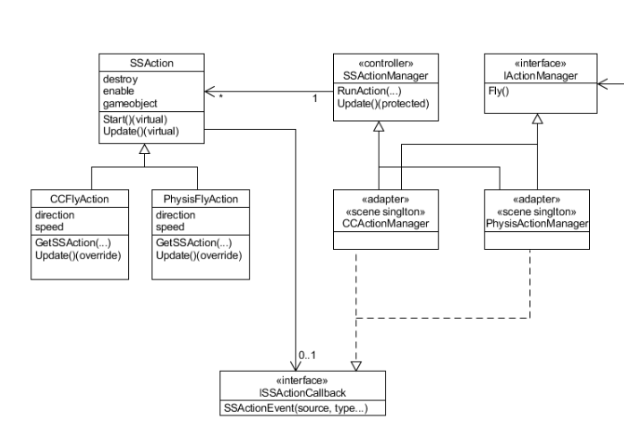  
    还是以动作分离为例，在前面我提到，CCActionManager、PhysisActionManager和IActionManager之间是Strategy模式和Composite模式，那么CCFlyAction、PhysisFlyAction和IActionManager之间，或者说SSAction的子类和IActionManager接口之间是什么模式呢？  
    没错，就是Adapter模式。无论是CCFlyAction还是PhysisAction，它们与IActionManager接口本身是不兼容的，不能直接将它们接上去，而CCActionManager和PhysisActionManager就成为了Adapter。CCActionManager、PhysisActionManager实现IActionManager接口并且调用CCFlyAction、PhysisAction的方法，从而实现了两者的适配。  
* 动作分离  
    动作分离并不是一个传统的设计模式，而是在老师课件中提出的，即将游戏中的动作单独划分出来进行实现。  
    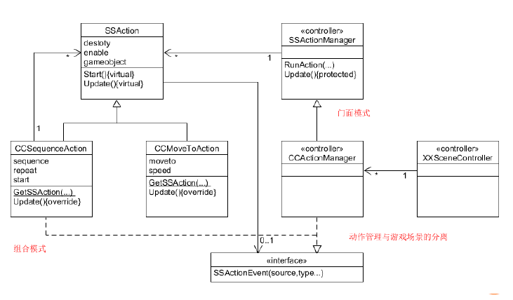  
    动作分离模式中主要有三个接口需要实现SSAction、ISSActionCallback、SSActionManager。SSAction封装动作的实现，SSActionManager封装动作的管理，ISSActionCallback实现回调(当然，后面有更合适的设计模式来实现回调)  
* Singleton Pattern——单例模式  
    这种类型的设计模式属于创建型模式，它提供了一种创建对象的最佳方式。  
    这种模式涉及到一个单一的类，该类负责创建自己的对象，同时确保只有单个对象被创建。这个类提供了一种访问其唯一的对象的方式，可以直接访问，不需要实例化该类的对象。(菜鸟教程)  
    单例模式的主要目的是能够快速的获得单一实例，实例可以自己实现创建方法，也可以由他人创建但是可以被共享获取。  
    在Unity游戏编程中，可以通过以下方法生成Singleton类  
    ```java
    public class Singleton<T> : MonoBehaviour where T: MonoBehaviour
    {
        protected static T instance;

        public static T Instance
        {
            get
            {
                if (instance == null)
                {
                    instance = (T)FindObjectOfType(typeof(T));
                    if (instance == null)
                    {
                        Debug.LogError("An instance of " + typeof(T) + " is needed in the scene, but there is none");
                    }
                }
                return instance;
            }
        }
    }
    ```  
    通过这个单实例类可以比较方便的获得Component实例，当然前提是这个Component提前被添加到对象上。  
* Factory Pattern——工厂模式  
    这种类型的设计模式属于创建型模式，它提供了一种创建对象的最佳方式。  
    在工厂模式中，我们在创建对象时不会对客户端暴露创建逻辑，并且是通过使用一个共同的接口来指向新创建的对象。(菜鸟教程)  
    工厂模式简而言之就是统一管理一个对象的创建与回收，在游戏编程当中经常能够用到  
    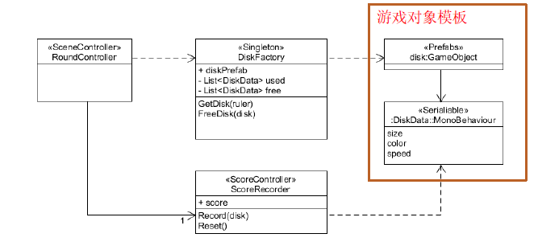  
    以UFO游戏为例，UFO的产生与回收可以由DiskFactory的工厂对象来统一管理。RoundController不需要了解diskGameObject的创建与销毁方法，而将这些工作交给DiskFactory来做，这样大大提高了获取对象的效率。  
* Observer Pattern——观察者模式  
    当对象间存在一对多关系时，则使用观察者模式（Observer Pattern）。比如，当一个对象被修改时，则会自动通知它的依赖对象。观察者模式属于行为型模式。(菜鸟教程)  
    观察者模式是实现依赖反转的解决办法。在之前的动作分离中，我们使用了一个ISSActionCallback来进行回调，这种方式可以被称为代理模式。这种方式在1对1或者确定数量的1对多上有不错的效果，但是对于不确定数量的一对多的回调上就束手无策了，同时这种方式需要在被调用者中主动设置调用者的回调接口，也很不方便，而观察者模式提供了解决方案。  
    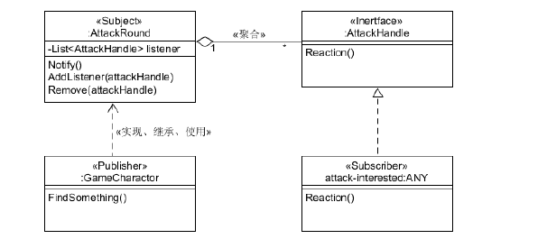  
    如上图中，GameCharator实现了AttackRound的接口，同时attack-interested实现AttackHandle接口，attack-interested将AttackHandle加入到AttackRound的listener中实现观察，这样当GameCharactor向AttackRound发送事件的时候，attack-interested就能接收并处理。  
    在C#中提供了这种模式的实现  
    ```c#
    // publisher
    public delegate void AttackAction(Object sender, string info);
    public static event AttackAction OnAttackAction;
    //subscriber  
    void OnEnable(){
        XXEventManager.AttackeAction += Teleport;
    }
    void OnDisable(){
        XXEventManager.AttackeAction -= Teleport;
    }
    ```  
    可以看到观察者模式类似于代理模式的扩展  

游戏编程中常用的设计模式就总结到这了  

## **程序框图有用吗?一定要用吗?**  
程序框图有用，但不一定要用。  
程序框图作用主要有两个，一是在游戏编程开始前将自己的想法与设计通过框图记下来，而是通过框图来向他人介绍自己的程序。  
因此程序框图不是必须的。如果在心中能够清晰的记下自己的计划，就不需要使用框图，因为需求是变化的，在编程的过程中可能有很多细节并不能提前想到。同时如果并不需要使用框图来介绍程序，也就不会用到框图。  
但是我的建议是最好能够使用，尤其是写博客进行介绍时。  
  
程序框图一般而言只要掌握类图即可，最初的时候可以跟着现有的类图画  
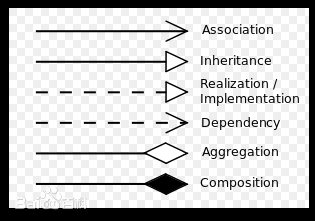  

## **设计模式与3D游戏编程实例**  
我就以之前的[Unity巡逻兵游戏-与怪兽战斗!](https://blog.csdn.net/qq_20549085/article/details/102798334)为例子吧，来谈谈我是怎么设计游戏编程的。  
在游戏编程前，如果完全不进行设计然后埋头苦干，很容易出现结构混乱、思路不清的问题，而设计的基础是要先找出需求。对于需求，我们可以遵循亚历山大的设计原则:  
* 每次一个
* 背景优先  

现在回到巡逻兵游戏上，我现在要做一个能够进行战斗、怪兽自动巡逻与追击的即时游戏，有哪些需求呢?  
1. 地图对象，游戏场景的基础
2. 玩家对象，玩家操作的承载者
3. 怪兽对象，敌人的承载者
4. 游戏需要导演
5. 游戏需要能够获得玩家的操作  
6. 地图需要能够探测玩家的位置
7. 地图需要能够将玩家的位置告诉怪兽
8. 玩家不在自己区域时，怪兽能够巡逻
9. 玩家在自己区域时，怪兽能够追击
10. 玩家进入攻击范围时，怪兽能够攻击
11. 怪兽或许要有一些动画
12. 怪兽有一些状态(受伤等)
13. 怪兽可以被批量生成和回收  
14. 玩家需要能够移动
15. 玩家能够攻击
16. 玩家能够跳跃
17. 玩家有一些状态(受伤等)  
18. 玩家或许要有一些动画  

还有什么需求?可以不用担心落下什么需求，需求是可能变化的，在编程过程中可以进行扩展，因此设计模式很重要。  
在需求中，1、2、3、11、16可以不通过编程来完成，因此我们掠过他们，得到新需求  
1. 游戏需要导演
2. 游戏需要能够获得玩家的操作  
3. 地图需要能够探测玩家的位置
4. 地图需要能够将玩家的位置告诉怪兽
5. 玩家不在自己区域时，怪兽能够巡逻
6. 玩家在自己区域时，怪兽能够追击
7.  玩家进入攻击范围时，怪兽能够攻击
8.  怪兽有一些状态(受伤等)
9.  怪兽可以被批量生成和回收  
10. 玩家需要能够移动
11. 玩家能够攻击
12. 玩家能够跳跃
13. 玩家有一些状态(受伤等)  

* 需求1、2  
    在课程中有关于导演类和交互模块的框架，我们可以直接拿来进行使用  
    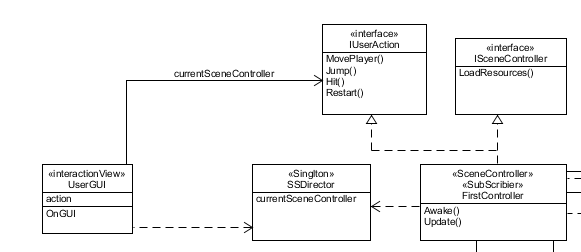  
* 需求3、4  
    对于需求3，我们可以设置一个类用于探测玩家的位置  
    对于需求4，可以用到*Observer模式*，将用户位置的事件发布给观察者    
    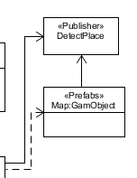  
* 需求5、6、10  
    显然，这三个需求与运动有关，显然我们可以用到*动作分离*，单独编写动作部分  
    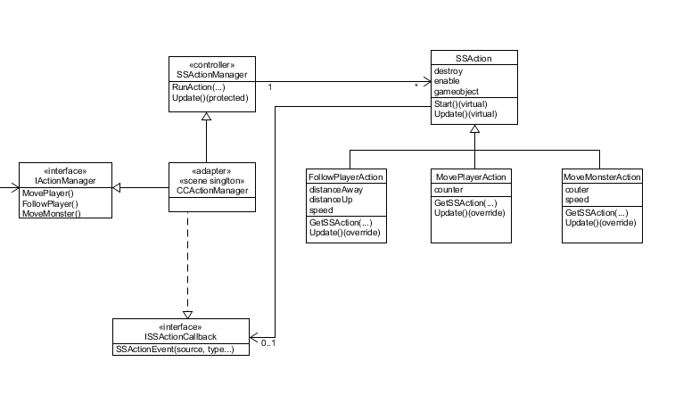  
    由于各个需求的动作要求不同，SSAction使用*Strategy模式*和*Composite模式*，将不同的动作进行封装  
    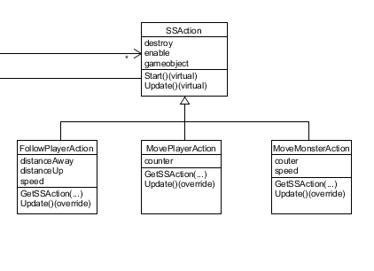  
    使用*Adapter模式*将SSAction适配IActionManager接口  
    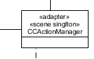  
    这里可能会有疑问，不使用这些模式进行设计，简单的进行动作分离(即只是将动作分出来写)，也可以实现，而且好像结构更简单?  
    是的，实际上如果按照之前Adapter模式，一个SSAction的子类型(FollowPlayerAction、MovePlayerAction、MoveMonsterAction)应该对应一个ActionManager，我没有这样做的原因就是这样会使得程序没必要的复杂，我将ActionManager作为SSAction的Adapter而不是其子类型的Adapter，因此这还是*Adapter模式*。  
    假如完全不使用设计模式，将各个动作直接与接口相连，那么结构就会变得更简约，但是这个时候对系统进行扩展会非常麻烦，很可能需要对已有的代码进行大量的修改。
    事实上，如果用一个SSAction的子类来对应一个ActionManager，那么当增加一个动作需求(SSAction子类)的时候，可以完全做到对原有代码零修改，但是结构更复杂，这就涉及到取舍了。  
    例如我现在这个Adapter的用法，如果增加一个SSAction的不同类型(也许叫DDAction)，可以零修改原代码，如果增加SSAction的子类，则需要对原代码进行少量修改。   
* 需求7、8、9  
    要能够批量生产和回收怪兽，自然能想到使用*工厂模式*   
    但是怪兽自身有一些行为和状态，例如攻击、受伤等，因此需要为怪兽增加一些管理者来处理这些事件，怪兽可能也需要发布一些事件(*Observer模式*)  
    之前提到人物的位置会被发布，而怪兽要获取这个信息，则需要订阅。  
    以上的逻辑很多，但是对于导演类而言并不需要这么多内容，怎么办?*Facade模式*就排上用场了。  
    结合一下上面的设计:  
    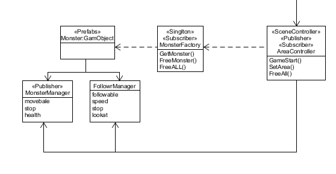  
* 需求11、12、13  
    类比怪兽的做法，需要设置一些管理者来处理玩家的事件，同时通过*Observer模式*发布一些事件(玩家受伤、死亡、得分等)  
    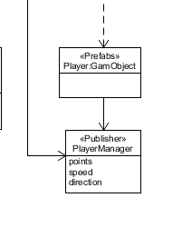  

暂时所有需求都被考虑到了，总体如下:  
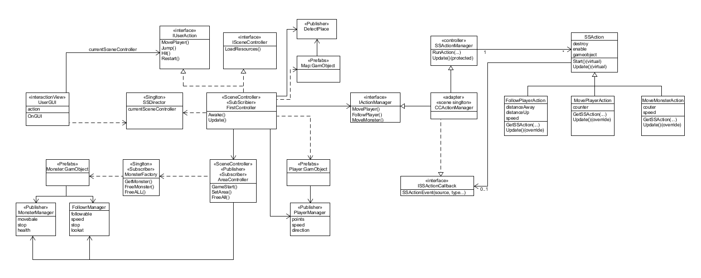  
游戏框架就设计完成了。利用好设计模式后，即使程序多达22个类，但是结构依然清晰，且扩展性强，接下来的任务，就是按照计划一步一步的编写代码了。  

